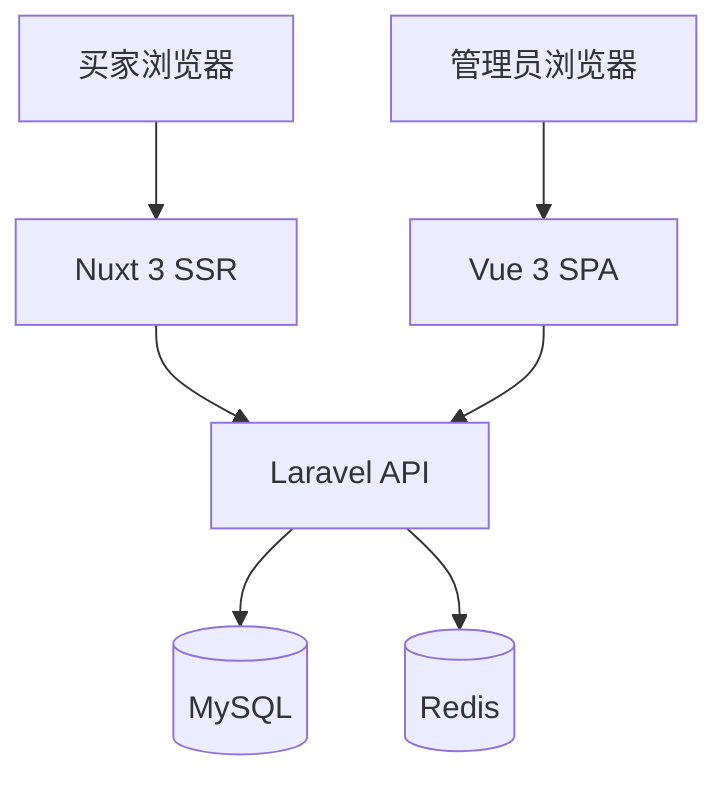
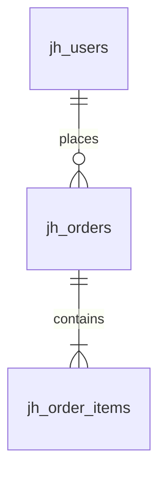

# JerseyHolic 文档体系指南

本文档是 JerseyHolic 跨境电商系统的文档体系总纲，定义了文档分类、目录结构、编写规范和生命周期管理。

---

## 1. 文档体系概览

项目文档分为 **6 个层级**，覆盖从战略到运维的完整生命周期：

| 层级 | 目录 | 目标读者 | 用途 |
|------|------|---------|------|
| 战略规划 | `plan/` | 项目经理、技术负责人 | 项目路线图、里程碑、阶段任务拆解 |
| 需求业务 | `prd/` | 产品经理、开发人员 | 功能清单、业务规则、验收标准、模块 PRD |
| 设计架构 | `architecture/` | 架构师、高级开发 | 系统架构、数据库设计、API 设计、安全架构 |
| 编码规范 | `standards/` | 全体开发人员 | 开发规范、后端/前端/数据库编码指南 |
| 测试质量 | `testing/` | QA、开发人员 | 测试策略、测试用例 |
| 运维部署 | `deployment/` | 运维工程师、开发人员 | 环境搭建、部署流程、故障排查 |

额外还有：
- **用户手册**（`user-manual/`）：面向管理员和买家的操作指南
- **数据迁移**（`migration/`）：旧系统迁移计划和执行记录
- **API 规范**（`api-spec.json`）：由 Scramble 自动生成的 OpenAPI 文档

---

## 2. 文档目录结构

```
docs/
├── DOCUMENTATION-GUIDE.md          # 本指南（文档体系总纲）
│
├── plan/                            # 战略规划层
│   ├── project-plan.md             # 项目总体规划
│   ├── tasks/                      # 阶段任务
│   │   └── phase-*.md
│   ├── progress/                   # 周进度报告
│   │   └── week-*.md
│   └── milestones/                 # 里程碑记录
│
├── prd/                             # 需求业务层
│   ├── feature-list.md             # 功能清单
│   ├── business-rules.md           # 业务规则
│   ├── acceptance-criteria.md      # 验收标准
│   └── modules/                    # 模块 PRD
│       └── <module-name>.md
│
├── architecture/                    # 设计架构层
│   ├── system-overview.md          # 系统架构概述
│   ├── database-design.md          # 数据库设计（ER 图 + 表说明）
│   ├── api-design.md               # API 设计原则
│   └── security-design.md          # 安全架构
│
├── standards/                       # 编码规范层
│   ├── development-standards.md    # 通用开发规范（已有）
│   ├── backend-guide.md            # Laravel 后端开发指南
│   ├── frontend-guide.md           # Vue 3 / Nuxt 3 前端开发指南
│   └── database-guide.md           # 数据库规范
│
├── testing/                         # 测试质量层
│   ├── testing-strategy.md         # 测试策略总览
│   └── test-cases/                 # 测试用例
│       └── <module-name>.md
│
├── deployment/                      # 运维部署层
│   ├── setup-guide.md              # 本地开发环境搭建
│   ├── deployment-guide.md         # 生产部署指南
│   └── troubleshooting.md          # 故障排查手册
│
├── user-manual/                     # 用户手册
│   ├── admin-guide.md              # 管理后台操作手册
│   └── buyer-guide.md              # 买家商城使用指南
│
├── api-spec.json                    # OpenAPI 规范（Scramble 自动生成）
│
└── migration/                       # 数据迁移（预留）
    └── migration-plan.md           # 迁移计划
```

---

## 3. 文档编写规范

### 3.1 文件命名

- 使用 **kebab-case**（小写 + 短横线），如 `database-design.md`
- 模块文档以模块英文名命名，如 `payment-system.md`
- 周报格式：`week-<N>.md`，阶段任务：`phase-<N>.md`

### 3.2 文档头部元信息

每个文档头部必须包含 YAML Front Matter：

```yaml
---
title: 文档标题
version: 1.0.0
updated: YYYY-MM-DD
maintainer: 维护人姓名
status: Draft | Review | Published | Deprecated
---
```

### 3.3 Markdown 格式标准

- 标题层级：`#` 为文档标题（仅一个），`##` 为章节，`###` 为小节
- 代码块标注语言：`` ```php ``、`` ```typescript ``、`` ```sql ``
- 表格用于结构化数据对比
- 列表层级不超过 3 级

### 3.4 图表规范

使用 Mermaid 语法嵌入架构图、ER 图、流程图：

**架构图示例：**
````markdown

````

**ER 图示例：**
````markdown

````

---

## 4. 文档生命周期管理

### 4.1 文档状态流转

```
Draft → Review → Published → Deprecated
```

| 状态 | 含义 | 操作 |
|------|------|------|
| **Draft** | 初稿编写中 | 作者编写，不保证准确性 |
| **Review** | 待审查 | 提交 PR，团队成员审查 |
| **Published** | 已发布 | 正式生效，可作为开发依据 |
| **Deprecated** | 已废弃 | 标注废弃原因和替代文档 |

### 4.2 文档与开发任务关联规则

| 开发活动 | 必须同步更新的文档 |
|---------|-------------------|
| 新功能开发 | 对应模块 PRD + API 文档 |
| 架构变更 | `architecture/` 下相关文档 |
| 数据库变更 | `database-design.md` |
| Bug 修复（涉及业务规则变更） | `business-rules.md` |
| 新增/修改 API | `api-spec.json`（自动）+ `api-design.md`（如涉及设计原则） |
| 部署流程变更 | `deployment/` 下相关文档 |

### 4.3 文档审查机制

- 文档变更随代码 PR 一起提交
- 至少 1 名团队成员审查文档变更
- 架构文档变更需技术负责人审批

---

## 5. 文档模板

### 5.1 PRD 模板

> 参考 `prd/modules/` 下现有文档格式。

```markdown
---
title: [模块名称] 产品需求文档
version: 1.0.0
updated: YYYY-MM-DD
maintainer: 维护人
status: Draft
---

# [模块名称]

## 1. 概述
简述模块目标和业务价值。

## 2. 用户故事
- 作为 [角色]，我希望 [操作]，以便 [价值]

## 3. 功能需求
### 3.1 核心功能
### 3.2 扩展功能

## 4. 业务规则

## 5. 数据模型
相关数据表和字段说明。

## 6. API 接口
接口清单和关键参数。

## 7. 验收标准
- [ ] 标准 1
- [ ] 标准 2

## 8. 非功能需求
性能、安全、兼容性等。
```

### 5.2 架构文档模板

```markdown
---
title: [模块/系统] 架构设计
version: 1.0.0
updated: YYYY-MM-DD
maintainer: 维护人
status: Draft
---

# [模块/系统] 架构设计

## 1. 概述
设计目标和约束条件。

## 2. 架构图
（使用 Mermaid 绘制）

## 3. 核心组件
### 3.1 组件 A
- 职责
- 技术选型
- 接口定义

## 4. 数据流
描述关键业务流程的数据流转。

## 5. 技术决策记录
| 决策 | 方案 | 原因 |
|------|------|------|

## 6. 风险与约束
```

### 5.3 测试用例模板

```markdown
---
title: [模块名称] 测试用例
version: 1.0.0
updated: YYYY-MM-DD
maintainer: 维护人
status: Draft
---

# [模块名称] 测试用例

## 1. 测试范围

## 2. 测试用例

| 编号 | 场景 | 前置条件 | 操作步骤 | 预期结果 | 优先级 |
|------|------|---------|---------|---------|--------|
| TC-001 | | | | | P0 |

## 3. 边界条件

## 4. 异常场景
```

### 5.4 用户手册模板

```markdown
---
title: [功能名称] 操作指南
version: 1.0.0
updated: YYYY-MM-DD
maintainer: 维护人
status: Draft
---

# [功能名称] 操作指南

## 1. 功能说明
简述功能用途。

## 2. 操作步骤
### 步骤 1：
（配图说明）

### 步骤 2：

## 3. 常见问题
| 问题 | 解决方法 |
|------|---------|
```

---

## 6. 各阶段文档产出计划

文档不必一次性写完，随开发进度逐步产出：

| 阶段 | 时间 | 应产出文档 |
|------|------|-----------|
| **Phase 2**（当前） | 基础功能开发 | 已实现模块的架构说明、数据库设计文档、开发规范完善 |
| **Phase 3** | 支付与物流 | 支付系统架构文档、物流模块 PRD、关键流程测试用例 |
| **Phase 4** | 系统集成 | 完整测试策略、部署文档、环境搭建指南 |
| **Phase 5** | 上线准备 | 用户手册（管理员 + 买家）、运维手册、故障排查手册 |

### 每个 Phase 结束时的文档 Checklist

- [ ] 新增模块的 PRD 已更新至 `prd/modules/`
- [ ] 数据库表变更已同步至 `database-design.md`
- [ ] API 变更已反映在 `api-spec.json`
- [ ] 架构变更已记录在 `architecture/` 下
- [ ] 周进度报告已提交至 `plan/progress/`

---

## 7. 快速索引

| 我想... | 去哪里找 |
|---------|---------|
| 了解项目整体规划 | `plan/project-plan.md` |
| 查看功能需求 | `prd/feature-list.md` |
| 查看某模块详细需求 | `prd/modules/<module>.md` |
| 了解系统架构 | `architecture/system-overview.md` |
| 查看 API 文档 | `api-spec.json` 或在线 Scramble 文档 |
| 了解开发规范 | `standards/development-standards.md` |
| 搭建本地环境 | `deployment/setup-guide.md` |
| 部署到生产 | `deployment/deployment-guide.md` |
| 排查问题 | `deployment/troubleshooting.md` |
