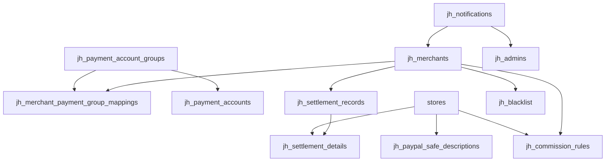

# JerseyHolic 数据库设计文档 — Phase M3 支付与结算

> Phase M3 产出。包含所有 M3 新增和修改的 Central DB 表结构。  
> 所有表使用 `jh_` 前缀，存储于 Central 数据库。

---

## 目录

1. [jh_payment_account_groups — 支付账号分组](#1-jh_payment_account_groups)
2. [jh_payment_accounts — 支付账号池](#2-jh_payment_accounts)
3. [jh_merchant_payment_group_mappings — 商户支付分组映射](#3-jh_merchant_payment_group_mappings)
4. [jh_paypal_safe_descriptions — PayPal 安全描述映射](#4-jh_paypal_safe_descriptions)
5. [jh_blacklist — 黑名单](#5-jh_blacklist)
6. [jh_commission_rules — 佣金规则](#6-jh_commission_rules)
7. [jh_settlement_records — 结算主记录](#7-jh_settlement_records)
8. [jh_settlement_details — 结算明细](#8-jh_settlement_details)
9. [jh_notifications — 站内通知](#9-jh_notifications)
10. [ER 关系图](#10-er-关系图)

---

## 1. jh_payment_account_groups

**说明：** 支付账号分组表，用于将支付账号按策略分组（如 VIP 专用组、标准共享组、黑名单隔离组等）。

**状态：** M1 已创建，M3 补充 `type` ENUM 语义说明。

### 字段列表

| 字段名 | 类型 | 默认值 | 约束 | 说明 |
|--------|------|--------|------|------|
| `id` | bigint unsigned | AUTO_INCREMENT | PK | 主键 |
| `name` | varchar(64) | — | NOT NULL | 分组名称 |
| `type` | varchar(32) | `'paypal'` | NOT NULL | 分组类型，取值：`paypal` / `credit_card` / `stripe` / `antom` |
| `description` | varchar(255) | `''` | NOT NULL | 分组描述 |
| `is_blacklist_group` | tinyint | `0` | NOT NULL | 是否黑名单专用组：`0`=否, `1`=是 |
| `status` | tinyint | `1` | NOT NULL | 状态：`0`=禁用, `1`=启用 |
| `created_at` | timestamp | NULL | — | 创建时间 |
| `updated_at` | timestamp | NULL | — | 更新时间 |

### 索引

| 索引名 | 字段 | 类型 | 说明 |
|--------|------|------|------|
| PRIMARY | `id` | 主键 | — |

### M3 分组策略类型说明

| type 值 | 业务含义 | 说明 |
|---------|---------|------|
| `paypal` | PayPal 分组 | VIP_EXCLUSIVE / STANDARD_SHARED / LITE_SHARED / BLACKLIST_ISOLATED |
| `credit_card` | 信用卡分组 | 同上 |
| `stripe` | Stripe 分组 | 同上 |
| `antom` | Antom 分组 | 同上 |

> 通过 `is_blacklist_group` 标记和商户映射（jh_merchant_payment_group_mappings）实现四级分组策略：
> - **VIP_EXCLUSIVE**：VIP 商户专享账号池
> - **STANDARD_SHARED**：标准共享池
> - **LITE_SHARED**：入门级共享池
> - **BLACKLIST_ISOLATED**：黑名单隔离池（`is_blacklist_group=1`）

---

## 2. jh_payment_accounts

**说明：** 支付账号池表，存储各支付网关的账号信息、额度配置、收款统计。

**状态：** M1 已创建，M3 补充字段说明（group_id 通过 `category_id` / `cc_category_id` 实现，lifecycle_stage / health_score 通过 `permission` / `error_time` / `error_msg` 等字段体现）。

### 字段列表

| 字段名 | 类型 | 默认值 | 约束 | 说明 |
|--------|------|--------|------|------|
| `id` | bigint unsigned | AUTO_INCREMENT | PK | 主键 |
| `account` | varchar(128) | — | NOT NULL | 账号标识/名称 |
| `email` | varchar(128) | `''` | NOT NULL | PayPal 邮箱 / Stripe 标识 |
| `client_id` | varchar(255) | `''` | NOT NULL | Client ID |
| `client_secret` | varchar(500) | `''` | NOT NULL | Client Secret（加密存储） |
| `merchant_id_external` | varchar(64) | `''` | NOT NULL | PayPal 商户 ID |
| `pay_method` | varchar(32) | `'paypal'` | NOT NULL | 支付方式：`paypal` / `credit_card` / `stripe` / `antom` / `payssion` |
| `category_id` | bigint unsigned | `0` | NOT NULL | PayPal 分组 ID → `jh_payment_account_groups.id` |
| `cc_category_id` | bigint unsigned | `0` | NOT NULL | 信用卡分组 ID → `jh_payment_account_groups.id` |
| `status` | tinyint | `1` | NOT NULL | 状态：`0`=禁用, `1`=启用 |
| `permission` | tinyint | `1` | NOT NULL | 权限/生命周期阶段：`1`=可收款(active), `2`=暂停(suspended), `3`=已封禁(banned) |
| `min_money` | decimal(12,2) | `0.00` | NOT NULL | 单笔最小金额(USD) |
| `max_money` | decimal(12,2) | `99999.00` | NOT NULL | 单笔最大金额(USD) |
| `limit_money` | decimal(12,2) | `0.00` | NOT NULL | 总限额(USD)，0=不限 |
| `daily_limit_money` | decimal(12,2) | `0.00` | NOT NULL | 日限额(USD)，0=不限 |
| `money_total` | decimal(12,2) | `0.00` | NOT NULL | 累计收款(USD) |
| `daily_money_total` | decimal(12,2) | `0.00` | NOT NULL | 当日累计收款(USD)，即 daily_used |
| `priority` | int | `0` | NOT NULL | 优先级，数值越大优先级越高 |
| `max_num` | int | `0` | NOT NULL | 最大成交单数，0=不限 |
| `deal_count` | int | `0` | NOT NULL | 已成交单数，即 monthly_used 参考 |
| `is_new` | tinyint | `0` | NOT NULL | 是否新账号：`0`=否, `1`=是 |
| `is_force` | tinyint | `0` | NOT NULL | 是否强制启用：`0`=否, `1`=是 |
| `error_time` | timestamp | NULL | — | 首次异常时间，用于 health_score 计算 |
| `error_msg` | varchar(500) | `''` | NOT NULL | 异常信息，error_count_24h 通过日志表聚合 |
| `webhook_id` | varchar(128) | `''` | NOT NULL | Webhook ID |
| `access_token` | text | NULL | — | Access Token |
| `access_token_expires_at` | timestamp | NULL | — | Token 过期时间 |
| `success_url` | varchar(512) | `''` | NOT NULL | 支付成功回调 URL |
| `cancel_url` | varchar(512) | `''` | NOT NULL | 支付取消回调 URL |
| `pay_url` | varchar(512) | `''` | NOT NULL | 支付网关 URL |
| `domain` | varchar(255) | `''` | NOT NULL | 关联域名 |
| `daily_reset_date` | date | NULL | — | 日限额重置日期 |
| `created_at` | timestamp | NULL | — | 创建时间 |
| `updated_at` | timestamp | NULL | — | 更新时间 |
| `deleted_at` | timestamp | NULL | — | 软删除时间 |

### 索引

| 索引名 | 字段 | 类型 | 说明 |
|--------|------|------|------|
| PRIMARY | `id` | 主键 | — |
| `idx_payment_accounts_pay_method` | `pay_method` | 普通索引 | 按支付方式查询 |
| `idx_payment_accounts_category_id` | `category_id` | 普通索引 | 按 PayPal 分组查询 |
| `idx_payment_accounts_cc_category_id` | `cc_category_id` | 普通索引 | 按信用卡分组查询 |
| `idx_payment_accounts_status_perm` | `status`, `permission` | 复合索引 | 按状态+权限查询可用账号 |
| `idx_payment_accounts_priority` | `priority` | 普通索引 | 按优先级排序 |

### 外键关系

| 字段 | 引用表 | 引用字段 | 说明 |
|------|--------|----------|------|
| `category_id` | `jh_payment_account_groups` | `id` | 逻辑外键（PayPal 分组） |
| `cc_category_id` | `jh_payment_account_groups` | `id` | 逻辑外键（信用卡分组） |

### M3 字段映射说明

| M3 设计概念 | 实际字段 | 说明 |
|------------|---------|------|
| `group_id` | `category_id` / `cc_category_id` | 按支付方式分别关联分组 |
| `lifecycle_stage` | `permission` | 1=active, 2=suspended, 3=banned |
| `health_score` | 通过 `error_time`, `error_msg` + 日志表聚合计算 | 运行时动态计算 |
| `daily_used` | `daily_money_total` | 当日累计收款 |
| `monthly_used` | `money_total` / `deal_count` | 累计收款/成交数 |
| `error_count_24h` | 通过 `jh_payment_account_logs` 聚合 | `WHERE created_at > NOW()-24h AND action='error'` |

---

## 3. jh_merchant_payment_group_mappings

**说明：** 商户-支付方式-支付分组三层映射表。实现「商户 + 支付方式 → 使用哪个支付账号分组」的路由规则。

**状态：** M3 新增。

### 字段列表

| 字段名 | 类型 | 默认值 | 约束 | 说明 |
|--------|------|--------|------|------|
| `id` | bigint unsigned | AUTO_INCREMENT | PK | 主键 |
| `merchant_id` | bigint unsigned | — | NOT NULL | 商户 ID → `jh_merchants.id` |
| `pay_method` | varchar(32) | — | NOT NULL | 支付方式：`paypal` / `credit_card` / `stripe` / `antom` |
| `payment_group_id` | bigint unsigned | — | NOT NULL | 支付分组 ID → `jh_payment_account_groups.id` |
| `priority` | int | `0` | NOT NULL | 优先级，数值越大越优先 |
| `created_at` | timestamp | NULL | — | 创建时间 |
| `updated_at` | timestamp | NULL | — | 更新时间 |

### 索引

| 索引名 | 字段 | 类型 | 说明 |
|--------|------|------|------|
| PRIMARY | `id` | 主键 | — |
| `udx_merchant_pay_method` | `merchant_id`, `pay_method` | 唯一索引 | 同一商户同一支付方式只映射一个分组 |
| `idx_payment_group_id` | `payment_group_id` | 普通索引 | 按分组反查 |

### 外键关系

| 字段 | 引用表 | 引用字段 | 说明 |
|------|--------|----------|------|
| `merchant_id` | `jh_merchants` | `id` | 逻辑外键 |
| `payment_group_id` | `jh_payment_account_groups` | `id` | 逻辑外键 |

---

## 4. jh_paypal_safe_descriptions

**说明：** PayPal 安全描述映射表。将商品分类映射为 PayPal 可接受的安全名称和描述，降低 PayPal 风控拦截风险。

**状态：** M3 新增。

### 字段列表

| 字段名 | 类型 | 默认值 | 约束 | 说明 |
|--------|------|--------|------|------|
| `id` | bigint unsigned | AUTO_INCREMENT | PK | 主键 |
| `store_id` | bigint unsigned | NULL | NULLABLE | 关联站点 ID，null=全局规则 → `stores.id` |
| `product_category` | varchar(64) | — | NOT NULL | 商品分类标识（如 `jerseys`, `accessories`） |
| `safe_name` | varchar(128) | — | NOT NULL | 安全名称（展示给 PayPal 的商品名） |
| `safe_description` | varchar(255) | — | NOT NULL | 安全描述文本 |
| `safe_category_code` | varchar(16) | `''` | NOT NULL | MCC 分类码（Merchant Category Code） |
| `weight` | int | `0` | NOT NULL | 权重，多条规则匹配时取权重最高的 |
| `status` | tinyint | `1` | NOT NULL | 状态：`0`=禁用, `1`=启用 |
| `created_at` | timestamp | NULL | — | 创建时间 |
| `updated_at` | timestamp | NULL | — | 更新时间 |

### 索引

| 索引名 | 字段 | 类型 | 说明 |
|--------|------|------|------|
| PRIMARY | `id` | 主键 | — |
| `idx_store_category` | `store_id`, `product_category` | 复合索引 | 按站点+分类查询 |
| `idx_status` | `status` | 普通索引 | 按状态筛选 |

### 外键关系

| 字段 | 引用表 | 引用字段 | 说明 |
|------|--------|----------|------|
| `store_id` | `stores` | `id` | 逻辑外键（nullable） |

---

## 5. jh_blacklist

**说明：** 黑名单表，支持平台级和商户级维度的风控拦截，覆盖 IP、邮箱、设备指纹、支付账号等维度。

**状态：** M3 新增。

### 字段列表

| 字段名 | 类型 | 默认值 | 约束 | 说明 |
|--------|------|--------|------|------|
| `id` | bigint unsigned | AUTO_INCREMENT | PK | 主键 |
| `scope` | varchar(16) | — | NOT NULL | 作用范围：`platform`=全平台, `merchant`=仅商户级 |
| `merchant_id` | bigint unsigned | NULL | NULLABLE | 商户 ID，scope=platform 时为 null → `jh_merchants.id` |
| `dimension` | varchar(32) | — | NOT NULL | 维度：`ip` / `email` / `device` / `payment_account` |
| `value` | varchar(255) | — | NOT NULL | 黑名单值（IP 地址 / 邮箱 / 设备指纹 / 支付账号标识） |
| `reason` | varchar(500) | `''` | NOT NULL | 加入原因 |
| `expires_at` | timestamp | NULL | NULLABLE | 过期时间，null=永久生效 |
| `created_at` | timestamp | NULL | — | 创建时间 |
| `updated_at` | timestamp | NULL | — | 更新时间 |

### 索引

| 索引名 | 字段 | 类型 | 说明 |
|--------|------|------|------|
| PRIMARY | `id` | 主键 | — |
| `idx_scope_dimension` | `scope`, `dimension` | 复合索引 | 按范围+维度查询 |
| `idx_dimension_value` | `dimension`, `value` | 复合索引 | 风控实时拦截查询（核心查询路径） |
| `idx_merchant_id` | `merchant_id` | 普通索引 | 按商户查询 |
| `idx_expires_at` | `expires_at` | 普通索引 | 过期清理 |

### 外键关系

| 字段 | 引用表 | 引用字段 | 说明 |
|------|--------|----------|------|
| `merchant_id` | `jh_merchants` | `id` | 逻辑外键（nullable） |

---

## 6. jh_commission_rules

**说明：** 佣金规则表，定义平台对商户的抽佣费率。支持全局规则、商户级规则和站点级规则（三级优先级：站点 > 商户 > 全局）。

**状态：** M3 新增。

### 字段列表

| 字段名 | 类型 | 默认值 | 约束 | 说明 |
|--------|------|--------|------|------|
| `id` | bigint unsigned | AUTO_INCREMENT | PK | 主键 |
| `merchant_id` | bigint unsigned | NULL | NULLABLE | 商户 ID，null=全局规则 → `jh_merchants.id` |
| `store_id` | bigint unsigned | NULL | NULLABLE | 站点 ID，null=商户级规则 → `stores.id` |
| `rule_type` | varchar(32) | — | NOT NULL | 规则类型标识 |
| `tier_name` | varchar(64) | — | NOT NULL | 阶梯名称（如 "Default Tier", "VIP Tier"） |
| `base_rate` | decimal(5,2) | — | NOT NULL | 基础费率(%)，如 5.00 表示 5% |
| `volume_discount` | decimal(5,2) | `0.00` | NOT NULL | 量级折扣(%)，订单量达标时的费率减免 |
| `loyalty_discount` | decimal(5,2) | `0.00` | NOT NULL | 忠诚度折扣(%)，合作时间越长折扣越大 |
| `min_rate` | decimal(5,2) | `0.00` | NOT NULL | 最低费率(%)，折后不低于此值 |
| `max_rate` | decimal(5,2) | `100.00` | NOT NULL | 最高费率(%)，费率上限 |
| `enabled` | tinyint | `1` | NOT NULL | 是否启用：`0`=禁用, `1`=启用 |
| `created_at` | timestamp | NULL | — | 创建时间 |
| `updated_at` | timestamp | NULL | — | 更新时间 |

### 索引

| 索引名 | 字段 | 类型 | 说明 |
|--------|------|------|------|
| PRIMARY | `id` | 主键 | — |
| `idx_merchant_id` | `merchant_id` | 普通索引 | 按商户查询 |
| `idx_store_id` | `store_id` | 普通索引 | 按站点查询 |
| `idx_rule_type` | `rule_type` | 普通索引 | 按规则类型筛选 |
| `idx_enabled` | `enabled` | 普通索引 | 按状态筛选 |

### 外键关系

| 字段 | 引用表 | 引用字段 | 说明 |
|------|--------|----------|------|
| `merchant_id` | `jh_merchants` | `id` | 逻辑外键（nullable） |
| `store_id` | `stores` | `id` | 逻辑外键（nullable） |

### 费率计算公式

```
实际费率 = max(min_rate, min(max_rate, base_rate - volume_discount - loyalty_discount))
```

### 规则优先级

1. 站点级规则（`store_id IS NOT NULL`）— 最高优先级
2. 商户级规则（`merchant_id IS NOT NULL AND store_id IS NULL`）
3. 全局规则（`merchant_id IS NULL AND store_id IS NULL`）— 兜底

---

## 7. jh_settlement_records

**说明：** 结算主记录表，记录每次结算的汇总数据，支持结算审核和打款流程。

**状态：** 已有表结构，M3 补充字段说明。

### 字段列表

| 字段名 | 类型 | 默认值 | 约束 | 说明 |
|--------|------|--------|------|------|
| `id` | bigint unsigned | AUTO_INCREMENT | PK | 主键 |
| `merchant_id` | bigint unsigned | — | NOT NULL | 商户 ID → `jh_merchants.id` |
| `period_start` | date | — | NOT NULL | 结算周期开始日期 |
| `period_end` | date | — | NOT NULL | 结算周期结束日期 |
| `total_revenue` | decimal(14,2) | `0.00` | NOT NULL | 总收入(USD) — 该周期内所有已完成订单金额之和 |
| `total_refunds` | decimal(14,2) | `0.00` | NOT NULL | 总退款(USD) — 该周期内所有退款金额之和 |
| `total_disputes` | decimal(14,2) | `0.00` | NOT NULL | 总争议金额(USD) — 该周期内所有争议冻结金额之和 |
| `platform_fee` | decimal(14,2) | `0.00` | NOT NULL | 平台服务费(USD) — 按佣金规则计算的平台抽成 |
| `payment_processing_fee` | decimal(14,2) | `0.00` | NOT NULL | 支付处理费(USD) — PayPal/Stripe 等网关手续费 |
| `net_amount` | decimal(14,2) | `0.00` | NOT NULL | 净结算额(USD) = revenue - refunds - disputes - platform_fee - processing_fee |
| `status` | varchar(16) | `'pending'` | NOT NULL | 状态：`pending`=待审核, `reviewed`=已审核, `paid`=已打款, `rejected`=已拒绝 |
| `reviewer_id` | bigint unsigned | NULL | NULLABLE | 审核人 Admin ID |
| `reviewed_at` | timestamp | NULL | — | 审核时间 |
| `review_comment` | varchar(500) | `''` | NOT NULL | 审核意见 |
| `paid_at` | timestamp | NULL | — | 打款时间 |
| `payment_method` | varchar(64) | `''` | NOT NULL | 打款方式（银行转账、PayPal 等） |
| `payment_reference` | varchar(128) | `''` | NOT NULL | 打款流水号 |
| `created_at` | timestamp | NULL | — | 创建时间 |
| `updated_at` | timestamp | NULL | — | 更新时间 |

### 索引

| 索引名 | 字段 | 类型 | 说明 |
|--------|------|------|------|
| PRIMARY | `id` | 主键 | — |
| `idx_merchant_id` | `merchant_id` | 普通索引 | 按商户查询 |
| `idx_status` | `status` | 普通索引 | 按状态筛选 |
| `idx_period` | `period_start`, `period_end` | 复合索引 | 按结算周期查询 |
| `udx_merchant_period` | `merchant_id`, `period_start`, `period_end` | 唯一索引 | 防止同一商户同一周期重复结算 |

### 外键关系

| 字段 | 引用表 | 引用字段 | 说明 |
|------|--------|----------|------|
| `merchant_id` | `jh_merchants` | `id` | 逻辑外键 |
| `reviewer_id` | `jh_admins` | `id` | 逻辑外键（nullable） |

### 结算金额计算公式

```
net_amount = total_revenue - total_refunds - total_disputes - platform_fee - payment_processing_fee
```

---

## 8. jh_settlement_details

**说明：** 结算明细表，按站点维度拆分结算数据，一条结算主记录对应多条明细。

**状态：** 已有表结构，M3 补充字段说明。

### 字段列表

| 字段名 | 类型 | 默认值 | 约束 | 说明 |
|--------|------|--------|------|------|
| `id` | bigint unsigned | AUTO_INCREMENT | PK | 主键 |
| `settlement_id` | bigint unsigned | — | NOT NULL | 结算主记录 ID → `jh_settlement_records.id` |
| `store_id` | bigint unsigned | — | NOT NULL | 站点 ID → `stores.id` |
| `revenue` | decimal(14,2) | `0.00` | NOT NULL | 该站点在结算周期内的收入(USD) |
| `refunds` | decimal(14,2) | `0.00` | NOT NULL | 该站点在结算周期内的退款(USD) |
| `disputes` | decimal(14,2) | `0.00` | NOT NULL | 该站点在结算周期内的争议金额(USD) |
| `net_amount` | decimal(14,2) | `0.00` | NOT NULL | 该站点净结算额(USD) = revenue - refunds - disputes |
| `order_count` | int | `0` | NOT NULL | 该站点在结算周期内的订单数 |
| `refund_count` | int | `0` | NOT NULL | 退款笔数 |
| `dispute_count` | int | `0` | NOT NULL | 争议笔数 |
| `created_at` | timestamp | NULL | — | 创建时间 |
| `updated_at` | timestamp | NULL | — | 更新时间 |

### 索引

| 索引名 | 字段 | 类型 | 说明 |
|--------|------|------|------|
| PRIMARY | `id` | 主键 | — |
| `idx_settlement_id` | `settlement_id` | 普通索引 | 按结算单查明细 |
| `idx_store_id` | `store_id` | 普通索引 | 按站点查询 |
| `udx_settlement_store` | `settlement_id`, `store_id` | 唯一索引 | 同一结算单同一站点仅一条明细 |

### 外键关系

| 字段 | 引用表 | 引用字段 | 说明 |
|------|--------|----------|------|
| `settlement_id` | `jh_settlement_records` | `id` | 逻辑外键 |
| `store_id` | `stores` | `id` | 逻辑外键 |

---

## 9. jh_notifications

**说明：** 站内通知表，支持向 Admin 和 Merchant 发送不同类型的通知（风控预警、结算通知、账号异常、黑名单命中等）。

**状态：** M3 新增。

### 字段列表

| 字段名 | 类型 | 默认值 | 约束 | 说明 |
|--------|------|--------|------|------|
| `id` | bigint unsigned | AUTO_INCREMENT | PK | 主键 |
| `user_type` | varchar(16) | — | NOT NULL | 用户类型：`admin` / `merchant` |
| `user_id` | bigint unsigned | — | NOT NULL | 用户 ID（Admin ID 或 MerchantUser ID） |
| `type` | varchar(32) | — | NOT NULL | 通知类型：`risk_alert` / `settlement` / `account_issue` / `blacklist` |
| `title` | varchar(128) | — | NOT NULL | 通知标题 |
| `content` | text | — | NOT NULL | 通知正文（支持 Markdown） |
| `channel` | varchar(16) | `'site'` | NOT NULL | 通知渠道：`site`=站内, `dingtalk`=钉钉 |
| `is_read` | tinyint | `0` | NOT NULL | 是否已读：`0`=未读, `1`=已读 |
| `read_at` | timestamp | NULL | NULLABLE | 阅读时间 |
| `metadata` | json | NULL | NULLABLE | 扩展数据（如关联的 merchant_id、settlement_id 等） |
| `created_at` | timestamp | NULL | — | 创建时间 |
| `updated_at` | timestamp | NULL | — | 更新时间 |

### 索引

| 索引名 | 字段 | 类型 | 说明 |
|--------|------|------|------|
| PRIMARY | `id` | 主键 | — |
| `idx_user` | `user_type`, `user_id` | 复合索引 | 按用户查询通知 |
| `idx_type` | `type` | 普通索引 | 按类型筛选 |
| `idx_is_read` | `is_read` | 普通索引 | 筛选未读通知 |
| `idx_created_at` | `created_at` | 普通索引 | 按时间排序 |

### 通知类型说明

| type 值 | 说明 | 触发场景 |
|---------|------|---------|
| `risk_alert` | 风控预警 | 商户争议率/退款率超阈值、黑名单命中等 |
| `settlement` | 结算通知 | 结算单生成、审核通过、打款完成 |
| `account_issue` | 账号异常 | 支付账号余额不足、API 调用失败、Token 过期 |
| `blacklist` | 黑名单通知 | 订单命中黑名单被拦截 |

---

## 10. ER 关系图



### 关系说明

| 关系 | 说明 |
|------|------|
| `jh_merchants` 1:N `jh_merchant_payment_group_mappings` | 一个商户对应多条支付分组映射 |
| `jh_payment_account_groups` 1:N `jh_merchant_payment_group_mappings` | 一个分组可被多个商户映射 |
| `jh_payment_account_groups` 1:N `jh_payment_accounts` | 一个分组下有多个支付账号 |
| `jh_merchants` 1:N `jh_settlement_records` | 一个商户有多条结算记录 |
| `jh_settlement_records` 1:N `jh_settlement_details` | 一条结算记录含多个站点明细 |
| `stores` 1:N `jh_settlement_details` | 一个站点在多次结算中有明细 |
| `stores` 1:N `jh_paypal_safe_descriptions` | 一个站点可配置多条安全描述 |
| `jh_merchants` 1:N `jh_blacklist` | 一个商户可有多条商户级黑名单 |
| `jh_merchants` 1:N `jh_commission_rules` | 一个商户可有多条佣金规则 |
| `jh_notifications` N:1 用户 | 通知指向 admin 或 merchant 用户 |
