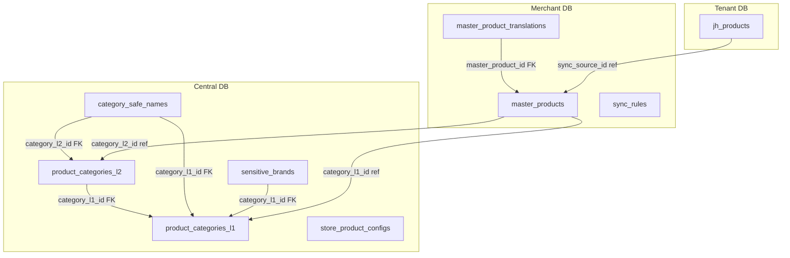

# JerseyHolic 数据库设计文档 — Phase M4 商品管理与多站点同步

> Phase M4 产出。包含 M4 新增的 Central DB、Merchant DB 和 Tenant DB 表结构。  
> Central DB 表使用 `jh_` 前缀，Merchant/Tenant DB 表按各自规范。

---

## 目录

1. [Central DB 新增表](#central-db-新增表)
   - [product_categories_l1 — 一级品类](#1-product_categories_l1)
   - [product_categories_l2 — 二级品类](#2-product_categories_l2)
   - [category_safe_names — 品类安全名称](#3-category_safe_names)
   - [sensitive_brands — 敏感品牌](#4-sensitive_brands)
   - [store_product_configs — 站点商品配置](#5-store_product_configs)
2. [Merchant DB 新增表](#merchant-db-新增表)
   - [master_products — 主商品](#6-master_products)
   - [master_product_translations — 主商品翻译](#7-master_product_translations)
   - [sync_rules — 同步规则](#8-sync_rules)
3. [Tenant DB 扩展](#tenant-db-扩展)
   - [jh_products 新增字段](#9-jh_products-扩展)
4. [ER 关系图](#10-er-关系图)

---

## Central DB 新增表

### 1. product_categories_l1

**说明：** 一级品类表，存储商品顶级分类（球衣、鞋类、服装等），支持 16 种语言名称和特货标识。

**迁移文件：** `database/migrations/central/2026_04_17_100100_create_product_categories_l1_table.php`

#### 字段列表

| 字段名 | 类型 | 默认值 | 约束 | 说明 |
|--------|------|--------|------|------|
| `id` | bigint unsigned | AUTO_INCREMENT | PK | 主键 |
| `code` | varchar(32) | — | NOT NULL, UNIQUE | 品类编码（JERSEY/FOOTWEAR/APPAREL 等），创建后不可修改 |
| `name` | json | — | NOT NULL | 多语言名称，JSON 格式存储 16 种语言 |
| `icon` | varchar(255) | `''` | NOT NULL | 品类图标/图片路径 |
| `is_sensitive` | tinyint | `0` | NOT NULL | 是否默认特货：`0`=否, `1`=是 |
| `sensitive_ratio` | decimal(3,2) | `0.00` | NOT NULL | 特货比例参考值（0.00-1.00） |
| `sort_order` | int | `0` | NOT NULL | 排序权重，越大越靠前 |
| `created_at` | timestamp | NULL | — | 创建时间 |
| `updated_at` | timestamp | NULL | — | 更新时间 |

#### 索引

| 索引名 | 字段 | 类型 | 说明 |
|--------|------|------|------|
| PRIMARY | `id` | 主键 | — |
| `product_categories_l1_code_unique` | `code` | UNIQUE | 品类编码唯一 |
| `product_categories_l1_sort_order_index` | `sort_order` | INDEX | 排序查询优化 |

#### 预置数据

| code | name(en) | is_sensitive | sensitive_ratio |
|------|----------|-------------|----------------|
| JERSEY | Jersey | 1 | 0.90 |
| FOOTWEAR | Footwear | 1 | 0.80 |
| APPAREL | Apparel | 0 | 0.50 |
| ACCESSORY | Accessory | 0 | 0.20 |
| ELECTRONICS | Electronics | 0 | 0.10 |
| DIY | DIY Custom | 0 | 0.40 |

---

### 2. product_categories_l2

**说明：** 二级品类表，隶属于一级品类，存储更细分的商品分类（足球球衣、运动鞋等）。

**迁移文件：** `database/migrations/central/2026_04_17_100200_create_product_categories_l2_table.php`

#### 字段列表

| 字段名 | 类型 | 默认值 | 约束 | 说明 |
|--------|------|--------|------|------|
| `id` | bigint unsigned | AUTO_INCREMENT | PK | 主键 |
| `category_l1_id` | bigint unsigned | — | NOT NULL, FK | 关联一级品类 ID |
| `code` | varchar(32) | — | NOT NULL, UNIQUE | 二级品类编码 |
| `name` | json | — | NOT NULL | 多语言名称（JSON/16 语言） |
| `sort_order` | int | `0` | NOT NULL | 排序权重 |
| `created_at` | timestamp | NULL | — | 创建时间 |
| `updated_at` | timestamp | NULL | — | 更新时间 |

#### 索引

| 索引名 | 字段 | 类型 | 说明 |
|--------|------|------|------|
| PRIMARY | `id` | 主键 | — |
| `product_categories_l2_code_unique` | `code` | UNIQUE | 二级品类编码唯一 |
| `product_categories_l2_l1_id_index` | `category_l1_id` | INDEX | 按一级品类查询 |

#### 外键

| 外键 | 引用表 | 引用字段 | ON DELETE |
|------|--------|---------|----------|
| `category_l1_id` | `product_categories_l1` | `id` | CASCADE |

---

### 3. category_safe_names

**说明：** 品类安全名称映射表，存储各品类在不同 SKU 前缀和站点下的安全名称（16 种语言），支持权重用于动态轮换选取。

**迁移文件：** `database/migrations/central/2026_04_17_100300_create_category_safe_names_table.php`

#### 字段列表

| 字段名 | 类型 | 默认值 | 约束 | 说明 |
|--------|------|--------|------|------|
| `id` | bigint unsigned | AUTO_INCREMENT | PK | 主键 |
| `category_l1_id` | bigint unsigned | — | NOT NULL, FK | 关联一级品类 ID |
| `category_l2_id` | bigint unsigned | NULL | FK | 关联二级品类 ID（可选） |
| `sku_prefix` | varchar(8) | NULL | — | SKU 前缀（hic/WPZ/DIY 等） |
| `store_id` | bigint unsigned | NULL | — | 站点 ID（站点级覆盖时使用，NULL=全局） |
| `safe_name_en` | varchar(128) | `''` | NOT NULL | 英文安全名称 |
| `safe_name_zh` | varchar(128) | `''` | NOT NULL | 中文安全名称 |
| `safe_name_ja` | varchar(128) | `''` | NOT NULL | 日文安全名称 |
| `safe_name_ko` | varchar(128) | `''` | NOT NULL | 韩文安全名称 |
| `safe_name_fr` | varchar(128) | `''` | NOT NULL | 法文安全名称 |
| `safe_name_de` | varchar(128) | `''` | NOT NULL | 德文安全名称 |
| `safe_name_es` | varchar(128) | `''` | NOT NULL | 西班牙文安全名称 |
| `safe_name_pt` | varchar(128) | `''` | NOT NULL | 葡萄牙文安全名称 |
| `safe_name_it` | varchar(128) | `''` | NOT NULL | 意大利文安全名称 |
| `safe_name_ru` | varchar(128) | `''` | NOT NULL | 俄文安全名称 |
| `safe_name_ar` | varchar(128) | `''` | NOT NULL | 阿拉伯文安全名称 |
| `safe_name_th` | varchar(128) | `''` | NOT NULL | 泰文安全名称 |
| `safe_name_vi` | varchar(128) | `''` | NOT NULL | 越南文安全名称 |
| `safe_name_nl` | varchar(128) | `''` | NOT NULL | 荷兰文安全名称 |
| `safe_name_pl` | varchar(128) | `''` | NOT NULL | 波兰文安全名称 |
| `safe_name_tr` | varchar(128) | `''` | NOT NULL | 土耳其文安全名称 |
| `weight` | int | `1` | NOT NULL | 权重（用于同级多条记录的动态轮换选取） |
| `created_at` | timestamp | NULL | — | 创建时间 |
| `updated_at` | timestamp | NULL | — | 更新时间 |

#### 索引

| 索引名 | 字段 | 类型 | 说明 |
|--------|------|------|------|
| PRIMARY | `id` | 主键 | — |
| `csn_l1_l2_prefix_store_index` | `category_l1_id`, `category_l2_id`, `sku_prefix`, `store_id` | INDEX | 映射查询组合索引 |
| `csn_store_id_index` | `store_id` | INDEX | 按站点查询 |

#### 外键

| 外键 | 引用表 | 引用字段 | ON DELETE |
|------|--------|---------|----------|
| `category_l1_id` | `product_categories_l1` | `id` | CASCADE |
| `category_l2_id` | `product_categories_l2` | `id` | SET NULL |

---

### 4. sensitive_brands

**说明：** 敏感品牌表，存储需要触发特货标记的品牌黑名单，支持品牌别名和风险等级。

**迁移文件：** `database/migrations/central/2026_04_17_100400_create_sensitive_brands_table.php`

#### 字段列表

| 字段名 | 类型 | 默认值 | 约束 | 说明 |
|--------|------|--------|------|------|
| `id` | bigint unsigned | AUTO_INCREMENT | PK | 主键 |
| `brand_name` | varchar(128) | — | NOT NULL | 品牌名称 |
| `brand_aliases` | json | NULL | — | 品牌别名列表，JSON 数组 `["NK","N1ke"]` |
| `category_l1_id` | bigint unsigned | NULL | FK | 关联品类（可选，NULL 表示全品类适用） |
| `risk_level` | enum('high','medium','low') | `'medium'` | NOT NULL | 风险等级 |
| `reason` | varchar(255) | `''` | NOT NULL | 标记原因说明 |
| `created_at` | timestamp | NULL | — | 创建时间 |
| `updated_at` | timestamp | NULL | — | 更新时间 |

#### 索引

| 索引名 | 字段 | 类型 | 说明 |
|--------|------|------|------|
| PRIMARY | `id` | 主键 | — |
| `sensitive_brands_brand_name_index` | `brand_name` | INDEX | 品牌名查询 |
| `sensitive_brands_risk_level_index` | `risk_level` | INDEX | 风险等级筛选 |
| `sensitive_brands_l1_id_index` | `category_l1_id` | INDEX | 按品类筛选 |

#### 外键

| 外键 | 引用表 | 引用字段 | ON DELETE |
|------|--------|---------|----------|
| `category_l1_id` | `product_categories_l1` | `id` | SET NULL |

---

### 5. store_product_configs

**说明：** 站点商品配置表，存储每个站点的价格覆盖策略、安全名称覆盖开关和显示货币。

**迁移文件：** `database/migrations/central/2026_04_17_100500_create_store_product_configs_table.php`

#### 字段列表

| 字段名 | 类型 | 默认值 | 约束 | 说明 |
|--------|------|--------|------|------|
| `id` | bigint unsigned | AUTO_INCREMENT | PK | 主键 |
| `store_id` | bigint unsigned | — | NOT NULL, UNIQUE | 站点 ID（一个站点一条配置） |
| `price_override_enabled` | tinyint | `0` | NOT NULL | 是否启用价格覆盖 |
| `price_override_strategy` | varchar(32) | `'multiplier'` | NOT NULL | 覆盖策略：multiplier/fixed/manual |
| `price_override_value` | decimal(10,4) | `1.0000` | NOT NULL | 覆盖值（multiplier 时为倍率，fixed 时为固定价格） |
| `safe_name_override_enabled` | tinyint | `0` | NOT NULL | 是否启用站点级安全名称覆盖 |
| `display_currency` | varchar(8) | `'USD'` | NOT NULL | 站点显示货币代码 |
| `created_at` | timestamp | NULL | — | 创建时间 |
| `updated_at` | timestamp | NULL | — | 更新时间 |

#### 索引

| 索引名 | 字段 | 类型 | 说明 |
|--------|------|------|------|
| PRIMARY | `id` | 主键 | — |
| `store_product_configs_store_id_unique` | `store_id` | UNIQUE | 每站点唯一配置 |

---

## Merchant DB 新增表

> 以下表存储在 Merchant Database 中，按商户隔离。

### 6. master_products

**说明：** 主商品表，商户统一管理的商品主数据，同步到各站点前的源数据。

**迁移文件：** `database/migrations/merchant/2026_04_17_200100_create_master_products_table.php`

#### 字段列表

| 字段名 | 类型 | 默认值 | 约束 | 说明 |
|--------|------|--------|------|------|
| `id` | bigint unsigned | AUTO_INCREMENT | PK | 主键 |
| `merchant_id` | bigint unsigned | — | NOT NULL | 商户 ID |
| `sku` | varchar(64) | — | NOT NULL, UNIQUE | 商品 SKU（唯一） |
| `name` | varchar(255) | — | NOT NULL | 商品名称 |
| `category_l1_id` | bigint unsigned | — | NOT NULL | 一级品类 ID |
| `category_l2_id` | bigint unsigned | NULL | — | 二级品类 ID |
| `is_sensitive` | tinyint | `0` | NOT NULL | 特货标记：`0`=普货, `1`=特货 |
| `base_price` | decimal(10,2) | — | NOT NULL | 基础价格（USD） |
| `images` | json | NULL | — | 商品图片 URL 数组 |
| `attributes` | json | NULL | — | 商品属性（颜色/尺码/材质等） |
| `variants` | json | NULL | — | 变体信息 |
| `sync_status` | enum('pending','synced','failed') | `'pending'` | NOT NULL | 同步状态 |
| `status` | enum('active','inactive') | `'active'` | NOT NULL | 商品状态 |
| `created_at` | timestamp | NULL | — | 创建时间 |
| `updated_at` | timestamp | NULL | — | 更新时间 |
| `deleted_at` | timestamp | NULL | — | 软删除时间 |

#### 索引

| 索引名 | 字段 | 类型 | 说明 |
|--------|------|------|------|
| PRIMARY | `id` | 主键 | — |
| `master_products_sku_unique` | `sku` | UNIQUE | SKU 唯一 |
| `master_products_merchant_id_index` | `merchant_id` | INDEX | 按商户查询 |
| `master_products_category_l1_id_index` | `category_l1_id` | INDEX | 按一级品类查询 |
| `master_products_sync_status_index` | `sync_status` | INDEX | 按同步状态查询 |
| `master_products_is_sensitive_index` | `is_sensitive` | INDEX | 按特货标记查询 |

---

### 7. master_product_translations

**说明：** 主商品翻译表，存储商品的多语言标题和描述。

**迁移文件：** `database/migrations/merchant/2026_04_17_200200_create_master_product_translations_table.php`

#### 字段列表

| 字段名 | 类型 | 默认值 | 约束 | 说明 |
|--------|------|--------|------|------|
| `id` | bigint unsigned | AUTO_INCREMENT | PK | 主键 |
| `master_product_id` | bigint unsigned | — | NOT NULL, FK | 关联主商品 ID |
| `locale` | varchar(8) | — | NOT NULL | 语言代码（en/zh/ja 等） |
| `title` | varchar(255) | — | NOT NULL | 翻译标题 |
| `description` | text | NULL | — | 翻译描述 |
| `created_at` | timestamp | NULL | — | 创建时间 |
| `updated_at` | timestamp | NULL | — | 更新时间 |

#### 索引

| 索引名 | 字段 | 类型 | 说明 |
|--------|------|------|------|
| PRIMARY | `id` | 主键 | — |
| `mpt_product_locale_unique` | `master_product_id`, `locale` | UNIQUE | 同商品同语言唯一 |

#### 外键

| 外键 | 引用表 | 引用字段 | ON DELETE |
|------|--------|---------|----------|
| `master_product_id` | `master_products` | `id` | CASCADE |

---

### 8. sync_rules

**说明：** 同步规则表，定义商户向各站点同步商品的策略（定价、自动同步、间隔等）。

**迁移文件：** `database/migrations/merchant/2026_04_17_200300_create_sync_rules_table.php`

#### 字段列表

| 字段名 | 类型 | 默认值 | 约束 | 说明 |
|--------|------|--------|------|------|
| `id` | bigint unsigned | AUTO_INCREMENT | PK | 主键 |
| `store_id` | bigint unsigned | — | NOT NULL | 站点 ID |
| `merchant_id` | bigint unsigned | — | NOT NULL | 商户 ID |
| `pricing_strategy` | varchar(32) | `'multiplier'` | NOT NULL | 定价策略：fixed/multiplier/manual |
| `price_multiplier` | decimal(6,4) | `1.0000` | NOT NULL | 价格倍率 |
| `auto_sync` | tinyint | `0` | NOT NULL | 是否自动同步：`0`=否, `1`=是 |
| `last_synced_at` | timestamp | NULL | — | 最近同步时间 |
| `sync_interval_hours` | int | `24` | NOT NULL | 自动同步间隔（小时） |
| `created_at` | timestamp | NULL | — | 创建时间 |
| `updated_at` | timestamp | NULL | — | 更新时间 |

#### 索引

| 索引名 | 字段 | 类型 | 说明 |
|--------|------|------|------|
| PRIMARY | `id` | 主键 | — |
| `sync_rules_store_merchant_unique` | `store_id`, `merchant_id` | UNIQUE | 同站点同商户唯一规则 |
| `sync_rules_merchant_id_index` | `merchant_id` | INDEX | 按商户查询 |

---

## Tenant DB 扩展

### 9. jh_products 扩展

**说明：** 在现有 Tenant DB 的 `jh_products` 表新增同步来源字段，关联主商品库。

**迁移文件：** `database/migrations/tenant/2026_04_17_300100_add_sync_fields_to_jh_products_table.php`

#### 新增字段

| 字段名 | 类型 | 默认值 | 约束 | 说明 |
|--------|------|--------|------|------|
| `sync_source_id` | bigint unsigned | NULL | — | 关联主商品 ID（来自 master_products），NULL 表示非同步商品 |
| `synced_at` | timestamp | NULL | — | 最近同步时间 |

#### 新增索引

| 索引名 | 字段 | 类型 | 说明 |
|--------|------|------|------|
| `jh_products_sync_source_id_index` | `sync_source_id` | INDEX | 按同步来源查询 |

---

## 10. ER 关系图

### 表总览

| 数据库 | 表名 | 说明 | 新增/扩展 |
|--------|------|------|----------|
| Central | product_categories_l1 | 一级品类 | 新增 |
| Central | product_categories_l2 | 二级品类 | 新增 |
| Central | category_safe_names | 品类安全名称映射 | 新增 |
| Central | sensitive_brands | 敏感品牌库 | 新增 |
| Central | store_product_configs | 站点商品配置 | 新增 |
| Merchant | master_products | 主商品 | 新增 |
| Merchant | master_product_translations | 主商品翻译 | 新增 |
| Merchant | sync_rules | 同步规则 | 新增 |
| Tenant | jh_products | 站点商品 | 扩展（+2 字段） |
