# JerseyHolic 多租户架构实现文档

> **版本**: v3.0  
> **日期**: 2026-04-17  
> **里程碑**: Phase M1 + Phase M2 + Phase M3  
> **核心依赖**: stancl/tenancy ^3.8

---

## 目录

1. [架构总览](#1-架构总览)
2. [stancl/tenancy v3 集成配置](#2-stancltenancy-v3-集成配置)
3. [Central DB 与 Tenant DB 分离架构](#3-central-db-与-tenant-db-分离架构)
4. [域名→站点→数据库自动识别与切换机制](#4-域名站点数据库自动识别与切换机制)
5. [StoreProvisioningService 实现细节](#5-storeprovisioningservice-实现细节)
6. [租户识别中间件工作原理](#6-租户识别中间件工作原理)
7. [Phase M2 商户管理核心架构](#phase-m2-商户管理核心架构)
8. [Phase M3 支付与结算架构](#phase-m3-支付与结算架构)

---

## 1. 架构总览

JerseyHolic 采用 **database-per-tenant** 多租户架构，基于 `stancl/tenancy v3` 实现。每个商户站点（Store）拥有独立数据库，平台管理数据存储在中央数据库中。

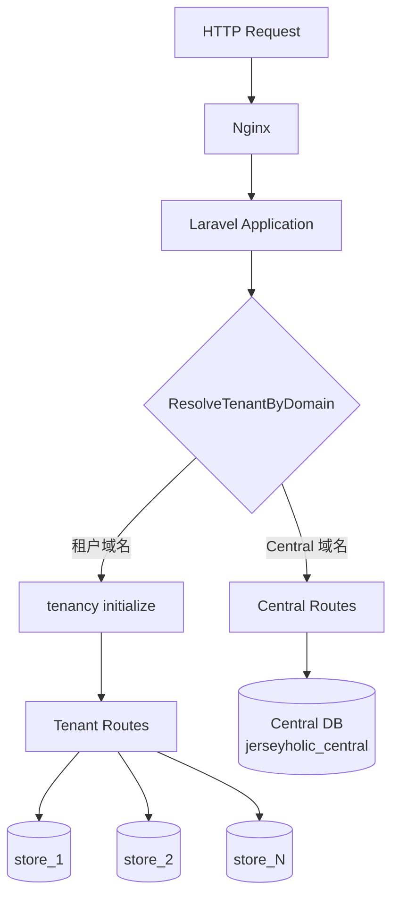

**核心设计决策：**

| 决策项 | 选择 | 理由 |
|--------|------|------|
| 多租户包 | stancl/tenancy ^3.8 | 功能完整，自动化程度最高，社区活跃 |
| 隔离模式 | database-per-tenant | 完全数据隔离，独立备份/恢复 |
| 租户模型 | `App\Models\Central\Store` | 每个站点即一个租户 |
| 域名识别 | 自定义 `ResolveTenantByDomain` 中间件 | 支持状态检查、Central 域名跳过 |
| 数据库命名 | `store_{id}` | 配置 `tenancy.database.prefix = 'store_'` |
| 表前缀 | `jh_` | Central 和 Tenant 库统一使用 |

---

## 2. stancl/tenancy v3 集成配置

### 2.1 Composer 依赖

```json
// api/composer.json
"stancl/tenancy": "^3.8"
```

### 2.2 租户配置 (`config/tenancy.php`)

**Tenant Model：**

```php
'tenant_model' => App\Models\Central\Store::class,
```

Store 模型同时作为 stancl/tenancy 的 Tenant 契约实现，对应 Central DB 的 `jh_stores` 表。

**Domain Model：**

```php
'domain_model' => \App\Models\Central\Domain::class,
```

**Central 域名（不触发租户识别）：**

```php
'central_domains' => [
    env('CENTRAL_DOMAIN', 'admin.jerseyholic.com'),
    'localhost',
    '127.0.0.1',
],
```

**Bootstrappers（租户初始化引导器）：**

当租户被识别后，以下引导器依次执行：

| Bootstrapper | 职责 |
|-------------|------|
| `DatabaseTenancyBootstrapper` | 切换数据库连接到租户库 |
| `CacheTenancyBootstrapper` | 缓存 key 前缀隔离（tag: `tenant_{id}`） |
| `QueueTenancyBootstrapper` | 队列任务自动携带租户上下文 |
| `FilesystemTenancyBootstrapper` | 文件系统路径隔离 |
| `RedisTenancyBootstrapper` | Redis key 前缀隔离 |

**数据库命名规则：**

```php
'database' => [
    'central_connection'        => env('TENANCY_CENTRAL_CONNECTION', 'central'),
    'template_tenant_connection' => 'tenant',
    'prefix' => 'store_',
    'suffix' => '',
],
```

生成规则：`store_` + `tenant_id` → 如 `store_1`, `store_2`

**迁移与 Seed 配置：**

```php
'migration_parameters' => [
    '--path'     => [database_path('migrations/tenant')],
    '--realpath' => true,
],
'seeder_parameters' => [
    '--class' => 'Database\Seeders\TenantDatabaseSeeder',
],
```

**资源隔离配置：**

```php
// 缓存隔离
'cache' => ['tag_base' => 'tenant_'],

// 文件系统隔离
'filesystem' => [
    'suffix_base'          => 'tenant',
    'disks'                => ['local', 'public'],
    'root_override'        => [
        'local'  => '%storage_path%/app/',
        'public' => '%storage_path%/app/public/',
    ],
    'suffix_storage_path'   => true,
    'asset_helper_tenancy'  => true,
],

// Redis 隔离
'redis' => [
    'prefix_base'          => 'tenant_',
    'prefixed_connections'  => ['default', 'cache'],
],
```

### 2.3 TenancyServiceProvider

文件：`app/Providers/TenancyServiceProvider.php`

职责：
1. **注册事件监听** — 租户生命周期事件（创建/删除/初始化/结束）
2. **注册中间件组** — `tenant` 中间件组
3. **配置路由** — 分离 Central 路由和 Tenant 路由

**事件→任务映射（关键部分）：**

```php
Events\TenantCreated::class => [
    JobPipeline::make([
        Jobs\CreateDatabase::class,    // 自动创建 Tenant DB
        Jobs\MigrateDatabase::class,   // 自动运行 Tenant 迁移
    ])->send(fn ($event) => $event->tenant)
      ->shouldBeQueued(false),  // 同步执行，不入队列
],

Events\TenantDeleted::class => [
    JobPipeline::make([
        Jobs\DeleteDatabase::class,    // 自动删除 Tenant DB
    ])->send(fn ($event) => $event->tenant)
      ->shouldBeQueued(false),
],

Events\TenancyInitialized::class => [
    Listeners\BootstrapTenancy::class,       // 执行所有 Bootstrappers
],

Events\TenancyEnded::class => [
    Listeners\RevertToCentralContext::class,  // 恢复 Central 上下文
],
```

**路由配置：**

```php
// Central 路由 — 绑定 Central 域名，不做租户初始化
Route::middleware(['api'])
    ->domain($centralDomain)
    ->group(base_path('routes/central.php'));

// Tenant 路由 — 带 'tenant' 中间件组，运行时动态识别租户
Route::middleware(['api', 'tenant'])
    ->group(base_path('routes/tenant.php'));
```

### 2.4 数据库连接配置 (`config/database.php`)

```php
'default' => env('DB_CONNECTION', 'central'),

'connections' => [
    // Central DB — 平台管理库
    'central' => [
        'driver'   => 'mysql',
        'database' => env('DB_DATABASE_CENTRAL', 'jerseyholic_central'),
        'prefix'   => 'jh_',
        // ...
    ],

    // Tenant DB 模板 — 由 stancl/tenancy 动态切换 database 值
    'tenant' => [
        'driver'   => 'mysql',
        'database' => null,  // 由 tenancy 动态设置
        'prefix'   => 'jh_',
        // ...
    ],
],
```

默认连接为 `central`，应用启动时操作 Central DB。当 `tenancy()->initialize($store)` 执行后，`tenant` 连接的 `database` 字段被动态替换为 `store_{id}`。

---

## 3. Central DB 与 Tenant DB 分离架构

### 3.1 架构示意图

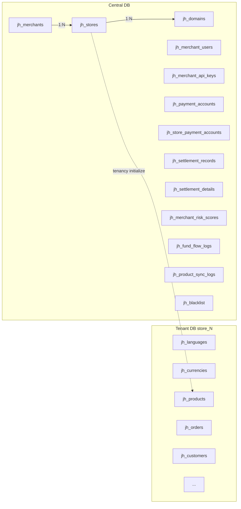

### 3.2 Central DB 表清单

Central DB 名称：`jerseyholic_central`，表前缀：`jh_`

迁移文件位于：`database/migrations/central/`（共 13 个迁移）

| # | 迁移文件 | 表名 | 说明 |
|---|---------|------|------|
| 1 | `2026_04_16_100000_create_merchants_table` | `jh_merchants` | 商户主表 |
| 2 | `2026_04_16_100100_create_stores_table` | `jh_stores` | 站点/租户主表（Tenant Model） |
| 3 | `2026_04_16_100200_create_domains_table` | `jh_domains` | 域名绑定表（Domain Model） |
| 4 | `2026_04_16_100300_create_merchant_users_table` | `jh_merchant_users` | 商户后台用户 |
| 5 | `2026_04_16_100400_create_merchant_api_keys_table` | `jh_merchant_api_keys` | 商户 API 密钥 |
| 6 | `2026_04_16_100500_create_payment_accounts_table` | `jh_payment_accounts` | 支付账户 |
| 7 | `2026_04_16_100600_create_store_payment_accounts_table` | `jh_store_payment_accounts` | 站点↔支付账户关联 |
| 8 | `2026_04_16_100700_create_settlement_records_table` | `jh_settlement_records` | 结算记录 |
| 9 | `2026_04_16_100800_create_settlement_details_table` | `jh_settlement_details` | 结算明细 |
| 10 | `2026_04_16_100900_create_merchant_risk_scores_table` | `jh_merchant_risk_scores` | 商户风控评分 |
| 11 | `2026_04_16_101000_create_fund_flow_logs_table` | `jh_fund_flow_logs` | 资金流水日志 |
| 12 | `2026_04_16_101100_create_product_sync_logs_table` | `jh_product_sync_logs` | 商品同步日志 |
| 13 | `2026_04_16_101200_create_blacklist_table` | `jh_blacklist` | 黑名单 |

### 3.3 Tenant DB 表清单

Tenant DB 名称：`store_{id}`（每个站点独立库），表前缀：`jh_`

迁移文件位于：`database/migrations/tenant/`（共 19 个迁移）

| # | 迁移文件 | 表/表组 | 说明 |
|---|---------|---------|------|
| 1 | `000001_create_languages_table` | `jh_languages` | 语言配置 |
| 2 | `000002_create_currencies_table` | `jh_currencies` | 货币配置 |
| 3 | `000003_create_countries_table` | `jh_countries` | 国家/地区 |
| 4 | `000004_create_geo_zones_table` | `jh_geo_zones` | 地理区域 |
| 5 | `000005_create_settings_table` | `jh_settings` | 站点设置 |
| 6 | `000006_create_customers_table` | `jh_customers` | 客户主表 |
| 7 | `000007_create_customer_addresses_table` | `jh_customer_addresses` | 客户地址 |
| 8 | `000008_create_categories_table` | `jh_categories` + 翻译表 | 分类 |
| 9 | `000009_create_products_table` | `jh_products` + 翻译表 | 商品主表 |
| 10 | `000010_create_product_related_tables` | 商品关联表组 | 图片/属性/SKU/库存 等 |
| 11 | `000011_create_mapping_tables` | 映射表组 | 商品↔分类等映射 |
| 12 | `000012_create_orders_table` | `jh_orders` | 订单主表 |
| 13 | `000013_create_order_related_tables` | 订单关联表组 | 订单商品/历史/退款 等 |
| 14 | `000014_create_payment_records_table` | `jh_payment_records` | 支付记录 |
| 15 | `000015_create_shipping_tables` | 物流表组 | 配送方式/运费规则 |
| 16 | `000016_create_marketing_tables` | 营销表组 | 优惠券/促销活动 |
| 17 | `000017_create_fb_pixel_tables` | FB Pixel 表组 | Facebook 像素追踪 |
| 18 | `000018_create_content_tables` | 内容表组 | CMS 页面/Banner |
| 19 | `000019_create_risk_orders_table` | `jh_risk_orders` | 风险订单 |

---

## 4. 域名→站点→数据库自动识别与切换机制

### 4.1 完整流程时序图

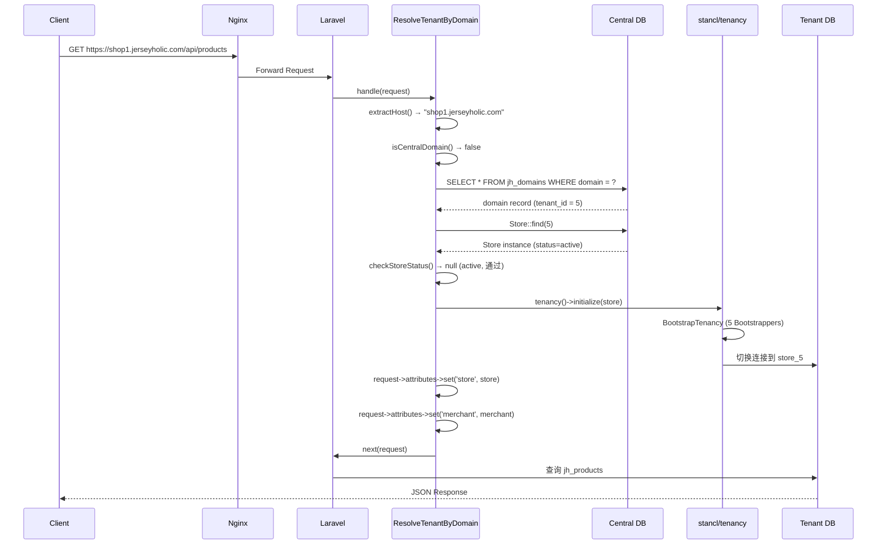

### 4.2 ResolveTenantByDomain 中间件详解

文件：`app/Http/Middleware/ResolveTenantByDomain.php`

这是多租户识别的核心中间件，处理流程如下：

**Step 1 — 提取 Host**
```php
protected function extractHost(Request $request): string
{
    $host = $request->getHost(); // 已去除 port
    if (str_starts_with($host, 'www.')) {
        $host = substr($host, 4); // 去除 www 前缀
    }
    return strtolower($host);
}
```

**Step 2 — 检查是否为 Central 域名**

比对 `config('tenancy.central_domains')` 列表，如果匹配则直接跳过租户识别，请求进入 Central 路由。

**Step 3 — 查询 Central DB 的 `jh_domains` 表**
```php
DB::connection('central')
    ->table('domains')
    ->where('domain', $host)
    ->first();
```

**Step 4 — 获取 Store 实例**

通过 `domain_record->tenant_id` 查找 Store 模型。

**Step 5 — 检查 Store 状态**

| 状态 | HTTP 响应 | 错误码 |
|------|----------|--------|
| `active` | 正常通过 | — |
| `maintenance` | 503 | `STORE_MAINTENANCE` |
| `suspended` | 403 | `STORE_SUSPENDED` |
| 其他 | 404 | `STORE_NOT_FOUND` |

**Step 6 — 初始化租户上下文**
```php
$this->tenancy->initialize($store);
```
触发 `TenancyInitialized` 事件 → `BootstrapTenancy` 监听器 → 执行 5 个 Bootstrappers → 数据库/缓存/队列/文件系统/Redis 全部切换到租户上下文。

**Step 7 — 注入请求属性**
```php
$request->attributes->set('store', $store);
$request->attributes->set('tenant_id', $store->getKey());
$request->attributes->set('merchant', $store->merchant);
$request->attributes->set('merchant_id', $merchant?->getKey());
```

后续 Controller 可通过 `$request->attributes->get('store')` 获取当前租户信息。

### 4.3 EnsureTenantContext 中间件

文件：`app/Http/Middleware/EnsureTenantContext.php`

作为安全守卫，确保进入 Tenant 路由的请求已完成租户初始化：

```php
public function handle(Request $request, Closure $next): Response
{
    if (!tenancy()->initialized) {
        return response()->json([
            'success'    => false,
            'message'    => 'Tenant context is required to access this resource.',
            'error_code' => 'TENANT_CONTEXT_REQUIRED',
        ], 403);
    }
    return $next($request);
}
```

### 4.4 PreventAccessFromTenantDomains 中间件

文件：`app/Http/Middleware/PreventAccessFromTenantDomains.php`

防止租户域名访问 Central 管理路由。仅允许 Central 域名（如 `admin.jerseyholic.com`）访问平台管理 API。

```php
if (!$this->isCentralDomain($host)) {
    // 返回 404，错误码 CENTRAL_ONLY
}
```

---

## 5. StoreProvisioningService 实现细节

文件：`app/Services/StoreProvisioningService.php`

### 5.1 provision() — 站点创建全流程

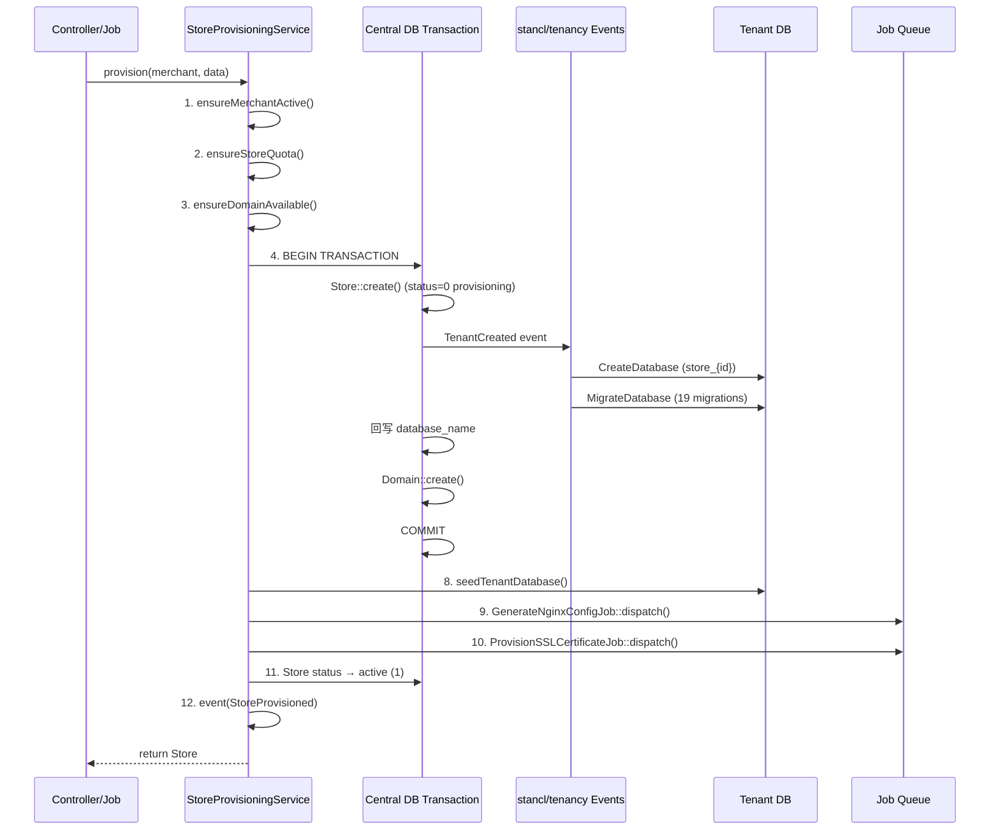

**详细步骤说明：**

| 步骤 | 操作 | 说明 |
|------|------|------|
| 1 | `ensureMerchantActive()` | 检查商户状态是否为 active |
| 2 | `ensureStoreQuota()` | 检查商户等级配额（starter:2, standard:5, advanced:10, vip:无限） |
| 3 | `ensureDomainAvailable()` | 检查域名是否已被其他站点占用 |
| 4 | `DB::connection('central')->transaction()` | 开启 Central DB 事务 |
| 5 | `Store::create()` | 创建 Store 记录（status=0，触发 stancl `TenantCreated` 事件） |
| 6 | stancl 自动执行 | `CreateDatabase` + `MigrateDatabase`（同步，非队列） |
| 7 | `Domain::create()` | 创建域名记录（certificate_status=pending） |
| 8 | `seedTenantDatabase()` | 在 Tenant 上下文中运行 `TenantDatabaseSeeder`（失败不阻塞） |
| 9 | `GenerateNginxConfigJob::dispatch()` | 异步生成 Nginx 配置 |
| 10 | `ProvisionSSLCertificateJob::dispatch()` | 异步申请 SSL 证书 |
| 11 | `Store::update(['status' => 1])` | 更新状态为 active |
| 12 | `event(StoreProvisioned)` | 触发站点创建成功事件 |

**商户等级配额：**

```php
protected const STORE_QUOTA = [
    'starter'  => 2,
    'standard' => 5,
    'advanced' => 10,
    'vip'      => null, // 不限
];
```

**错误处理：**

- 业务异常（`StoreProvisioningException`）：直接抛出，触发 `StoreProvisionFailed` 事件
- 意外异常：标记 Store 状态为 `-1`（provisioning_failed），触发 `StoreProvisionFailed` 事件后包装为 `StoreProvisioningException` 抛出

### 5.2 deprovision() — 站点删除流程

```php
public function deprovision(Store $store): bool
```

| 步骤 | 操作 | 说明 |
|------|------|------|
| 1 | `checkPendingOrders()` | 在 Tenant 上下文检查未完成订单（status 0/1） |
| 2 | `$store->update(['status' => 0])` | 标记为 inactive |
| 3 | `$store->delete()` | 软删除 Store 记录 |
| 4 | `domains()->update(...)` | 域名标记为 inactive |
| 5 | — | 不立即删除 Tenant DB（保留 30 天后由定时任务清理） |
| 6 | `event(StoreDeprovisioned)` | 触发站点删除事件 |

> **设计决策**：使用软删除而非硬删除，不触发 stancl 的 `TenantDeleted` 事件，因此不会自动删除数据库。数据库保留 30 天作为安全缓冲期。

### 5.3 ProvisionStoreJob — 异步队列化

文件：`app/Jobs/ProvisionStoreJob.php`

将 `provision()` 放入队列执行，适用于批量创建场景。

```php
class ProvisionStoreJob implements ShouldQueue
{
    public int $tries   = 3;          // 最多重试 3 次
    public int $timeout = 300;        // 超时 5 分钟
    public array $backoff = [10, 30, 60]; // 递增重试间隔

    public function __construct(int $merchantId, array $storeData)
    {
        $this->onQueue('provisioning'); // 使用独立队列
    }
}
```

失败处理：自动查找已部分创建的 Store，标记状态为 `-1`，触发 `StoreProvisionFailed` 事件。

### 5.4 事件系统

| 事件 | 触发时机 | 携带数据 |
|------|---------|---------|
| `StoreProvisioned` | provision() 全流程完成 | `Store $store` |
| `StoreProvisionFailed` | provision() 过程中异常 | `?Store $store`, `Throwable $exception`, `array $context` |
| `StoreDeprovisioned` | deprovision() 完成 | `Store $store` |

### 5.5 StoreProvisioningException 错误码

| 常量 | 错误码 | 说明 |
|------|--------|------|
| `MERCHANT_INACTIVE` | `MERCHANT_INACTIVE` | 商户未激活 |
| `QUOTA_EXCEEDED` | `QUOTA_EXCEEDED` | 站点配额已满 |
| `DOMAIN_TAKEN` | `DOMAIN_TAKEN` | 域名已被占用 |
| `DB_CREATION_FAILED` | `DB_CREATION_FAILED` | 数据库创建失败 |
| `MIGRATION_FAILED` | `MIGRATION_FAILED` | 迁移执行失败 |
| `SEED_FAILED` | `SEED_FAILED` | Seeder 执行失败 |
| `HAS_PENDING_ORDERS` | `HAS_PENDING_ORDERS` | 站点有未完成订单，无法删除 |

提供工厂方法便捷创建：`merchantInactive()`, `quotaExceeded()`, `domainTaken()`, `dbCreationFailed()`, `migrationFailed()`, `hasPendingOrders()`

---

## 6. 租户识别中间件工作原理

### 6.1 三个中间件的职责分工

| 中间件 | 别名 | 职责 | 应用范围 |
|--------|------|------|---------|
| `ResolveTenantByDomain` | `tenant` | 从请求域名识别租户，初始化租户上下文，注入 store/merchant 信息 | Tenant 路由 |
| `EnsureTenantContext` | `ensure.tenant` | 安全守卫，确保租户上下文已初始化 | Tenant 路由 |
| `PreventAccessFromTenantDomains` | `central.only` | 阻止租户域名访问 Central 管理路由 | Central 路由 |

### 6.2 中间件注册方式

**Kernel.php 别名注册：**

```php
// app/Http/Kernel.php
protected $middlewareAliases = [
    // ... 其他中间件
    'tenant'        => \App\Http\Middleware\ResolveTenantByDomain::class,
    'ensure.tenant' => \App\Http\Middleware\EnsureTenantContext::class,
    'central.only'  => \App\Http\Middleware\PreventAccessFromTenantDomains::class,
];
```

**TenancyServiceProvider 中间件组注册：**

```php
// app/Providers/TenancyServiceProvider.php
Route::middlewareGroup('tenant', [
    ResolveTenantByDomain::class,
    EnsureTenantContext::class,
    Middleware\PreventAccessFromCentralDomains::class, // stancl 内置
]);
```

### 6.3 中间件在请求生命周期中的位置

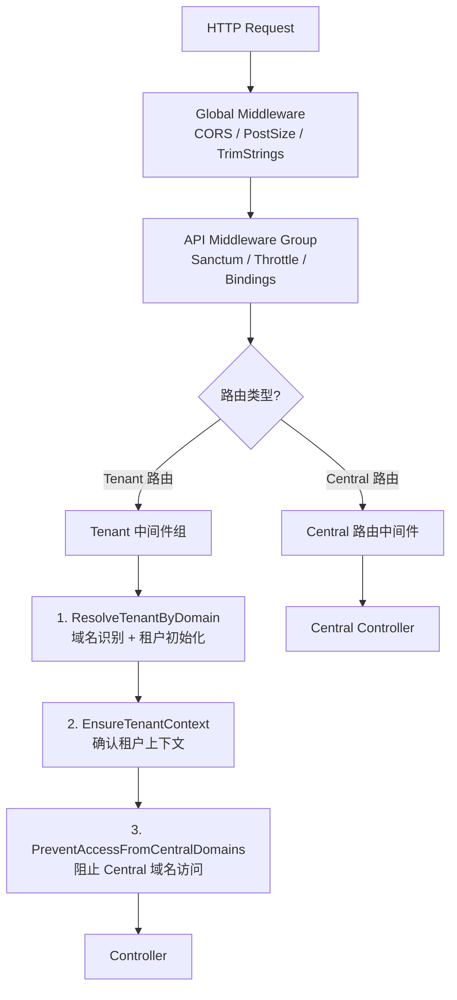

**执行顺序：**

1. **全局中间件** — CORS、请求体大小验证、字符串裁剪
2. **API 中间件组** — Sanctum 前端状态、限流、路由绑定
3. **租户中间件组**（仅 Tenant 路由）：
   - `ResolveTenantByDomain` — 域名识别 + 状态检查 + `tenancy()->initialize()`
   - `EnsureTenantContext` — 确保初始化成功
   - `PreventAccessFromCentralDomains` — 阻止 Central 域名访问 Tenant 路由
4. **业务中间件 + Controller**

---

## 附录：关键文件索引

| 文件 | 说明 |
|------|------|
| `config/tenancy.php` | stancl/tenancy 主配置 |
| `config/database.php` | 数据库连接配置（central/tenant） |
| `app/Providers/TenancyServiceProvider.php` | 事件/中间件/路由注册 |
| `app/Http/Kernel.php` | 中间件别名注册 |
| `app/Http/Middleware/ResolveTenantByDomain.php` | 域名→租户识别核心中间件 |
| `app/Http/Middleware/EnsureTenantContext.php` | 租户上下文安全守卫 |
| `app/Http/Middleware/PreventAccessFromTenantDomains.php` | Central 路由保护 |
| `app/Services/StoreProvisioningService.php` | 站点创建/销毁服务 |
| `app/Jobs/ProvisionStoreJob.php` | 异步站点创建 Job |
| `app/Events/StoreProvisioned.php` | 站点创建成功事件 |
| `app/Events/StoreProvisionFailed.php` | 站点创建失败事件 |
| `app/Events/StoreDeprovisioned.php` | 站点删除事件 |
| `app/Exceptions/StoreProvisioningException.php` | 站点创建异常（含错误码） |
| `database/migrations/central/` | Central DB 迁移（13 个） |
| `database/migrations/tenant/` | Tenant DB 迁移（19 个） |

---

## Phase M2 商户管理核心架构

> **版本**: v2.0  
> **日期**: 2026-04-17  
> **里程碑**: Phase M2 — 商户管理核心功能

---

### 1. 商户认证体系

Phase M2 为商户后台引入独立的第三套 Sanctum Guard，与平台管理的 `admin` guard 和前台的 `web` guard 完全隔离。

**Guard 配置（`config/auth.php`）：**

```php
// Guards
'merchant' => [
    'driver'   => 'sanctum',
    'provider' => 'merchant_users',
],

// Providers
'merchant_users' => [
    'driver' => 'eloquent',
    'model'  => App\Models\Central\MerchantUser::class,
],
```

**认证相关控制器：**

| 控制器 | 路由可见性 | 职责 |
|--------|-----------|------|
| `RegisterController` | 公开（无需认证） | 商户注册（创建商户 + 主账号） |
| `AuthController` | login 公开，其余需认证 | login / logout / me / refresh |

**LoginRequest 验证规则：**

```php
'email'    => ['required', 'email'],
'password' => ['required', 'string', 'min:8'],
```

**认证流程：**

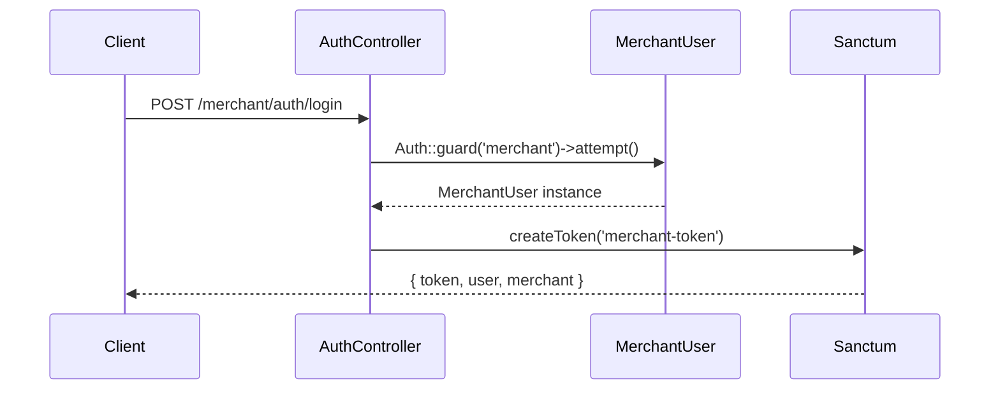

---

### 2. 商户 CRUD 与状态管理

**MerchantService 方法清单：**

| 方法 | 说明 |
|------|------|
| `register(array $data)` | 商户注册（创建 Merchant + 主账号 MerchantUser） |
| `getMerchant(int $id)` | 获取商户详情（含关联数据） |
| `updateMerchant(Merchant $merchant, array $data)` | 更新商户基本信息 |
| `listMerchants(array $filters)` | 分页列表（支持状态/等级/关键词过滤） |
| `changeStatus(Merchant $merchant, int $status, ?string $reason)` | 变更商户状态 |
| `updateLevel(Merchant $merchant, string $level)` | 升降级（含配额校验） |
| `review(Merchant $merchant, string $action, ?string $note)` | 审核（approve/reject/request_info） |

**商户状态整型映射：**

| 整型值 | 字符串常量 | 含义 |
|--------|-----------|------|
| 0 | `pending` | 待审核 |
| 1 | `active` | 正常运营 |
| 2 | `suspended` | 暂停（临时限制） |
| 3 | `banned` | 永久封禁 |
| 4 | `reviewing` | 审核中 |
| 5 | `rejected` | 审核拒绝 |

**等级站点配额上限：**

| 等级 | 最大站点数 |
|------|----------|
| `starter` | 2 |
| `standard` | 5 |
| `advanced` | 10 |
| `vip` | 无限制（null） |

---

### 3. 站点管理

**StoreService 职责：**

`StoreService` 是站点管理的统一门面，封装 `StoreProvisioningService`（底层创建/销毁）并提供完整的 CRUD 与配置管理能力。

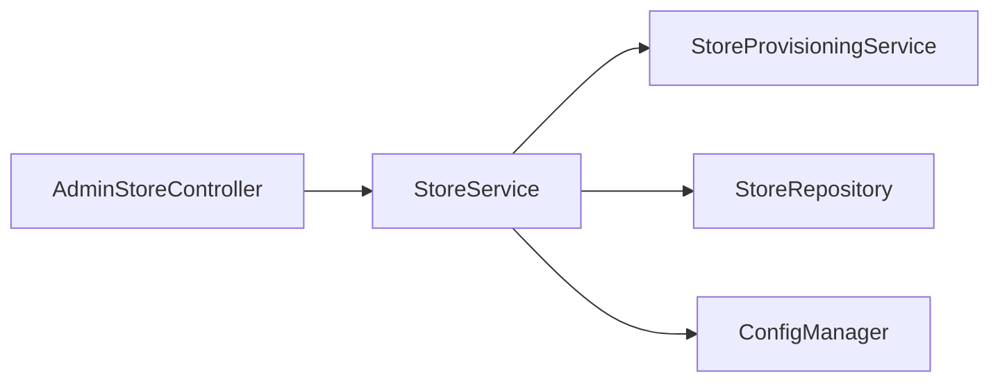

**Admin StoreController 接口（共 14 个）：**

| # | Method | URI | 说明 |
|---|--------|-----|------|
| 1 | GET | `/admin/merchants/{merchant}/stores` | 列出商户所有站点 |
| 2 | POST | `/admin/merchants/{merchant}/stores` | 为商户创建站点 |
| 3 | GET | `/admin/merchants/{merchant}/stores/{store}` | 站点详情 |
| 4 | PUT | `/admin/merchants/{merchant}/stores/{store}` | 更新站点基本信息 |
| 5 | DELETE | `/admin/merchants/{merchant}/stores/{store}` | 删除（下线）站点 |
| 6 | POST | `/admin/merchants/{merchant}/stores/{store}/activate` | 激活站点 |
| 7 | POST | `/admin/merchants/{merchant}/stores/{store}/deactivate` | 停用站点 |
| 8 | POST | `/admin/merchants/{merchant}/stores/{store}/maintenance` | 进入维护模式 |
| 9 | GET | `/admin/merchants/{merchant}/stores/{store}/config` | 获取站点配置 |
| 10 | PUT | `/admin/merchants/{merchant}/stores/{store}/config` | 更新站点配置 |
| 11 | GET | `/admin/merchants/{merchant}/stores/{store}/domains` | 获取域名列表 |
| 12 | POST | `/admin/merchants/{merchant}/stores/{store}/domains` | 添加域名 |
| 13 | DELETE | `/admin/merchants/{merchant}/stores/{store}/domains/{domain}` | 移除域名 |
| 14 | GET | `/admin/stores` | 全平台站点列表（可跨商户过滤） |

**站点归属验证：** 所有 `{store}` 路由参数均通过路由模型绑定校验 `store.merchant_id === merchant.id`，防止越权访问。

---

### 4. RSA 密钥管理

**MerchantKeyService 核心机制：**

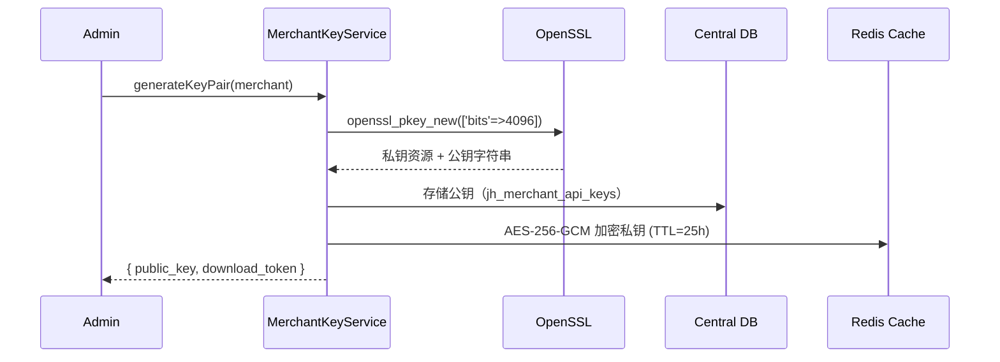

**私钥安全存储策略：**

| 数据 | 存储位置 | 说明 |
|------|---------|------|
| 公钥 | Central DB（`jh_merchant_api_keys`） | 明文存储，用于验签 |
| 私钥 | Redis Cache（AES-256-GCM 加密） | TTL=25h，**不落库** |
| 下载令牌 | Redis Cache | SHA-256 哈希，一次性使用，24h 有效 |

**密钥轮换流程：**

```
旧密钥 → 状态变更为 rotating
        ↓
生成新密钥对 → 新密钥 active
        ↓
旧密钥进入 Grace Period（24h）
        ↓
24h 后旧密钥标记 revoked（定时任务清理）
```

---

### 5. 商户审核流程

**MerchantService::review() 审核动作：**

| 动作 | 触发条件 | 后续操作 |
|------|---------|----------|
| `approve` | 审核通过 | 状态 → `active`，自动创建商户专属数据库 |
| `reject` | 审核拒绝 | 状态 → `rejected`，记录拒绝原因 |
| `request_info` | 需补充资料 | 状态 → `reviewing`，向商户发送通知 |

**approve 时的自动数据库创建：**

`MerchantService::approve()` 调用 `MerchantDatabaseService::createMerchantDatabase(merchant)` 自动创建商户专属数据库 `jerseyholic_merchant_{id}`，该库包含以下基础表：

| 表名 | 说明 |
|------|------|
| `master_products` | 商品主数据（平台侧） |
| `master_product_translations` | 商品多语言翻译 |
| `sync_rules` | 商品同步规则配置 |

**审核日志：** 每次 `review()` 操作均写入 `MerchantAuditLog`，记录操作人、动作、备注及时间戳。

---

### 6. 权限隔离

**MerchantStoreAccess 中间件工作原理：**

文件：`app/Http/Middleware/MerchantStoreAccess.php`

该中间件实现三级 `store_id` 获取策略，确保商户只能访问自己名下的站点：

```mermaid
graph TB
    Request --> Step1{1. 路由参数<br/>route('store_id')}
    Step1 -->|有| Validate
    Step1 -->|无| Step2{2. X-Store-Id Header}
    Step2 -->|有| Validate
    Step2 -->|无| Step3{3. query/body store_id}
    Step3 -->|有| Validate
    Step3 -->|无| Error403[403 STORE_ID_REQUIRED]
    Validate --> CheckOwner{store.merchant_id<br/>== auth merchant?}
    CheckOwner -->|是| CheckPerm{用户权限检查}
    CheckOwner -->|否| Error403B[403 STORE_ACCESS_DENIED]
    CheckPerm -->|通过| Inject[注入 current_store<br/>+ current_merchant]
    CheckPerm -->|失败| Error403C[403 PERMISSION_DENIED]
    Inject --> Next[next(request)]
```

**注入的请求属性：**

```php
$request->attributes->set('current_store', $store);
$request->attributes->set('current_merchant', $merchant);
```

---

### 7. 状态级联

**MerchantStatusCascadeService 行为矩阵：**

| 商户状态变更 | 站点影响 | API 密钥 | 资金 |
|------------|---------|---------|------|
| → `suspended` | 所有站点 → `maintenance` | 不吊销 | 不冻结 |
| → `banned` | 所有站点 → `inactive` | 全部吊销 | 冻结 180 天 |

**handleReactivation() 恢复逻辑：**

```php
// 商户从 suspended 恢复 → active
public function handleReactivation(Merchant $merchant): void
{
    // maintenance 状态的站点 → active
    $merchant->stores()
        ->where('status', 'maintenance')
        ->update(['status' => 'active']);

    // 注意：已吊销(revoked)的 API 密钥不自动恢复
    // 商户需重新申请新密钥
}
```

---

### 8. 跨租户聚合查询

**DashboardController — 数据聚合：**

使用 `Store::run()` 在每个可访问站点的 Tenant 上下文中执行查询，将结果聚合后返回：

```php
$result = [];
foreach ($merchant->stores as $store) {
    $store->run(function () use (&$result, $store) {
        $result[$store->id] = [
            'orders_count'   => Order::count(),
            'revenue_today'  => Order::whereDate('created_at', today())->sum('total'),
            // ...
        ];
    });
}
```

**OrderController — 跨站点查询：**

| 场景 | 参数 | 行为 |
|------|------|------|
| 单站点查询 | `store_id=N` | 切换到指定站点 Tenant 上下文查询 |
| 跨站点聚合 | 无 `store_id` | 遍历商户所有站点，合并分页结果 |

分页响应字段统一使用 `list`（非 `data`）：

```json
{
  "list": [...],
  "total": 100,
  "page": 1,
  "per_page": 20
}
```

**单站点异常降级：** 单个站点查询失败时记录错误日志，跳过该站点继续聚合其他站点数据，不中断整体响应。

---

### 9. 商户子账号管理

**MerchantUserService 方法清单：**

| 方法 | 说明 |
|------|------|
| `createUser(Merchant $merchant, array $data)` | 创建子账号 |
| `updateUser(MerchantUser $user, array $data)` | 更新子账号信息 |
| `deleteUser(MerchantUser $user)` | 删除子账号 |
| `listUsers(Merchant $merchant, array $filters)` | 子账号列表 |
| `assignRole(MerchantUser $user, string $role)` | 分配角色 |
| `revokeRole(MerchantUser $user, string $role)` | 撤销角色 |
| `getPermissions(MerchantUser $user)` | 获取用户权限列表 |
| `syncPermissions(MerchantUser $user, array $permissions)` | 同步权限 |

**UserController 端点（共 8 个）：**

| # | Method | URI | 说明 |
|---|--------|-----|------|
| 1 | GET | `/merchant/users` | 子账号列表 |
| 2 | POST | `/merchant/users` | 创建子账号 |
| 3 | GET | `/merchant/users/{user}` | 子账号详情 |
| 4 | PUT | `/merchant/users/{user}` | 更新子账号 |
| 5 | DELETE | `/merchant/users/{user}` | 删除子账号 |
| 6 | POST | `/merchant/users/{user}/roles` | 分配角色 |
| 7 | DELETE | `/merchant/users/{user}/roles/{role}` | 撤销角色 |
| 8 | PUT | `/merchant/users/{user}/permissions` | 同步权限 |

---

## 附录（Phase M2）：关键文件索引

| 文件 | 说明 |
|------|------|
| `config/auth.php` | merchant guard + merchant_users provider 配置 |
| `app/Http/Controllers/Merchant/Auth/RegisterController.php` | 商户公开注册 |
| `app/Http/Controllers/Merchant/Auth/AuthController.php` | login / logout / me / refresh |
| `app/Http/Requests/Merchant/Auth/LoginRequest.php` | 登录请求验证 |
| `app/Services/MerchantService.php` | 商户 CRUD / 状态 / 审核 |
| `app/Services/MerchantDatabaseService.php` | 商户专属库自动创建 |
| `app/Services/StoreService.php` | 站点 CRUD + 配置管理（封装 StoreProvisioningService） |
| `app/Services/MerchantKeyService.php` | RSA-4096 密钥对生成与轮换 |
| `app/Services/MerchantStatusCascadeService.php` | 状态级联（suspended/banned） |
| `app/Services/MerchantUserService.php` | 子账号 CRUD + 角色权限 |
| `app/Http/Controllers/Admin/StoreController.php` | Admin 站点管理（14 个接口） |
| `app/Http/Controllers/Merchant/UserController.php` | 子账号管理（8 个端点） |
| `app/Http/Controllers/Merchant/DashboardController.php` | 跨租户数据聚合 |
| `app/Http/Controllers/Merchant/OrderController.php` | 单/跨站点订单查询 |
| `app/Http/Middleware/MerchantStoreAccess.php` | 商户站点三级权限隔离中间件 |
| `app/Models/Central/MerchantAuditLog.php` | 商户审核日志 |

---

## Phase M3 支付与结算架构

> **版本**: v3.0  
> **日期**: 2026-04-17  
> **里程碑**: Phase M3 — 支付与结算核心架构

---

### 1. 支付网关架构

系统采用 **工厂模式 + 策略模式** 实现支付网关的可扩展设计，通过 `PaymentGatewayFactory` 根据订单的 `pay_method` 字段动态创建对应的支付网关实例。

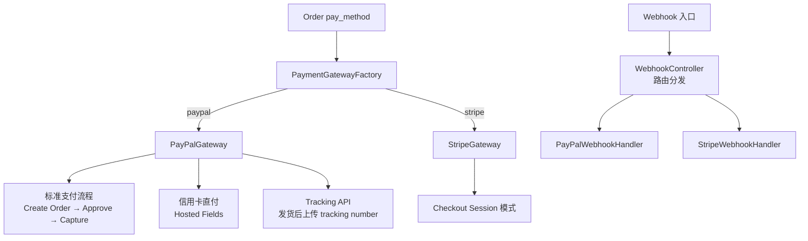

**PayPalGateway 支付流程：**

| 步骤 | 操作 | 说明 |
|------|------|------|
| 1 | Create Order | 调用 PayPal REST API v2 创建订单，返回 approval URL |
| 2 | Approve | 买家在 PayPal 页面授权付款 |
| 3 | Capture | 商户捕获付款，资金到账 |
| 4 | Tracking | 发货后通过 Tracking API 上传物流信息 |

**StripeGateway 支付流程：**

通过 Stripe Checkout Session 模式，创建 Session 后重定向买家到 Stripe 托管支付页面，支付完成后通过 Webhook 通知。

**Webhook 统一处理：**

`WebhookController` 作为统一入口，根据请求路径 (`/webhook/paypal`, `/webhook/stripe`) 分发到对应的 Handler。每个 Handler 负责验签和业务逻辑处理。

---

### 2. 商品描述脱敏架构

**PayPalDescriptionService** 实现三层防护机制，确保支付时传递给 PayPal 的商品描述不包含敏感品牌信息：

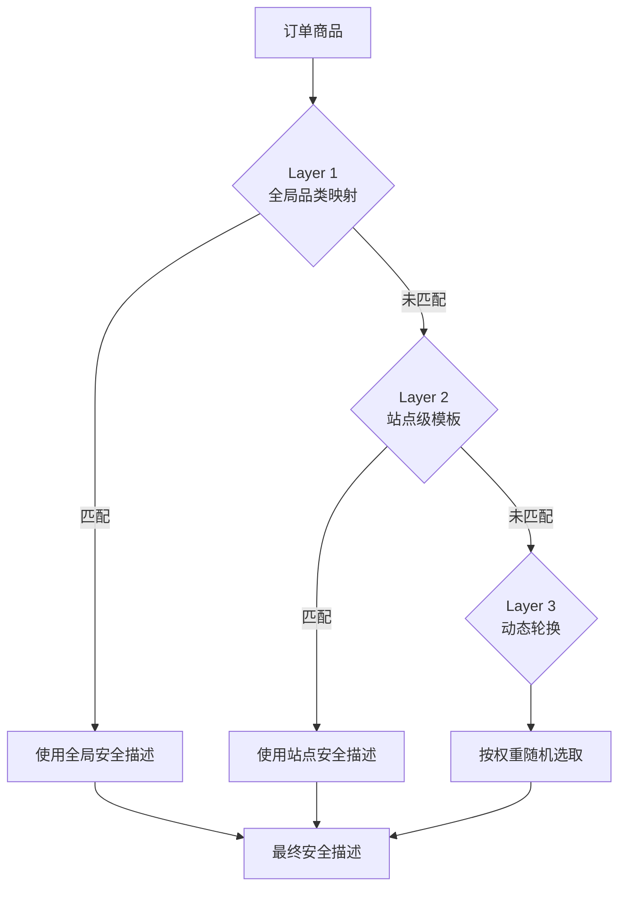

**三层防护说明：**

| 层级 | 数据来源 | 说明 |
|------|---------|------|
| Layer 1 — 全局品类映射 | `jh_paypal_safe_descriptions WHERE store_id IS NULL` | 平台级默认安全描述，适用于所有站点 |
| Layer 2 — 站点级模板 | `jh_paypal_safe_descriptions WHERE store_id = X` | 站点自定义安全描述，优先于全局 |
| Layer 3 — 动态轮换 | 同表按 `weight` 权重随机选取 | 防止 PayPal 检测到固定描述模式 |

> **优先级规则**：站点级描述 > 全局描述。当同一品类在站点级和全局级都有配置时，优先使用站点级。

---

### 3. 选号算法架构

**ElectionService** 实现完整的 8 层筛选流程，为每笔交易选择最优的 PayPal 支付账号：

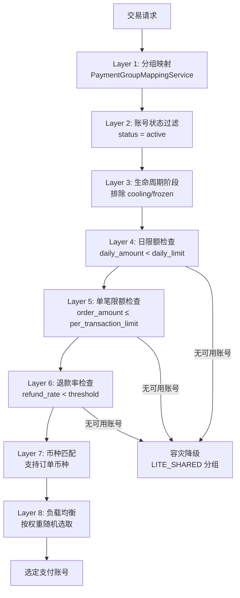

**PaymentGroupMappingService 三层映射：**

| 优先级 | 映射维度 | 说明 |
|--------|---------|------|
| 1（最高） | Domain → Group | 按域名精确匹配支付分组 |
| 2 | Merchant → Group | 按商户匹配支付分组 |
| 3（最低） | Default Group | 默认全局分组 |

**缓存策略：**
- Redis 缓存 TTL：5 分钟
- 缓存 Key：`election:group:{store_id}`
- 缓存失效：账号状态变更时主动清除

**容灾处理：**
- 主分组账号全部耗尽（限额/冷却/冻结）时，自动降级到 `LITE_SHARED` 共享分组
- `LITE_SHARED` 分组为平台级兜底分组，佣金比例较高

---

### 4. 账号温养策略

**AccountLifecycleService** 管理支付账号的全生命周期，实现 4 阶段自动流转：

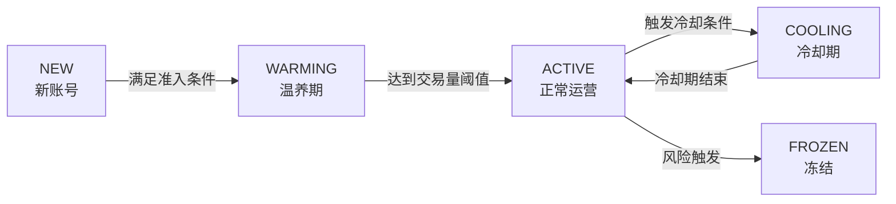

**4 阶段说明：**

| 阶段 | 限制 | 流转条件 |
|------|------|----------|
| NEW → WARMING | 仅小额交易（≤$50）、低频（≤3笔/天） | 完成 10 笔交易且无争议 |
| WARMING → ACTIVE | 逐步放开限额 | 累计交易额达 $500 |
| ACTIVE → COOLING | 暂停使用 | 日退款率超 2% 或连续投诉 |
| COOLING → ACTIVE | 冷却期 7-14 天 | 冷却期满且退款率恢复正常 |

**交易行为约束：**

| 约束项 | 规则 | 说明 |
|--------|------|------|
| 金额波动 | 相邻交易金额差 ≤ 30% | 避免触发 PayPal 异常检测 |
| 时间限频 | 同账号间隔 ≥ 3 分钟 | 模拟真实交易节奏 |
| IP 监控 | 同 IP 24h 内使用不同账号 ≤ 3 个 | 防止关联检测 |

**退款率实时监控与自动降级：**
- 实时计算 7 日滑动窗口退款率
- 退款率 > 1.5%：发送预警通知
- 退款率 > 2%：自动进入 COOLING 状态
- 退款率 > 5%：自动进入 FROZEN 状态

---

### 5. 佣金与结算架构

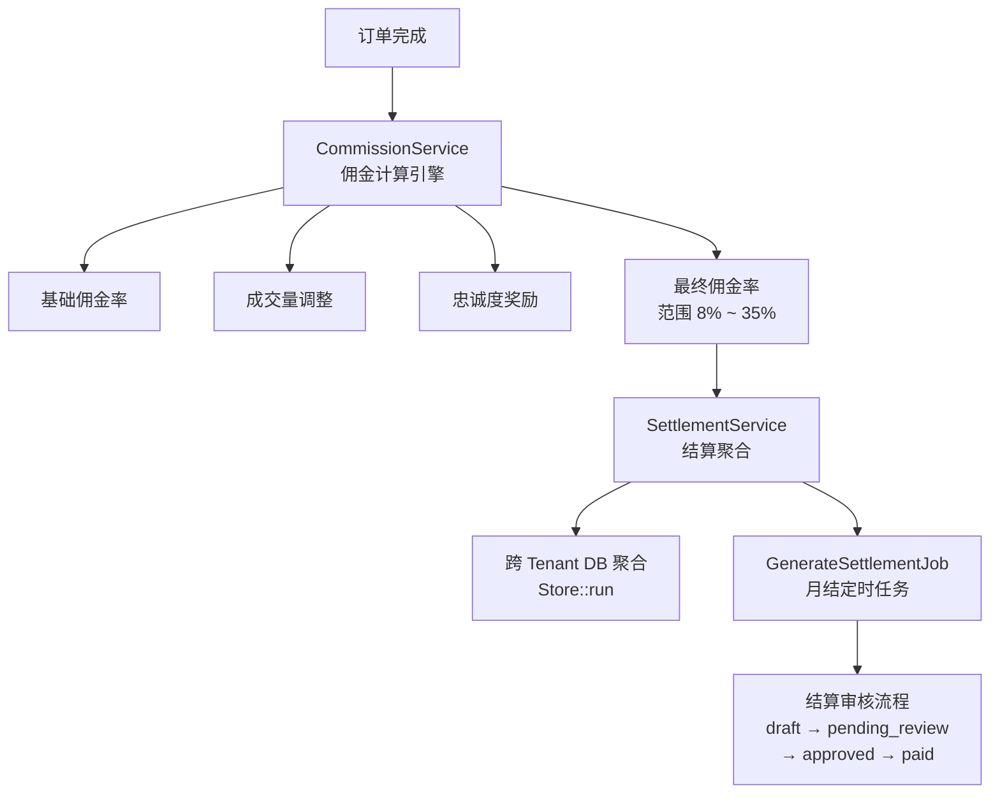

**CommissionService 佣金计算引擎：**

佣金率由三个维度叠加计算，最终范围限制在 `[8%, 35%]`：

| 维度 | 说明 | 影响 |
|------|------|------|
| 基础佣金率 | 由商户等级决定 | starter:20%, standard:18%, advanced:15%, vip:12% |
| 成交量调整 | 月成交量越高，佣金率越低 | 每 $10K 降 0.5%，最多降 5% |
| 忠诚度奖励 | 合作时长越久，佣金率越低 | 每满 6 个月降 0.5%，最多降 3% |

**SettlementService 结算聚合：**
- 使用 `Store::run()` 跨 Tenant DB 聚合查询各站点的订单和佣金数据
- 聚合结果写入 Central DB 的 `jh_settlement_records` 和 `jh_settlement_details`

**GenerateSettlementJob 月结定时任务：**
- 每月 1 号凌晨自动执行
- 汇总上月所有已完成订单的佣金
- 生成结算单（status = draft）

**结算审核流程：**

| 状态 | 说明 | 操作人 |
|------|------|--------|
| `draft` | 系统自动生成 | 系统 |
| `pending_review` | 提交审核 | 商户/系统 |
| `approved` | 审核通过 | 平台管理员 |
| `paid` | 已打款 | 平台财务 |

---

### 6. RSA 签名验证架构

**VerifyMerchantSignature 中间件** 仅应用于资金操作相关接口（支付、退款、结算），确保请求来源合法且数据未被篡改。

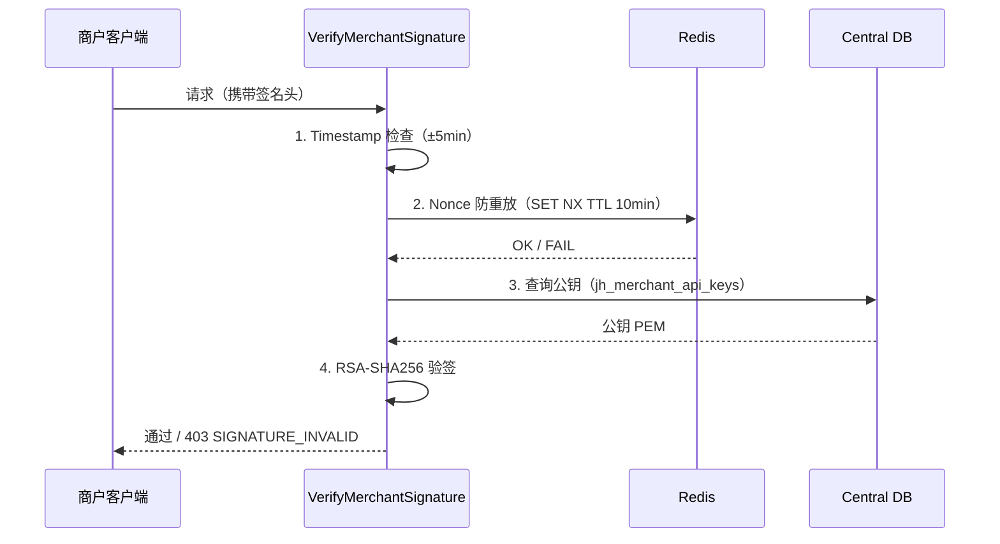

**验签流程四步骤：**

| 步骤 | 操作 | 失败响应 |
|------|------|----------|
| 1 | Timestamp 检查 | 时间戳与服务器时间差超 ±5 分钟 → 403 |
| 2 | Nonce 防重放 | Redis SET NX 失败（重复请求）→ 403 |
| 3 | 公钥查询 | 查找 merchant 的 active 密钥 |
| 4 | RSA-SHA256 验签 | 签名不匹配 → 403 |

**MerchantSignatureClient SDK：**
- 提供 Guzzle 中间件，自动为每个请求添加签名头
- 签名头包含：`X-Timestamp`、`X-Nonce`、`X-Key-Id`、`X-Signature`

---

### 7. 消息推送架构

**NotificationService** 提供双通道消息推送能力：站内通知 + 钉钉 Webhook。

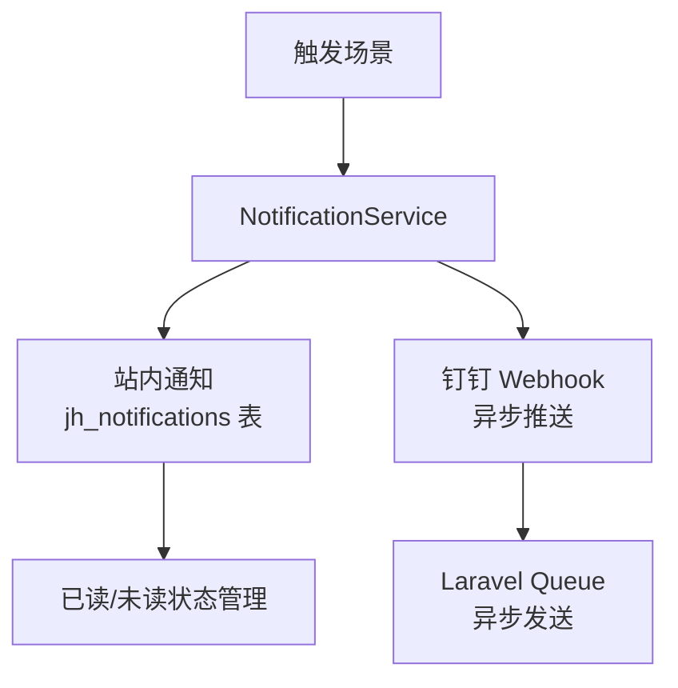

**触发场景：**

| 场景 | 通知渠道 | 优先级 |
|------|---------|--------|
| 风险告警（退款率超标/异常交易） | 站内 + 钉钉 | 高 |
| 结算提醒（结算单生成/审核通过/打款） | 站内 + 钉钉 | 中 |
| 账号异常（冷却/冻结/解冻） | 站内 + 钉钉 | 高 |
| 黑名单命中 | 站内 + 钉钉 | 紧急 |

**异步推送机制：** 所有外部推送（钉钉 Webhook）通过 Laravel Queue 异步发送，不阻塞主流程。

---

### 8. 风控架构

**MerchantRiskService** 实现 5 维度加权评分模型，实时评估商户风险等级：

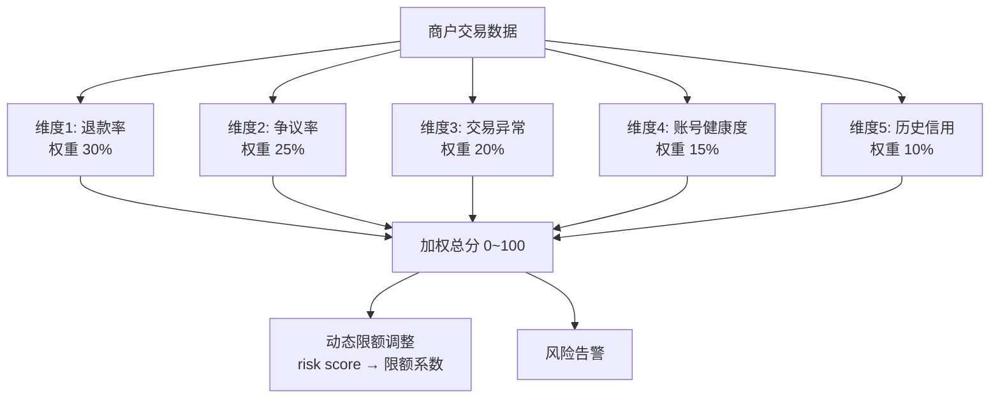

**5 维度评分模型：**

| 维度 | 权重 | 评分指标 |
|------|------|----------|
| 退款率 | 30% | 7 日/30 日退款率 |
| 争议率 | 25% | PayPal Dispute 比例 |
| 交易异常 | 20% | 金额异常、频率异常、IP 异常 |
| 账号健康度 | 15% | 账号年龄、验证状态、历史限制 |
| 历史信用 | 10% | 合作时长、累计交易额、历史违规次数 |

**动态限额调整：**

| Risk Score 范围 | 限额系数 | 说明 |
|----------------|---------|------|
| 0 ~ 30 | 1.0 | 正常限额 |
| 31 ~ 60 | 0.7 | 限额下调 30% |
| 61 ~ 80 | 0.4 | 限额下调 60% |
| 81 ~ 100 | 0.1 | 限额下调 90%（接近冻结）|

**BlacklistService 黑名单机制：**

| 触发方式 | 说明 |
|---------|------|
| 自动触发 | Risk Score ≥ 90 持续 24h 自动加入黑名单 |
| 手动干预 | 平台管理员手动添加/移除 |

**黑名单路由：** 命中黑名单的商户/IP/邮箱，其交易请求的支付账号自动路由到 `BLACKLIST_ISOLATED` 隔离分组，与正常账号池完全隔离。

---

### 附录（Phase M3）：关键文件索引

| 文件 | 说明 |
|------|------|
| `app/Services/Payment/PaymentGatewayFactory.php` | 支付网关工厂 |
| `app/Services/Payment/PayPalGateway.php` | PayPal 支付网关实现 |
| `app/Services/Payment/StripeGateway.php` | Stripe 支付网关实现 |
| `app/Http/Controllers/Webhook/WebhookController.php` | Webhook 统一入口 |
| `app/Services/Payment/PayPalWebhookHandler.php` | PayPal Webhook 处理 |
| `app/Services/Payment/StripeWebhookHandler.php` | Stripe Webhook 处理 |
| `app/Services/Payment/PayPalDescriptionService.php` | 商品描述脱敏服务 |
| `app/Services/Payment/ElectionService.php` | 支付账号选号服务 |
| `app/Services/Payment/PaymentGroupMappingService.php` | 支付分组映射服务 |
| `app/Services/Payment/AccountLifecycleService.php` | 账号生命周期管理 |
| `app/Services/CommissionService.php` | 佣金计算引擎 |
| `app/Services/SettlementService.php` | 结算聚合服务 |
| `app/Jobs/GenerateSettlementJob.php` | 月结定时任务 |
| `app/Http/Middleware/VerifyMerchantSignature.php` | RSA 签名验证中间件 |
| `app/Services/MerchantSignatureClient.php` | 商户签名 SDK |
| `app/Services/NotificationService.php` | 消息推送服务 |
| `app/Services/MerchantRiskService.php` | 风控评分服务 |
| `app/Services/BlacklistService.php` | 黑名单服务 |

