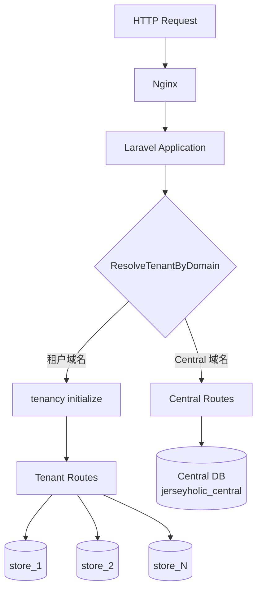
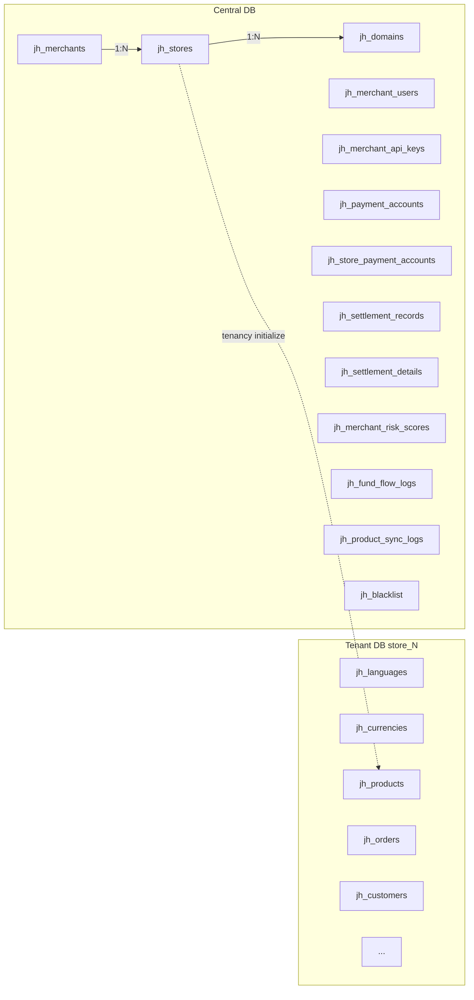
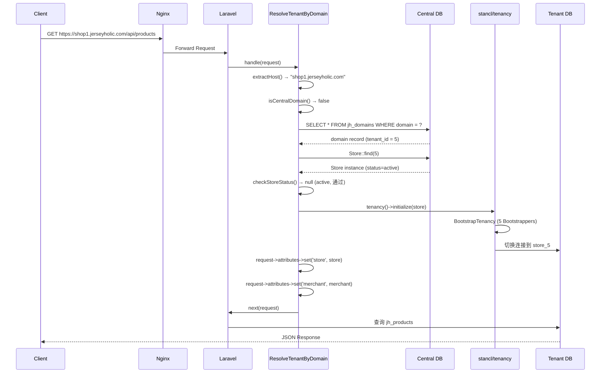
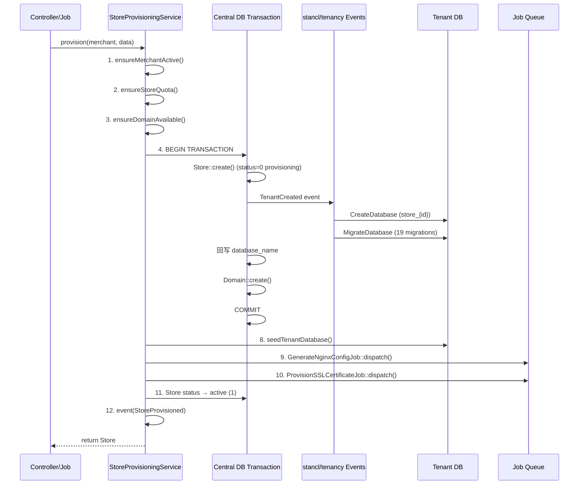
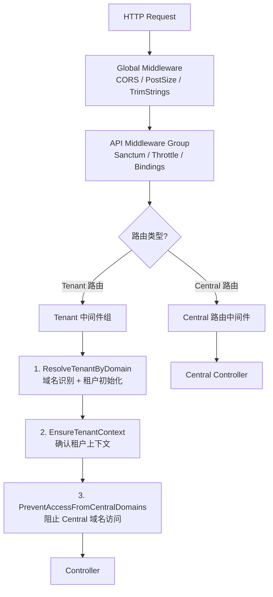

# JerseyHolic 多租户架构实现文档

> **版本**: v1.0  
> **日期**: 2026-04-17  
> **里程碑**: Phase M1 — 多租户基础架构  
> **核心依赖**: stancl/tenancy ^3.8

---

## 目录

1. [架构总览](#1-架构总览)
2. [stancl/tenancy v3 集成配置](#2-stancltenancy-v3-集成配置)
3. [Central DB 与 Tenant DB 分离架构](#3-central-db-与-tenant-db-分离架构)
4. [域名→站点→数据库自动识别与切换机制](#4-域名站点数据库自动识别与切换机制)
5. [StoreProvisioningService 实现细节](#5-storeprovisioningservice-实现细节)
6. [租户识别中间件工作原理](#6-租户识别中间件工作原理)

---

## 1. 架构总览

JerseyHolic 采用 **database-per-tenant** 多租户架构，基于 `stancl/tenancy v3` 实现。每个商户站点（Store）拥有独立数据库，平台管理数据存储在中央数据库中。



**核心设计决策：**

| 决策项 | 选择 | 理由 |
|--------|------|------|
| 多租户包 | stancl/tenancy ^3.8 | 功能完整，自动化程度最高，社区活跃 |
| 隔离模式 | database-per-tenant | 完全数据隔离，独立备份/恢复 |
| 租户模型 | `App\Models\Central\Store` | 每个站点即一个租户 |
| 域名识别 | 自定义 `ResolveTenantByDomain` 中间件 | 支持状态检查、Central 域名跳过 |
| 数据库命名 | `store_{id}` | 配置 `tenancy.database.prefix = 'store_'` |
| 表前缀 | `jh_` | Central 和 Tenant 库统一使用 |

---

## 2. stancl/tenancy v3 集成配置

### 2.1 Composer 依赖

```json
// api/composer.json
"stancl/tenancy": "^3.8"
```

### 2.2 租户配置 (`config/tenancy.php`)

**Tenant Model：**

```php
'tenant_model' => App\Models\Central\Store::class,
```

Store 模型同时作为 stancl/tenancy 的 Tenant 契约实现，对应 Central DB 的 `jh_stores` 表。

**Domain Model：**

```php
'domain_model' => \App\Models\Central\Domain::class,
```

**Central 域名（不触发租户识别）：**

```php
'central_domains' => [
    env('CENTRAL_DOMAIN', 'admin.jerseyholic.com'),
    'localhost',
    '127.0.0.1',
],
```

**Bootstrappers（租户初始化引导器）：**

当租户被识别后，以下引导器依次执行：

| Bootstrapper | 职责 |
|-------------|------|
| `DatabaseTenancyBootstrapper` | 切换数据库连接到租户库 |
| `CacheTenancyBootstrapper` | 缓存 key 前缀隔离（tag: `tenant_{id}`） |
| `QueueTenancyBootstrapper` | 队列任务自动携带租户上下文 |
| `FilesystemTenancyBootstrapper` | 文件系统路径隔离 |
| `RedisTenancyBootstrapper` | Redis key 前缀隔离 |

**数据库命名规则：**

```php
'database' => [
    'central_connection'        => env('TENANCY_CENTRAL_CONNECTION', 'central'),
    'template_tenant_connection' => 'tenant',
    'prefix' => 'store_',
    'suffix' => '',
],
```

生成规则：`store_` + `tenant_id` → 如 `store_1`, `store_2`

**迁移与 Seed 配置：**

```php
'migration_parameters' => [
    '--path'     => [database_path('migrations/tenant')],
    '--realpath' => true,
],
'seeder_parameters' => [
    '--class' => 'Database\Seeders\TenantDatabaseSeeder',
],
```

**资源隔离配置：**

```php
// 缓存隔离
'cache' => ['tag_base' => 'tenant_'],

// 文件系统隔离
'filesystem' => [
    'suffix_base'          => 'tenant',
    'disks'                => ['local', 'public'],
    'root_override'        => [
        'local'  => '%storage_path%/app/',
        'public' => '%storage_path%/app/public/',
    ],
    'suffix_storage_path'   => true,
    'asset_helper_tenancy'  => true,
],

// Redis 隔离
'redis' => [
    'prefix_base'          => 'tenant_',
    'prefixed_connections'  => ['default', 'cache'],
],
```

### 2.3 TenancyServiceProvider

文件：`app/Providers/TenancyServiceProvider.php`

职责：
1. **注册事件监听** — 租户生命周期事件（创建/删除/初始化/结束）
2. **注册中间件组** — `tenant` 中间件组
3. **配置路由** — 分离 Central 路由和 Tenant 路由

**事件→任务映射（关键部分）：**

```php
Events\TenantCreated::class => [
    JobPipeline::make([
        Jobs\CreateDatabase::class,    // 自动创建 Tenant DB
        Jobs\MigrateDatabase::class,   // 自动运行 Tenant 迁移
    ])->send(fn ($event) => $event->tenant)
      ->shouldBeQueued(false),  // 同步执行，不入队列
],

Events\TenantDeleted::class => [
    JobPipeline::make([
        Jobs\DeleteDatabase::class,    // 自动删除 Tenant DB
    ])->send(fn ($event) => $event->tenant)
      ->shouldBeQueued(false),
],

Events\TenancyInitialized::class => [
    Listeners\BootstrapTenancy::class,       // 执行所有 Bootstrappers
],

Events\TenancyEnded::class => [
    Listeners\RevertToCentralContext::class,  // 恢复 Central 上下文
],
```

**路由配置：**

```php
// Central 路由 — 绑定 Central 域名，不做租户初始化
Route::middleware(['api'])
    ->domain($centralDomain)
    ->group(base_path('routes/central.php'));

// Tenant 路由 — 带 'tenant' 中间件组，运行时动态识别租户
Route::middleware(['api', 'tenant'])
    ->group(base_path('routes/tenant.php'));
```

### 2.4 数据库连接配置 (`config/database.php`)

```php
'default' => env('DB_CONNECTION', 'central'),

'connections' => [
    // Central DB — 平台管理库
    'central' => [
        'driver'   => 'mysql',
        'database' => env('DB_DATABASE_CENTRAL', 'jerseyholic_central'),
        'prefix'   => 'jh_',
        // ...
    ],

    // Tenant DB 模板 — 由 stancl/tenancy 动态切换 database 值
    'tenant' => [
        'driver'   => 'mysql',
        'database' => null,  // 由 tenancy 动态设置
        'prefix'   => 'jh_',
        // ...
    ],
],
```

默认连接为 `central`，应用启动时操作 Central DB。当 `tenancy()->initialize($store)` 执行后，`tenant` 连接的 `database` 字段被动态替换为 `store_{id}`。

---

## 3. Central DB 与 Tenant DB 分离架构

### 3.1 架构示意图



### 3.2 Central DB 表清单

Central DB 名称：`jerseyholic_central`，表前缀：`jh_`

迁移文件位于：`database/migrations/central/`（共 13 个迁移）

| # | 迁移文件 | 表名 | 说明 |
|---|---------|------|------|
| 1 | `2026_04_16_100000_create_merchants_table` | `jh_merchants` | 商户主表 |
| 2 | `2026_04_16_100100_create_stores_table` | `jh_stores` | 站点/租户主表（Tenant Model） |
| 3 | `2026_04_16_100200_create_domains_table` | `jh_domains` | 域名绑定表（Domain Model） |
| 4 | `2026_04_16_100300_create_merchant_users_table` | `jh_merchant_users` | 商户后台用户 |
| 5 | `2026_04_16_100400_create_merchant_api_keys_table` | `jh_merchant_api_keys` | 商户 API 密钥 |
| 6 | `2026_04_16_100500_create_payment_accounts_table` | `jh_payment_accounts` | 支付账户 |
| 7 | `2026_04_16_100600_create_store_payment_accounts_table` | `jh_store_payment_accounts` | 站点↔支付账户关联 |
| 8 | `2026_04_16_100700_create_settlement_records_table` | `jh_settlement_records` | 结算记录 |
| 9 | `2026_04_16_100800_create_settlement_details_table` | `jh_settlement_details` | 结算明细 |
| 10 | `2026_04_16_100900_create_merchant_risk_scores_table` | `jh_merchant_risk_scores` | 商户风控评分 |
| 11 | `2026_04_16_101000_create_fund_flow_logs_table` | `jh_fund_flow_logs` | 资金流水日志 |
| 12 | `2026_04_16_101100_create_product_sync_logs_table` | `jh_product_sync_logs` | 商品同步日志 |
| 13 | `2026_04_16_101200_create_blacklist_table` | `jh_blacklist` | 黑名单 |

### 3.3 Tenant DB 表清单

Tenant DB 名称：`store_{id}`（每个站点独立库），表前缀：`jh_`

迁移文件位于：`database/migrations/tenant/`（共 19 个迁移）

| # | 迁移文件 | 表/表组 | 说明 |
|---|---------|---------|------|
| 1 | `000001_create_languages_table` | `jh_languages` | 语言配置 |
| 2 | `000002_create_currencies_table` | `jh_currencies` | 货币配置 |
| 3 | `000003_create_countries_table` | `jh_countries` | 国家/地区 |
| 4 | `000004_create_geo_zones_table` | `jh_geo_zones` | 地理区域 |
| 5 | `000005_create_settings_table` | `jh_settings` | 站点设置 |
| 6 | `000006_create_customers_table` | `jh_customers` | 客户主表 |
| 7 | `000007_create_customer_addresses_table` | `jh_customer_addresses` | 客户地址 |
| 8 | `000008_create_categories_table` | `jh_categories` + 翻译表 | 分类 |
| 9 | `000009_create_products_table` | `jh_products` + 翻译表 | 商品主表 |
| 10 | `000010_create_product_related_tables` | 商品关联表组 | 图片/属性/SKU/库存 等 |
| 11 | `000011_create_mapping_tables` | 映射表组 | 商品↔分类等映射 |
| 12 | `000012_create_orders_table` | `jh_orders` | 订单主表 |
| 13 | `000013_create_order_related_tables` | 订单关联表组 | 订单商品/历史/退款 等 |
| 14 | `000014_create_payment_records_table` | `jh_payment_records` | 支付记录 |
| 15 | `000015_create_shipping_tables` | 物流表组 | 配送方式/运费规则 |
| 16 | `000016_create_marketing_tables` | 营销表组 | 优惠券/促销活动 |
| 17 | `000017_create_fb_pixel_tables` | FB Pixel 表组 | Facebook 像素追踪 |
| 18 | `000018_create_content_tables` | 内容表组 | CMS 页面/Banner |
| 19 | `000019_create_risk_orders_table` | `jh_risk_orders` | 风险订单 |

---

## 4. 域名→站点→数据库自动识别与切换机制

### 4.1 完整流程时序图



### 4.2 ResolveTenantByDomain 中间件详解

文件：`app/Http/Middleware/ResolveTenantByDomain.php`

这是多租户识别的核心中间件，处理流程如下：

**Step 1 — 提取 Host**
```php
protected function extractHost(Request $request): string
{
    $host = $request->getHost(); // 已去除 port
    if (str_starts_with($host, 'www.')) {
        $host = substr($host, 4); // 去除 www 前缀
    }
    return strtolower($host);
}
```

**Step 2 — 检查是否为 Central 域名**

比对 `config('tenancy.central_domains')` 列表，如果匹配则直接跳过租户识别，请求进入 Central 路由。

**Step 3 — 查询 Central DB 的 `jh_domains` 表**
```php
DB::connection('central')
    ->table('domains')
    ->where('domain', $host)
    ->first();
```

**Step 4 — 获取 Store 实例**

通过 `domain_record->tenant_id` 查找 Store 模型。

**Step 5 — 检查 Store 状态**

| 状态 | HTTP 响应 | 错误码 |
|------|----------|--------|
| `active` | 正常通过 | — |
| `maintenance` | 503 | `STORE_MAINTENANCE` |
| `suspended` | 403 | `STORE_SUSPENDED` |
| 其他 | 404 | `STORE_NOT_FOUND` |

**Step 6 — 初始化租户上下文**
```php
$this->tenancy->initialize($store);
```
触发 `TenancyInitialized` 事件 → `BootstrapTenancy` 监听器 → 执行 5 个 Bootstrappers → 数据库/缓存/队列/文件系统/Redis 全部切换到租户上下文。

**Step 7 — 注入请求属性**
```php
$request->attributes->set('store', $store);
$request->attributes->set('tenant_id', $store->getKey());
$request->attributes->set('merchant', $store->merchant);
$request->attributes->set('merchant_id', $merchant?->getKey());
```

后续 Controller 可通过 `$request->attributes->get('store')` 获取当前租户信息。

### 4.3 EnsureTenantContext 中间件

文件：`app/Http/Middleware/EnsureTenantContext.php`

作为安全守卫，确保进入 Tenant 路由的请求已完成租户初始化：

```php
public function handle(Request $request, Closure $next): Response
{
    if (!tenancy()->initialized) {
        return response()->json([
            'success'    => false,
            'message'    => 'Tenant context is required to access this resource.',
            'error_code' => 'TENANT_CONTEXT_REQUIRED',
        ], 403);
    }
    return $next($request);
}
```

### 4.4 PreventAccessFromTenantDomains 中间件

文件：`app/Http/Middleware/PreventAccessFromTenantDomains.php`

防止租户域名访问 Central 管理路由。仅允许 Central 域名（如 `admin.jerseyholic.com`）访问平台管理 API。

```php
if (!$this->isCentralDomain($host)) {
    // 返回 404，错误码 CENTRAL_ONLY
}
```

---

## 5. StoreProvisioningService 实现细节

文件：`app/Services/StoreProvisioningService.php`

### 5.1 provision() — 站点创建全流程



**详细步骤说明：**

| 步骤 | 操作 | 说明 |
|------|------|------|
| 1 | `ensureMerchantActive()` | 检查商户状态是否为 active |
| 2 | `ensureStoreQuota()` | 检查商户等级配额（starter:2, standard:5, advanced:10, vip:无限） |
| 3 | `ensureDomainAvailable()` | 检查域名是否已被其他站点占用 |
| 4 | `DB::connection('central')->transaction()` | 开启 Central DB 事务 |
| 5 | `Store::create()` | 创建 Store 记录（status=0，触发 stancl `TenantCreated` 事件） |
| 6 | stancl 自动执行 | `CreateDatabase` + `MigrateDatabase`（同步，非队列） |
| 7 | `Domain::create()` | 创建域名记录（certificate_status=pending） |
| 8 | `seedTenantDatabase()` | 在 Tenant 上下文中运行 `TenantDatabaseSeeder`（失败不阻塞） |
| 9 | `GenerateNginxConfigJob::dispatch()` | 异步生成 Nginx 配置 |
| 10 | `ProvisionSSLCertificateJob::dispatch()` | 异步申请 SSL 证书 |
| 11 | `Store::update(['status' => 1])` | 更新状态为 active |
| 12 | `event(StoreProvisioned)` | 触发站点创建成功事件 |

**商户等级配额：**

```php
protected const STORE_QUOTA = [
    'starter'  => 2,
    'standard' => 5,
    'advanced' => 10,
    'vip'      => null, // 不限
];
```

**错误处理：**

- 业务异常（`StoreProvisioningException`）：直接抛出，触发 `StoreProvisionFailed` 事件
- 意外异常：标记 Store 状态为 `-1`（provisioning_failed），触发 `StoreProvisionFailed` 事件后包装为 `StoreProvisioningException` 抛出

### 5.2 deprovision() — 站点删除流程

```php
public function deprovision(Store $store): bool
```

| 步骤 | 操作 | 说明 |
|------|------|------|
| 1 | `checkPendingOrders()` | 在 Tenant 上下文检查未完成订单（status 0/1） |
| 2 | `$store->update(['status' => 0])` | 标记为 inactive |
| 3 | `$store->delete()` | 软删除 Store 记录 |
| 4 | `domains()->update(...)` | 域名标记为 inactive |
| 5 | — | 不立即删除 Tenant DB（保留 30 天后由定时任务清理） |
| 6 | `event(StoreDeprovisioned)` | 触发站点删除事件 |

> **设计决策**：使用软删除而非硬删除，不触发 stancl 的 `TenantDeleted` 事件，因此不会自动删除数据库。数据库保留 30 天作为安全缓冲期。

### 5.3 ProvisionStoreJob — 异步队列化

文件：`app/Jobs/ProvisionStoreJob.php`

将 `provision()` 放入队列执行，适用于批量创建场景。

```php
class ProvisionStoreJob implements ShouldQueue
{
    public int $tries   = 3;          // 最多重试 3 次
    public int $timeout = 300;        // 超时 5 分钟
    public array $backoff = [10, 30, 60]; // 递增重试间隔

    public function __construct(int $merchantId, array $storeData)
    {
        $this->onQueue('provisioning'); // 使用独立队列
    }
}
```

失败处理：自动查找已部分创建的 Store，标记状态为 `-1`，触发 `StoreProvisionFailed` 事件。

### 5.4 事件系统

| 事件 | 触发时机 | 携带数据 |
|------|---------|---------|
| `StoreProvisioned` | provision() 全流程完成 | `Store $store` |
| `StoreProvisionFailed` | provision() 过程中异常 | `?Store $store`, `Throwable $exception`, `array $context` |
| `StoreDeprovisioned` | deprovision() 完成 | `Store $store` |

### 5.5 StoreProvisioningException 错误码

| 常量 | 错误码 | 说明 |
|------|--------|------|
| `MERCHANT_INACTIVE` | `MERCHANT_INACTIVE` | 商户未激活 |
| `QUOTA_EXCEEDED` | `QUOTA_EXCEEDED` | 站点配额已满 |
| `DOMAIN_TAKEN` | `DOMAIN_TAKEN` | 域名已被占用 |
| `DB_CREATION_FAILED` | `DB_CREATION_FAILED` | 数据库创建失败 |
| `MIGRATION_FAILED` | `MIGRATION_FAILED` | 迁移执行失败 |
| `SEED_FAILED` | `SEED_FAILED` | Seeder 执行失败 |
| `HAS_PENDING_ORDERS` | `HAS_PENDING_ORDERS` | 站点有未完成订单，无法删除 |

提供工厂方法便捷创建：`merchantInactive()`, `quotaExceeded()`, `domainTaken()`, `dbCreationFailed()`, `migrationFailed()`, `hasPendingOrders()`

---

## 6. 租户识别中间件工作原理

### 6.1 三个中间件的职责分工

| 中间件 | 别名 | 职责 | 应用范围 |
|--------|------|------|---------|
| `ResolveTenantByDomain` | `tenant` | 从请求域名识别租户，初始化租户上下文，注入 store/merchant 信息 | Tenant 路由 |
| `EnsureTenantContext` | `ensure.tenant` | 安全守卫，确保租户上下文已初始化 | Tenant 路由 |
| `PreventAccessFromTenantDomains` | `central.only` | 阻止租户域名访问 Central 管理路由 | Central 路由 |

### 6.2 中间件注册方式

**Kernel.php 别名注册：**

```php
// app/Http/Kernel.php
protected $middlewareAliases = [
    // ... 其他中间件
    'tenant'        => \App\Http\Middleware\ResolveTenantByDomain::class,
    'ensure.tenant' => \App\Http\Middleware\EnsureTenantContext::class,
    'central.only'  => \App\Http\Middleware\PreventAccessFromTenantDomains::class,
];
```

**TenancyServiceProvider 中间件组注册：**

```php
// app/Providers/TenancyServiceProvider.php
Route::middlewareGroup('tenant', [
    ResolveTenantByDomain::class,
    EnsureTenantContext::class,
    Middleware\PreventAccessFromCentralDomains::class, // stancl 内置
]);
```

### 6.3 中间件在请求生命周期中的位置



**执行顺序：**

1. **全局中间件** — CORS、请求体大小验证、字符串裁剪
2. **API 中间件组** — Sanctum 前端状态、限流、路由绑定
3. **租户中间件组**（仅 Tenant 路由）：
   - `ResolveTenantByDomain` — 域名识别 + 状态检查 + `tenancy()->initialize()`
   - `EnsureTenantContext` — 确保初始化成功
   - `PreventAccessFromCentralDomains` — 阻止 Central 域名访问 Tenant 路由
4. **业务中间件 + Controller**

---

## 附录：关键文件索引

| 文件 | 说明 |
|------|------|
| `config/tenancy.php` | stancl/tenancy 主配置 |
| `config/database.php` | 数据库连接配置（central/tenant） |
| `app/Providers/TenancyServiceProvider.php` | 事件/中间件/路由注册 |
| `app/Http/Kernel.php` | 中间件别名注册 |
| `app/Http/Middleware/ResolveTenantByDomain.php` | 域名→租户识别核心中间件 |
| `app/Http/Middleware/EnsureTenantContext.php` | 租户上下文安全守卫 |
| `app/Http/Middleware/PreventAccessFromTenantDomains.php` | Central 路由保护 |
| `app/Services/StoreProvisioningService.php` | 站点创建/销毁服务 |
| `app/Jobs/ProvisionStoreJob.php` | 异步站点创建 Job |
| `app/Events/StoreProvisioned.php` | 站点创建成功事件 |
| `app/Events/StoreProvisionFailed.php` | 站点创建失败事件 |
| `app/Events/StoreDeprovisioned.php` | 站点删除事件 |
| `app/Exceptions/StoreProvisioningException.php` | 站点创建异常（含错误码） |
| `database/migrations/central/` | Central DB 迁移（13 个） |
| `database/migrations/tenant/` | Tenant DB 迁移（19 个） |

