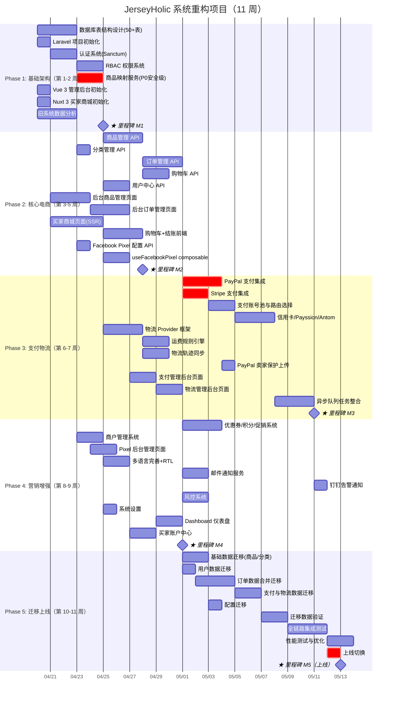
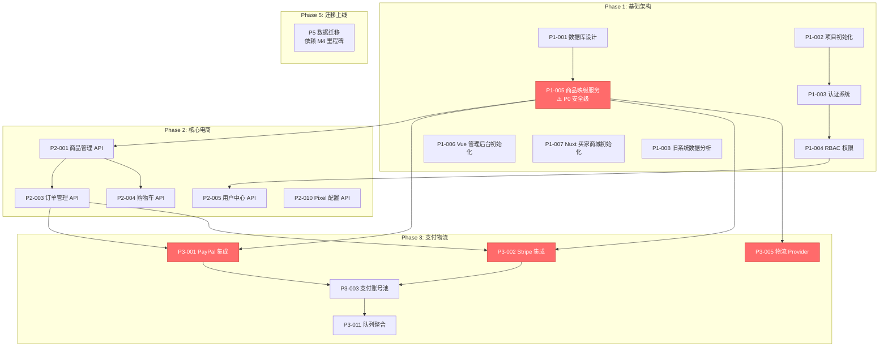

# JerseyHolic 跨境电商统一系统重构 — 项目总体计划

> 版本：v1.0 | 创建日期：2026-04-16 | 状态：已批准  
> 项目经理：@leader | 预计工期：11 周（5 个 Phase）

---

## 1. 项目概述

### 1.1 项目目标

从零开始，使用 Laravel 10+ / Vue 3 / Nuxt 3 技术栈开发一套统一的跨境电商管理系统，完全替代现有的 OpenCart（买家站）+ ThinkPHP（支付后台）双系统架构，消除数据冗余和管理割裂。

### 1.2 项目范围

| 维度 | 范围说明 |
|------|---------|
| 旧系统 A | OpenCart 3.0 — 买家独立站（商品展示、购物车、结账、63 个支付扩展、16 种语言） |
| 旧系统 B | ThinkPHP 6.1 — 支付后台（统一支付网关、订单管理、物流发货、支付账号池、47 个异步任务） |
| 新系统 | 统一平台：Laravel 10 后端 + Vue 3 管理后台 + Nuxt 3 SSR 买家商城 |
| 功能总量 | 126 个功能项（57 P0 + 47 P1 + 22 P2），覆盖 15 个模块 |

### 1.3 技术栈

| 层级 | 技术选型 |
|------|---------|
| 后端框架 | Laravel 10+（PHP 8.1+），Sanctum 认证，Eloquent ORM |
| 管理后台 | Vue 3 + TypeScript + Element Plus + Vite |
| 买家商城 | Nuxt 3（SSR）+ TailwindCSS + @nuxtjs/i18n |
| 数据库 | MySQL 8.0+，表前缀 `jh_`，InnoDB + utf8mb4 |
| 缓存/队列 | Redis |
| API 风格 | RESTful，统一 `{code, message, data}` 响应格式 |

### 1.4 团队组成

| 专家 | Agent 名称 | 核心职责 | 关联技能 |
|------|-----------|---------|---------|
| 产品经理 | @product-manager | 需求分析、PRD 编写、验收标准 | — |
| 架构师 | @architect | 数据库设计、API 契约定义、模块依赖规划 | database-architect, laravel-api, auth-rbac |
| 后端开发 | @backend-dev | Laravel API 开发、支付集成、队列任务、业务逻辑 | laravel-api, payment-gateway, queue-worker, auth-rbac |
| 前端开发 | @frontend-dev | Vue 3 管理后台、Nuxt 3 SSR 买家商城、Pixel 集成、i18n | vue-admin-panel, vue-storefront |
| 物流集成 | @integration-specialist | 物流 Provider 对接、第三方服务集成、Webhook、通知服务 | logistics-service, queue-worker, payment-gateway |
| 迁移专家 | @migration-specialist | 旧系统数据分析、迁移脚本、数据验证、切换方案 | data-migration, database-architect |

---

## 2. 五阶段规划

### 2.1 阶段总览

| Phase | 名称 | 周期 | 目标 | 里程碑 |
|-------|------|------|------|--------|
| 1 | 基础架构 | 第 1-2 周 | 数据库设计、认证权限、商品映射服务、前端项目初始化 | M1 |
| 2 | 核心电商 | 第 3-5 周 | 商品管理、订单流程、购物车、用户中心、Facebook Pixel | M2 |
| 3 | 支付物流 | 第 6-7 周 | 支付渠道集成、物流发货系统、异步队列整合 | M3 |
| 4 | 营销增强 | 第 8-9 周 | 营销功能、通知服务、风控系统、系统管理完善 | M4 |
| 5 | 数据迁移与上线 | 第 10-11 周 | 旧系统数据迁移、全面测试、上线切换 | M5 |

### 2.2 甘特图



---

## 3. 里程碑定义

### M1：基础架构就绪（第 2 周末）

| 验收项 | 标准 |
|--------|------|
| 数据库 | 50+ 张 Migration 文件全部可执行，表关系完整，外键约束正确 |
| 认证 | Admin/Merchant/Buyer 三类用户可登录，Sanctum Token 发放/撤销正常 |
| 权限 | RBAC 角色-权限 CRUD 正常，中间件守卫生效 |
| 商品映射 | ProductMappingService 三级优先级查询正确，100% 单测覆盖 |
| 前端 | Vue 3 / Nuxt 3 项目可启动，Axios 封装、路由守卫、i18n 配置就绪 |
| 旧数据分析 | 字段映射文档完整，数据量统计完成 |

### M2：核心电商流程跑通（第 5 周末）

| 验收项 | 标准 |
|--------|------|
| 商品 | 商品 CRUD + 多语言描述 + 变体管理正常 |
| 订单 | 订单全生命周期管理正常（创建→状态流转→历史记录） |
| 购物车 | 增删改查、库存校验正常 |
| 买家商城 | SSR 渲染正常，首页/列表/详情页 SEO 元信息完整 |
| 结账 | 购物车→结账流程前端完整 |
| Pixel | useFacebookPixel composable 12+ 种事件追踪正常 |

### M3：完整购买流程跑通（第 7 周末）

| 验收项 | 标准 |
|--------|------|
| 支付 | PayPal/Stripe 创建→回调→退款正常，**使用安全商品名** |
| 账号池 | ElectionService 按 8 层筛选策略选择账号 |
| 物流 | Provider 接口定义完成，至少 1 个供应商可用 |
| 运费 | 多规则类型运费计算正确 |
| 队列 | 6 个队列优先级配置，20 个 Job 正常执行 |

### M4：全功能就绪（第 9 周末）

| 验收项 | 标准 |
|--------|------|
| 营销 | 优惠券 CRUD + 下单优惠计算正确 |
| 通知 | 邮件通知 + 钉钉告警正常 |
| 风控 | 黑名单拦截 + 风险订单标记正常 |
| 多语言 | 16 语言切换正常，阿拉伯语 RTL 布局正确 |
| 管理后台 | Dashboard + 所有管理页面可用 |

### M5：系统上线（第 11 周末）

| 验收项 | 标准 |
|--------|------|
| 数据迁移 | 验证报告通过，零数据丢失 |
| 集成测试 | 核心流程端到端测试全部通过 |
| 性能 | API 响应 < 200ms，并发 100+ |
| 切换方案 | 切换文档完整，回滚方案就绪 |

---

## 4. 关键依赖链

### 4.1 依赖关系图



### 4.2 关键路径

```
P1-001(数据库设计, 3d) → P1-005(商品映射, 2d) → P2-001(商品API, 3d) → P2-003(订单API, 3d) → P3-001(PayPal, 3d) → P3-003(账号池, 2d) → P3-011(队列, 3d)
```

**关键路径总长：19 个工作日（约 4 周）**

### 4.3 安全级依赖（⚠️ 零容忍）

- `ProductMappingService`（P1-005）**必须**在任何支付/物流任务之前完成并通过验收
- 支付创建接口**必须**调用映射服务获取安全商品名称
- 物流面单生成**必须**调用映射服务获取安全商品名称
- Facebook Pixel 追踪使用**真实商品名称**（不用映射）

---

## 5. 团队分工与协作模型

### 5.1 各阶段工作分配

| Phase | @architect | @backend-dev | @frontend-dev | @integration-specialist | @migration-specialist |
|-------|-----------|-------------|--------------|------------------------|----------------------|
| 1 | 数据库设计(3d) | 初始化+认证+权限+映射(7d) | Vue+Nuxt初始化(2d) | — | 数据分析(3d) |
| 2 | API契约评审 | 商品+订单+购物车+用户+Pixel API(12d) | 后台页面+商城页面+Pixel(15d) | — | — |
| 3 | — | PayPal+Stripe+账号池+队列(13d) | 支付+物流后台页面(4d) | 物流Provider+运费+轨迹+卖家保护(8d) | — |
| 4 | — | 营销+商户+风控+系统(8d) | Pixel管理+多语言+Dashboard+账户(8d) | 邮件+钉钉通知(3d) | — |
| 5 | — | 集成测试+性能测试(5d) | 集成测试(3d) | — | 全量数据迁移+验证+切换(12d) |

### 5.2 协作规则

1. **契约先行**：前后端并行开发时，API 契约文档由 @architect 定义并冻结后，双方才开始开发
2. **Mock 并行**：前端可使用 Mock 数据先行开发，联调必须等后端 API 就绪并通过单测
3. **代码评审**：所有 P0 功能代码需要至少 1 人 review（尤其是商品映射相关代码）
4. **日站会**：每日 15 分钟同步，识别阻塞项
5. **迁移锁定**：数据迁移严格安排在 M4 里程碑通过后才启动

---

## 6. 风险登记册

| 风险 ID | 风险描述 | 影响级别 | 概率 | 缓解措施 | 负责人 |
|---------|---------|---------|------|---------|--------|
| R1 | 支付 API 变更（PayPal/Stripe 升级） | 高 | 中 | 对接前确认最新 API 版本，Provider 模式便于替换 | @backend-dev |
| R2 | 16 语言翻译质量不一 | 中 | 高 | 优先保证 en/de/fr/es 四种主力语言，其他渐进完善 | @frontend-dev |
| R3 | 订单合并迁移数据不一致 | 高 | 高 | 试运行验证，保留旧系统 ID 溯源，迁移前完整备份 | @migration-specialist |
| R4 | 商品映射遗漏导致支付暴露真实商品名 | **极高** | 中 | 兜底默认名称机制，映射服务 100% 单测覆盖，上线前专项审计 | @backend-dev |
| R5 | Facebook Pixel 事件丢失影响广告投放 | 高 | 中 | 事件追踪单元测试，迁移后对比旧系统事件数据 | @frontend-dev |
| R6 | 前后端联调延期 | 中 | 高 | Mock 数据先行，API 契约文档冻结后才开始联调 | @leader |

---

## 7. 沟通与汇报机制

| 频率 | 形式 | 参与者 | 内容 |
|------|------|--------|------|
| 每日 | 站会（15 分钟） | 全团队 | 昨日完成/今日计划/阻塞项 |
| 每周 | 周报 | @leader | 看板状态快照 + 风险更新 + 下周计划 |
| 阶段末 | 里程碑验收会 | 全团队 | 逐项验收 + 问题修复 + 下阶段启动 |
| 即时 | 消息通知 | 相关人员 | 阻塞/依赖就绪/紧急变更 |

### 进度跟踪看板格式

```
📊 Phase N 进度看板

### 待开始 (To Do)
- [ ] TASK-ID: 任务描述 (@负责人) [优先级]

### 进行中 (In Progress)
- [~] TASK-ID: 任务描述 (@负责人) - 进度说明

### 待验收 (In Review)
- [?] TASK-ID: 任务描述 (@负责人) - 待验收项

### 已完成 (Done)
- [x] TASK-ID: 任务描述 (@负责人) ✅

### 阻塞 (Blocked)
- [!] TASK-ID: 任务描述 (@负责人) - 阻塞原因 → 解决方案
```

---

## 8. 任务清单索引

| 文件 | 内容 |
|------|------|
| `tasks/phase-1.md` | Phase 1 基础架构（8 个任务） |
| `tasks/phase-2.md` | Phase 2 核心电商（11 个任务） |
| `tasks/phase-3.md` | Phase 3 支付物流（11 个任务） |
| `tasks/phase-4.md` | Phase 4 营销增强（10 个任务） |
| `tasks/phase-5.md` | Phase 5 数据迁移与上线（9 个任务） |
| `progress/week-1.md` | 第 1 周进度报告模板 |
| `milestones/M-1.md` ~ `M-5.md` | 各里程碑验收报告（待创建） |

---

## 9. 变更控制

| 变更类型 | 审批级别 | 流程 |
|---------|---------|------|
| 功能新增/删除 | @leader + @product-manager | 评估影响 → 更新 PRD → 调整排期 |
| 优先级变更 | @leader | 评估依赖链影响 → 通知相关人员 |
| 技术方案变更 | @architect + @leader | 评估风险 → 原型验证 → 决策记录 |
| 排期调整 | @leader | 关键路径分析 → 资源协调 → 更新甘特图 |
