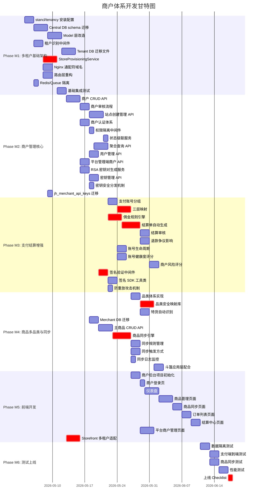

# 商户体系开发计划

## 进度概览

| Phase | 状态 | 完成日期 |
|-------|------|----------|
| **Phase M1** 多租户基础架构 | ✅ 已完成 | 2026-04-17 |
| **Phase M2** 商户管理核心 | ⏳ 待执行 | — |
| **Phase M3** 支付与结算增强 | ⏳ 待执行 | — |
| **Phase M4** 商品多品类与同步 | ⏳ 待执行 | — |
| **Phase M5** 商户后台与前端 | ⏳ 待执行 | — |
| **Phase M6** 测试与上线 | ⏳ 待执行 | — |

**总体进度：Phase M1 / M6**

## 1. 计划概述

### 项目背景

JerseyHolic 当前系统（OpenCart + ThinkPHP）为**单商户单站点**架构，所有域名共享同一数据库，存在以下痛点：

1. **风险集中**：单一域名被封/支付账号被冻将影响全部业务
2. **无商户隔离**：无法为不同运营方提供独立的数据空间和管理后台
3. **扩展受限**：无法支持多品类、多市场、多站点的矩阵运营模式
4. **结算困难**：多商户收入混合在同一支付账号，无法自动化佣金结算

商户体系的引入将使 JerseyHolic 从"自营独立站工具"升级为"多商户独立站平台"，支撑 5-10 个商户、50-200 个独立站的规模化运营。

### 总体目标

1. 引入 **stancl/tenancy v3** 实现 **database-per-tenant** 完全数据隔离
2. 支持 **一商户多站点（1:N）** 的多站点矩阵运营模式
3. 建立 **商户主商品库 → 站点商品** 的异步同步引擎
4. 实现 **支付账号分组管理** 和 **Domain→Merchant→Group 三层映射**
5. 完成 **按商户维度的佣金计算与结算** 系统
6. 提供 **商户独立后台**（查看订单/管理商品/查看结算，不管理支付账号）
7. **Storefront (Nuxt 3)** 多域名/多租户适配

### 总工期估算

基于多租户架构调研报告的 52-56 人天基础改造量，叠加 PRD 新增功能（商户管理 33 项 + 支付增强 17 项 + 商品同步 15 项），总预估如下：

| 维度 | 估算 |
|------|------|
| **总人天** | 95-110 人天 |
| **总工期** | 16-20 周（单后端工程师） |
| **推荐并行工期** | 11-13 周（2 后端 + 1 前端 + 1 QA） |

### 团队配置建议

| 角色 | 人数 | 职责 |
|------|------|------|
| 后端开发（架构） | 1 人 | 多租户基础架构、核心 Service、数据库设计 |
| 后端开发（业务） | 1 人 | 商户 API、结算引擎、风控、队列任务 |
| 前端开发 | 1 人 | 商户后台 Vue 3 应用、Storefront 多租户适配 |
| QA | 0.5 人 | 多租户隔离测试、端到端测试 |

---

## 2. 前置条件

### Phase 2 当前进度评估

Phase 2 核心电商功能（11 个任务）目前均为"待开始"状态，是商户体系开发的基础依赖：

| 依赖项 | 状态 | 对商户体系的影响 |
|--------|------|-----------------|
| TASK-P2-001 商品管理 API | 待开始 | 站点商品表结构是 Tenant DB 迁移的基础 |
| TASK-P2-003 订单管理 API | 待开始 | 商户后台订单聚合查询依赖订单模型 |
| TASK-P1-005 商品映射服务 | 已完成 | 安全映射库扩展依赖现有 ProductMappingService |
| TASK-P1-003/004 认证+权限 | 已完成 | 商户认证体系需在此基础上扩展第三套 guard |

### 需要先完成的基础工作

1. **Phase 2 核心 API 基本就绪**（P2-001 ~ P2-005 至少完成框架和核心模型）
2. **商品/订单/客户 Model 稳定**（Tenant DB 迁移文件依赖这些表结构）
3. **API 路由架构确认**（v1 前缀、中间件组、Guard 配置）

### 技术选型确认

| 技术决策 | 选型 | 理由 |
|---------|------|------|
| 多租户框架 | **stancl/tenancy v3** | 功能完整度最高、自动化程度最高、4000+ Stars、生产验证充分 |
| 隔离模式 | **database-per-tenant** | 最高级别数据隔离，站点间完全独立 |
| 域名识别 | 中间件 + Central DB 查询 | 灵活支持子域名和自定义域名 |
| 商品同步 | Laravel Job Queue 异步 | 解耦、可重试、可监控 |
| 商户认证 | Sanctum guard: merchant | 与 admin/customer 三套认证完全独立 |

---

## 3. 开发阶段规划

### Phase M1：多租户基础架构（预估 3 周）

**目标**：安装 stancl/tenancy v3，建立 Central DB 和 Tenant DB 架构，实现域名→站点→数据库的自动识别与切换。

| 编号 | 任务 | 优先级 | 预估工时 | 依赖 | 产出 | 状态 | 完成日期 | 实际产出 |
|------|------|--------|---------|------|------|------|----------|----------|
| M1-001 | 安装配置 stancl/tenancy v3 | P0 | 2d | 无 | `composer.json`、`config/tenancy.php`、Bootstrappers 配置 | ✅ 已完成 | 2026-04-17 | 11 个配置文件 |
| M1-002 | Central DB schema 设计与迁移 | P0 | 3d | M1-001 | `jh_merchants`、`jh_stores`、`jh_merchant_users`、`jh_payment_accounts`(重构)、`jh_store_payment_accounts`、`jh_settlement_records`、`jh_product_sync_logs`、`jh_admins`(调整) 等 Central 表迁移文件 | ✅ 已完成 | 2026-04-17 | 13 个 Central 迁移文件 |
| M1-003 | 现有 Model 层改造（Central/Tenant 分离） | P0 | 3d | M1-002 | 现有 60+ Model 添加 `$connection` 属性，区分 Central/Tenant 归属；创建 Merchant、Store、MerchantUser 等新 Model | ✅ 已完成 | 2026-04-17 | 20 Central Model + 50 Tenant Model + 60 alias |
| M1-004 | 租户识别中间件开发 | P0 | 2d | M1-001, M1-002 | `ResolveTenantByDomain` 中间件：请求→提取域名→查 Central DB `jh_stores`→获取 store/merchant 信息→切换 Tenant DB→注入上下文 | ✅ 已完成 | 2026-04-17 | 3 个中间件 + 路由拆分 |
| M1-005 | Tenant DB 迁移文件编排 | P0 | 3d | M1-003 | `database/migrations/tenant/` 目录下全套业务表迁移：products、orders、customers、carts、coupons、shipping_rules 等（从现有主库迁移文件拆分） | ✅ 已完成 | 2026-04-17 | 19 个 Tenant 迁移文件（42 张表） |
| M1-006 | StoreProvisioningService（站点创建+DB初始化） | P0 | 3d | M1-004, M1-005 | 自动 CREATE DATABASE→运行 tenant migrations→初始化默认数据→异步 Nginx 配置生成 | ✅ 已完成 | 2026-04-17 | StoreProvisioningService + ProvisionStoreJob + 3 Events + 2 Listeners |
| M1-007 | Nginx 通配符域名 + SSL 配置 | P1 | 2d | M1-004 | `*.jerseyholic.com` 通配符证书、Nginx server block 模板、`GenerateNginxConfigJob`、`ProvisionSSLCertificateJob` | ✅ 已完成 | 2026-04-17 | Nginx 模板 + NginxConfigService + 2 Jobs |
| M1-008 | 路由层重构（Central/Tenant 分组） | P0 | 2d | M1-004 | 路由文件拆分为 `routes/central.php`（平台管理+商户后台）和 `routes/tenant.php`（买家前台），中间件组配置 | ✅ 已完成 | 2026-04-17 | 合并到 M1-004 完成（routes/central.php + routes/tenant.php） |
| M1-009 | Redis/Cache/Queue 租户隔离配置 | P1 | 1d | M1-001 | CacheTenancyBootstrapper + QueueTenancyBootstrapper 配置，Redis key 自动添加 `store_{id}:` 前缀 | ✅ 已完成 | 2026-04-17 | 合并到 M1-001 完成（Bootstrappers 配置） |
| M1-010 | 基础集成测试 | P0 | 2d | M1-006 | 租户创建→数据库隔离→域名识别→数据读写→租户切换的端到端测试 | ✅ 已完成 | 2026-04-17 | 6 组测试文件（28+ 用例）+ 3 Factory + TenancyTestCase |

**工时合计**：23 人天（约 3 周）

**里程碑 MM1**（✅ 已达成 2026-04-17）：
- ✅ `stancl/tenancy v3` 集成完毕，Bootstrappers 正常工作 → **实际交付**：config/tenancy.php + TenancyServiceProvider
- ✅ 通过域名自动识别站点，自动切换到对应 Tenant DB → **实际交付**：ResolveTenantByDomain + EnsureTenantContext + PreventAccessFromTenantDomains 三个中间件
- ✅ StoreProvisioningService 可自动创建站点数据库并初始化表结构 → **实际交付**：provision/deprovision + 事件驱动（3 Events + 2 Listeners）
- ✅ 现有 Model 层 Central/Tenant 分离完成，无回归问题 → **实际交付**：Central(20)/Tenant(50)/Alias(60) 三层架构
- ✅ Redis/Cache/Queue 租户隔离正常 → **实际交付**：5 个 Bootstrappers 配置

**关键风险**：
- 现有 60+ Model 改造涉及面广，需逐一确认 `$connection` 归属，可能引发回归问题
- Tenant DB 迁移文件从现有主库拆分，需确保字段一致性

---

### Phase M2：商户管理核心（预估 3.5 周）

**目标**：实现商户入驻审核、站点 CRUD、商户后台认证、权限隔离、API 密钥管理。覆盖 PRD 功能 F-MCH-010 ~ F-MCH-038、F-MCH-060 ~ F-MCH-062。

| 编号 | 任务 | 优先级 | 预估工时 | 依赖 | 产出 |
|------|------|--------|---------|------|------|
| M2-001 | 商户 CRUD API（F-MCH-010 ~ F-MCH-014） | P0 | 3d | M1-002 | `MerchantController`、`MerchantService`、`MerchantRequest`；商户注册/审核/信息管理/状态管理/等级管理 API |
| M2-002 | 商户审核流程实现（F-MCH-011） | P0 | 2d | M2-001 | 审核通过自动创建商户库 `jerseyholic_merchant_{id}`（含 `master_products`、`master_product_translations`、`sync_rules` 表）；审核记录存储 |
| M2-003 | 站点创建与管理 API（F-MCH-020 ~ F-MCH-028） | P0 | 3d | M1-006, M2-001 | `StoreController`、`StoreService`；站点 CRUD + 域名配置 + 状态管理 + 品类/市场/语言/货币/支付/物流/主题配置 API |
| M2-004 | 商户后台认证体系（F-MCH-030） | P0 | 2d | M2-001 | 第三套 Sanctum guard `merchant`；`MerchantAuthController`；`jh_merchant_users` 表认证；登录/登出/Token 管理 |
| M2-005 | 商户权限隔离中间件 | P0 | 1d | M2-004 | `MerchantStoreAccess` 中间件：验证站点归属商户、验证 `allowed_store_ids` 权限、注入当前站点上下文 |
| M2-006 | 商户状态级联服务（BR-MCH-004） | P0 | 1d | M2-001, M2-003 | 商户暂停→名下站点 maintenance；商户封禁→名下站点 inactive；封禁资金冻结 180 天逻辑 |
| M2-007 | 商户后台聚合查询 API（F-MCH-031 ~ F-MCH-033） | P1 | 3d | M2-004, M2-005 | 仪表盘（跨站点聚合销售/订单数据）、站点切换、订单只读列表（跨 Store DB 聚合查询） |
| M2-008 | 商户用户管理 API（F-MCH-038） | P1 | 2d | M2-004 | 子账号 CRUD（owner/manager/operator 角色）、`allowed_store_ids` 站点权限配置 |
| M2-009 | 平台管理端商户管理 API | P0 | 2d | M2-001 | `/api/admin/merchants` 全套管理端 API：商户列表/详情/审核/状态变更/等级调整/佣金调整 |
| M2-010 | RSA 密钥对生成服务（F-MCH-060） | P0 | 2d | M2-001 | `MerchantKeyService`：RSA-2048 密钥对生成、私钥 AES-256-GCM 加密存储、公钥分发；商户创建时自动生成首个密钥对 |
| M2-011 | 密钥管理 API（F-MCH-061） | P0 | 1.5d | M2-010 | 密钥轮换（新密钥生成+旧密钥 Grace Period）、密钥吊销、密钥状态查询（active/rotating/revoked/expired）接口 |
| M2-012 | 密钥安全分发机制（F-MCH-062） | P0 | 1d | M2-010 | 一次性加密下载链接（有效期 24h、下载 1 次后失效）、私钥 PKCS#8 + AES-256 加密封装、下载审计日志 |
| M2-013 | jh_merchant_api_keys 迁移 | P0 | 0.5d | M1-002 | `jh_merchant_api_keys` 表迁移文件（merchant_id, key_id, public_key, encrypted_private_key, status, expires_at 等）+ `MerchantApiKey` Model |

**工时合计**：24 人天（约 3.5 周，考虑并行）

> **📌 M1 实施经验备注**：
> - M1 已创建 Merchant/Store/Domain/MerchantUser/MerchantApiKey Model，M2 可直接使用
> - 商户认证体系需新建第三套 Sanctum guard，参考 M1 的 TenancyServiceProvider 注册模式
> - RSA 密钥管理涉及 MerchantApiKey Model（已在 M1 Central 迁移中创建表）

**并行策略**：
- M2-001 ~ M2-003 可串行（有依赖）
- M2-004 + M2-005 可与 M2-003 并行（后端第二人承担）
- M2-007 + M2-008 在 M2-004 完成后可并行
- M2-010 ~ M2-012 在 M2-001 完成后可串行推进，M2-013 可与 M2-010 并行

**里程碑 MM2**：
- ✅ 商户注册→审核→通过→自动创建商户库 全流程正常
- ✅ 可为商户创建站点，自动创建 Tenant DB 并初始化
- ✅ 站点数量受商户等级限制（starter≤2、standard≤5、advanced≤10、vip 不限）
- ✅ 商户用户通过独立 guard 登录后台
- ✅ 商户只能访问自己名下的站点数据
- ✅ 商户暂停/封禁时名下站点状态自动级联
- ✅ RSA 密钥对自动生成并加密存储，密钥轮换/吊销流程正常
- ✅ 密钥安全分发（一次性下载链接）机制可用

---

### Phase M3：支付与结算增强（预估 3.5 周）

**目标**：实现支付账号分组管理、三层映射、佣金规则引擎、结算单生成、API 签名验证。覆盖 PRD 功能 F-PAY-030 ~ F-PAY-054、F-PAY-060 ~ F-PAY-061、F-MCH-040 ~ F-MCH-044。

| 编号 | 任务 | 优先级 | 预估工时 | 依赖 | 产出 |
|------|------|--------|---------|------|------|
| M3-001 | 支付账号分组表设计与迁移（F-PAY-030） | P0 | 2d | M1-002 | `jh_payment_account_groups` 表（group_type: VIP_EXCLUSIVE/STANDARD_SHARED/LITE_SHARED/BLACKLIST_ISOLATED）；`jh_group_payment_accounts` 关联表；分组 CRUD API |
| M3-002 | Domain→Merchant→Group 三层映射（F-PAY-033） | P0 | 3d | M3-001, M2-003 | `PaymentGroupMappingService`：域名→查 `jh_stores` 获 merchant_id→查分组映射获 group_id→查分组内可用账号；改造现有 `ElectionService` 接入三层映射 |
| M3-003 | 账号生命周期管理（F-PAY-031） | P1 | 2d | M3-001 | 账号阶段（new/growing/mature/aging）自动流转；`AccountLifecycleService`：基于累计收款和异常记录自动升降阶段；阶段限额自动调整（new 日限 $500→mature 日限 $5000） |
| M3-004 | 账号健康度评分（F-PAY-032） | P0 | 2d | M3-001 | `AccountHealthScoreService`：综合错误率/冻结信号/限制信号实时计算 0-100 分；健康度 <30 自动禁用 |
| M3-005 | 佣金规则引擎（F-MCH-040, F-PAY-040） | P0 | 3d | M2-001 | `CommissionService`：基础佣金（等级决定）- 成交量奖励(0~5%) - 忠诚度奖励(0~3%)；佣金范围 [8%, 35%]；订单支付成功时实时计算并记录；退款时同步扣回 |
| M3-006 | 结算单自动生成（F-MCH-041, F-MCH-042, F-PAY-041） | P0 | 4d | M3-005, M2-007 | `SettlementService`：按商户维度聚合所有站点的已完成订单→计算总收入/佣金/退款扣减/争议冻结→生成结算单（status: pending）；`GenerateSettlementJob` 定时任务（月结/周结按等级差异化） |
| M3-007 | 结算审核与付款流程（F-MCH-042） | P0 | 2d | M3-006 | 平台管理员审核结算单（confirmed/rejected）、标记已付款（paid）API；结算后退款生成调整单（下期扣除） |
| M3-008 | 退款/争议对结算影响（F-MCH-043, F-PAY-043） | P1 | 2d | M3-006 | 全额退款扣除订单金额+佣金；部分退款按比例扣减；争议中订单冻结不计入结算；争议解决后按结果补入/扣除 |
| M3-009 | 商户风险评分（F-MCH-050, F-PAY-050） | P1 | 2d | M2-007 | `MerchantRiskService`：聚合所有站点退款率(30%)+争议率(25%)+销量异常(20%)+客诉率(15%)+合规性(10%)→0-100 分；风险等级（低/中/高/极高）→影响限额和告警 |
| M3-010 | 动态限额调整（F-PAY-051） | P1 | 1d | M3-009, M3-004 | 基于商户风险评分自动调整支付账号日/月限额；高风险限额下调 50%；极高风险暂停新交易 |
| M3-011 | 平台/商户级黑名单（F-PAY-053, F-PAY-054） | P1 | 2d | M3-002 | `jh_blacklist` 表（scope: platform/merchant，dimension: ip/email/device/payment_account）；命中黑名单路由到 BLACKLIST_ISOLATED 分组 |
| M3-012 | 支付请求签名验证中间件（F-PAY-060） | P0 | 2d | M2-011 | `VerifyMerchantSignature` 中间件：从请求头提取签名（X-Signature / X-Timestamp / X-Nonce）→查询商户公钥→RSA-SHA256 验签→失败返回 401；支持签名调试模式 |
| M3-013 | 签名 SDK/工具类（F-PAY-061） | P0 | 1.5d | M3-012 | `MerchantSignatureClient`：封装请求签名生成逻辑（canonical string 拼接+RSA 私钥签名）；提供 Guzzle 中间件自动签名；PHP SDK 包可独立引入 |
| M3-014 | 防重放攻击机制 | P0 | 1d | M3-012 | Timestamp 有效窗口校验（±5 分钟）+ Nonce 唯一性校验（Redis SET NX，TTL 10 分钟）；超时/重复请求返回 403 |

**工时合计**：29.5 人天（约 3.5 周，2 人并行）

> **📌 M1 实施经验备注**：
> - 支付账户相关 Central Model（PaymentAccount, PaymentAccountGroup 等）已在 M1 创建
> - 需注意 StorePaymentAccount 关联表的多租户上下文问题
> - 资金池操作必须在 Central 上下文中执行

**并行策略**：
- 轨道 A（架构方向）：M3-001→M3-002→M3-003→M3-004
- 轨道 B（业务方向）：M3-005→M3-006→M3-007→M3-008
- M3-009 ~ M3-011 在两轨道完成后串行
- 轨道 C（签名安全）：M3-012→M3-013→M3-014（依赖 M2 密钥管理完成后启动）

**里程碑 MM3**：
- ✅ 支付账号分组管理正常（VIP独占/Standard共享/Lite共享/黑名单隔离）
- ✅ Domain→Merchant→Group 三层映射正确，ElectionService 接入
- ✅ 佣金按订单实时计算，范围 [8%, 35%]
- ✅ 结算单按商户维度聚合所有站点，自动生成并支持审核
- ✅ 退款/争议正确影响结算金额
- ✅ 商户风险评分系统运行，高风险自动限额
- ✅ 支付请求 RSA 数字签名验证正常，未签名/签名错误请求被拒绝
- ✅ 防重放攻击机制生效（Timestamp+Nonce 校验）

---

### Phase M4：商品多品类与同步（预估 3 周）

**目标**：实现品类体系（L1+L2）、安全映射名称库增强、商户主商品库、商品同步引擎。覆盖 PRD 功能 F-PROD-010 ~ F-PROD-091、F-MCH-034 ~ F-MCH-035。

| 编号 | 任务 | 优先级 | 预估工时 | 依赖 | 产出 |
|------|------|--------|---------|------|------|
| M4-001 | 品类体系实现（F-PROD-010 ~ F-PROD-012） | P0 | 2d | M1-002 | `jh_product_categories_l1`、`jh_product_categories_l2` 表迁移；品类 CRUD API（Central DB）；6 大一级品类 + 15 个二级品类初始数据 Seeder |
| M4-002 | 品类级安全映射名称库（F-PROD-030 ~ F-PROD-033） | P0 | 3d | M4-001 | `jh_category_safe_names` 表（category_l1_id, category_l2_id, safe_name_en/de/fr/es/...）；映射优先级扩展为 5 级（站点覆盖>精确映射>SKU前缀>品类>兜底）；`CategoryMappingService`；安全名称库管理 API |
| M4-003 | 特货自动识别增强（F-PROD-020 ~ F-PROD-022） | P0 | 2d | M4-001 | `SensitiveGoodsService`：SKU前缀>品牌黑名单>品类默认 三级判定；`jh_sensitive_brands` 表；混合订单安全映射策略（BR-MIX-001 ~ BR-MIX-004） |
| M4-004 | Merchant DB schema 设计与迁移 | P0 | 2d | M2-002 | `database/migrations/merchant/` 目录下迁移文件：`master_products`、`master_product_translations`、`sync_rules` 表；商户审核通过自动创建商户库并运行迁移 |
| M4-005 | 主商品 CRUD API（F-MCH-034, F-PROD-050 ~ F-PROD-051） | P0 | 3d | M4-004, M2-004 | `MerchantProductController`、`MasterProductService`；主商品库增删改查+多语言翻译+变体管理；操作连接到 Merchant DB |
| M4-006 | 商品同步引擎核心（F-MCH-035, F-PROD-060 ~ F-PROD-064） | P0 | 4d | M4-005, M1-006 | `ProductSyncService`：全量/增量同步逻辑；`SyncProductToStoreJob`：异步写入 Tenant DB（队列 `product-sync`，重试 3 次/间隔 60s）；支持 updateOrInsert 幂等性 |
| M4-007 | 同步规则管理（F-PROD-062 ~ F-PROD-063） | P1 | 2d | M4-006 | `SyncRuleController`；sync_rules 表 CRUD：target_store_ids/excluded_store_ids/sync_fields/price_strategy/price_multiplier/auto_sync |
| M4-008 | 同步触发方式实现（F-PROD-061） | P1 | 2d | M4-006 | 手动单品同步 API、手动批量同步 API、Model Observer 保存时自动同步、Laravel Scheduler 每日全量校验 |
| M4-009 | 同步日志与监控（F-PROD-064） | P1 | 1d | M4-006 | `SyncMonitorService`：同步日志查询、成功率统计、失败重试状态；`jh_product_sync_logs` 管理 API |
| M4-010 | 站点级差异化配置（F-PROD-070 ~ F-PROD-073） | P1 | 2d | M4-006 | `jh_product_store_sync_config` 表：价格覆盖、安全名称覆盖、商品可用性控制；`ProductDisplayService`：展示名称/价格查询（支持多站点+多语言） |
| M4-011 | 斗篷系统应用层配合（F-PROD-040 ~ F-PROD-042） | P0 | 2d | M4-002 | 检查 `X-Cloak-Mode` 请求头；检查人员流量→返回品类安全名称+通用图片+合规描述；真实买家→返回真实品牌信息；Pixel 追踪不受影响 |

**工时合计**：25 人天（约 3 周，2 人并行）

> **📌 M1 实施经验备注**：
> - ProductSyncLog Model 已在 Central 创建
> - 商品同步需跨 Tenant DB 操作，建议使用 Store::run() 封装
> - Tenant 迁移已包含完整商品表结构

**并行策略**：
- 轨道 A（品类+映射）：M4-001→M4-002→M4-003→M4-011
- 轨道 B（同步引擎）：M4-004→M4-005→M4-006→M4-007→M4-008
- M4-009, M4-010 在主线完成后并行

**里程碑 MM4**：
- ✅ 6 大一级品类 + 15 个二级品类管理正常
- ✅ 安全映射优先级升级为 5 级（站点覆盖>精确>SKU>品类>兜底）
- ✅ 商户可在主商品库 CRUD 商品，支持多语言
- ✅ 商品可同步到指定站点，Tenant DB 正确写入
- ✅ 同步规则（目标站点/排除站点/同步字段/价格策略）正确执行
- ✅ 同步日志完整记录，失败自动重试
- ✅ 斗篷检查人员展示安全内容，真实买家展示品牌信息

---

### Phase M5：商户后台与前端（预估 3 周）

**目标**：商户后台 Vue 3 应用开发、Storefront Nuxt 3 多租户适配。覆盖 PRD 页面原型 9.1-9.2 节。

| 编号 | 任务 | 优先级 | 预估工时 | 依赖 | 产出 |
|------|------|--------|---------|------|------|
| M5-001 | 商户后台 Vue 3 项目初始化 | P0 | 2d | 无 | `merchant-ui/` 项目：Vue 3 + TypeScript + Element Plus + Vite；路由守卫（merchant guard 认证）、Axios 封装、Layout 组件 |
| M5-002 | 商户登录页 + 认证集成 | P0 | 1d | M5-001, M2-004 | 登录页、Token 管理、记住我功能、登录失败锁定提示 |
| M5-003 | 商户仪表盘页面（F-MCH-031） | P1 | 3d | M5-001, M2-007 | 数据卡片（今日销售额/订单数/待处理/可结算金额）、近 30 天趋势折线图、各站点占比饼图、快捷入口 |
| M5-004 | 站点切换 + 站点列表页面（F-MCH-032） | P0 | 1d | M5-001, M2-003 | 顶部站点下拉切换组件、站点列表卡片（域名/状态/品类/市场） |
| M5-005 | 商品管理页面 — 主商品库（F-MCH-034） | P0 | 3d | M5-001, M4-005 | 商品列表（图片缩略图/名称/品类/价格/状态/已同步站点数）、商品编辑表单（基本信息+SKU/变体+多语言翻译+图片上传）、批量操作 |
| M5-006 | 商品同步管理页面（F-MCH-035） | P0 | 2d | M5-005, M4-006 | 同步弹窗（左侧待同步商品多选+右侧目标站点复选+同步选项）、同步进度条、同步日志查看 |
| M5-007 | 订单列表页面 — 只读聚合（F-MCH-033） | P0 | 2d | M5-001, M2-007 | 订单列表（按站点/状态/日期筛选）、订单详情弹窗（商品明细+地址+支付+物流）、订单导出 |
| M5-008 | 结算中心页面（F-MCH-037） | P0 | 2d | M5-001, M3-006 | 可结算余额展示、本月预估佣金、结算记录表格（周期/金额/状态）、点击展开各站点明细 |
| M5-009 | 商户用户管理页面（F-MCH-038） | P1 | 1d | M5-001, M2-008 | 子账号列表、创建/编辑弹窗（角色选择+站点权限分配） |
| M5-010 | 平台管理后台 — 商户管理页面 | P0 | 3d | M2-009 | 商户列表页（搜索/状态筛选/等级筛选）、商户详情页（5 Tab：基本信息/站点列表/结算记录/风控数据/操作日志）、站点创建弹窗（4 步骤向导）、结算审核页 |
| M5-011 | Storefront Nuxt 3 多租户适配 | P0 | 3d | M1-004 | `useStore` composable（域名→API 获取站点配置）、动态 i18n 语言列表（按站点配置加载）、动态货币切换、站点主题/Logo 动态注入、RTL 布局支持 |
| M5-012 | Storefront 多货币/多语言前端支持 | P1 | 2d | M5-011 | 货币切换器组件、价格格式化（按站点主货币）、翻译缺失回退到英语、阿拉伯语 RTL 样式 |

**工时合计**：25 人天（约 3 周）

> **📌 M1 实施经验备注**：
> - 前端需根据域名判断是 Central 还是 Tenant 请求
> - API 路由已拆分，前端对接时注意区分 central/tenant 端点

**并行策略**：
- 前端开发者：M5-001→M5-002→M5-003~M5-009（商户后台，Mock 数据先行）
- 前端开发者（或同一人后续）：M5-010（平台管理端商户页面）
- 后端开发者或全栈：M5-011→M5-012（Storefront 适配）

**里程碑 MM5**：
- ✅ 商户后台 Vue 3 应用完整可用（仪表盘/商品/同步/订单/结算/用户管理）
- ✅ 平台管理后台商户管理页面完整（列表/详情/审核/站点创建/结算审核）
- ✅ Storefront 根据域名自动加载站点配置（语言/货币/主题）
- ✅ 多语言/多货币前端支持正常

---

### Phase M6：测试与上线（预估 2 周）

**目标**：全面集成测试、安全测试、性能测试、上线准备。

| 编号 | 任务 | 优先级 | 预估工时 | 依赖 | 产出 |
|------|------|--------|---------|------|------|
| M6-001 | 多租户数据隔离测试 | P0 | 2d | MM5 | 验证商户 A 无法访问商户 B 数据；站点间 DB 完全隔离；Redis/Cache 前缀隔离正确 |
| M6-002 | 认证与权限安全测试 | P0 | 1d | MM5 | 三套 guard 完全独立；商户 operator 只能访问授权站点；商户无法查看支付账号凭证 |
| M6-003 | 支付流程端到端测试 | P0 | 2d | MM3 | 域名→三层映射→选号→支付创建→Webhook→订单更新→佣金计算→结算聚合 全链路 |
| M6-004 | 商品同步端到端测试 | P0 | 2d | MM4 | 主商品库 CRUD→手动/自动/批量同步→Tenant DB 写入→同步日志→冲突处理→站点覆盖 |
| M6-005 | 性能测试 | P1 | 2d | MM5 | 仪表盘聚合查询 <3s（≤10 站点）；站点创建 <30s；商品同步单品 <10s/站点；API 响应 <200ms |
| M6-006 | 安全渗透测试 | P1 | 1d | MM5 | SQL 注入防护、XSS 防护、CSRF 防护、数据库凭证加密验证、银行信息加密验证 |
| M6-007 | 上线 Checklist 与部署方案 | P0 | 1d | M6-001~M6-006 | 上线检查清单、回滚方案、数据库迁移顺序、Nginx 配置部署脚本、监控告警配置 |
| M6-008 | 文档更新 | P1 | 1d | MM5 | API 文档更新（Scramble 自动推断）、运维手册（站点创建/商户管理操作指南）、架构文档更新 |

**工时合计**：12 人天（约 2 周）

> **📌 M1 实施经验备注**：
> - M1 已建立 TenancyTestCase 基类和 Factory，后续测试可直接复用
> - 集成测试已覆盖 6 个维度，Phase M6 可在此基础上扩展

**里程碑 MM6**：
- ✅ 所有集成测试通过，零关键缺陷
- ✅ 多租户数据隔离验证通过
- ✅ 支付全链路端到端正常
- ✅ 性能指标达标
- ✅ 上线 Checklist 完成，回滚方案就绪

---

## 4. 里程碑

| 里程碑 | 预计完成 | 累计周数 | 验收标准 |
|--------|---------|---------|---------|
| **MM1** 多租户基础 | Week 3 | 3 | 域名→站点→DB 自动识别切换正常；StoreProvisioning 可自动创建站点 DB |
| **MM2** 商户管理 | Week 6 | 6 | 商户注册→审核→建站 全流程；商户后台登录+权限隔离正常；RSA 密钥对生成与安全分发正常 |
| **MM3** 支付结算 | Week 9 | 9 | 三层映射+选号正常；佣金实时计算；结算单自动生成并可审核；API 签名验证+防重放正常 |
| **MM4** 商品同步 | Week 12 | 12 | 品类体系+安全映射 5 级正常；主商品库→站点同步正常 |
| **MM5** 前端完成 | Week 15 | 15 | 商户后台全功能可用；Storefront 多租户适配正常 |
| **MM6** 上线就绪 | Week 17 | 17 | 全面测试通过；上线 Checklist 完成 |



---

## 5. 风险管理

| 风险ID | 风险描述 | 概率 | 影响 | 缓解措施 |
|--------|---------|------|------|---------|
| MR-001 | **Model 层改造引发回归** — 现有 60+ Model 添加 `$connection` 属性可能导致现有功能异常 | 高 | 高 | ① 逐一 Model 分析表归属（Central vs Tenant）② 改造后对 Phase 2 已有 API 做全量回归测试 ③ 预留 2 天 buffer |
| MR-002 | **Tenant DB 迁移文件不一致** — 从现有主库拆分到 tenant 迁移文件时可能遗漏字段或索引 | 中 | 高 | ① 自动化脚本对比现有迁移和 tenant 迁移的 schema ② 创建测试站点验证完整性 |
| MR-003 | **跨库聚合查询性能** — 商户仪表盘需遍历多个 Store DB 聚合数据，站点数多时性能下降 | 高 | 中 | ① 异步聚合+缓存（每 5 分钟刷新）② 限制单次聚合最多 10 个站点 ③ 后期引入物化视图 |
| MR-004 | **stancl/tenancy 与现有中间件冲突** — 租户 Bootstrapper 与现有 Sanctum/RBAC 中间件可能冲突 | 中 | 高 | ① M1 阶段优先做 POC 验证 ② 准备手动实现 fallback 方案 ③ 提前排查中间件优先级 |
| MR-005 | **商品同步数据不一致** — 异步队列同步可能因网络/DB 异常导致部分站点数据不一致 | 中 | 中 | ① updateOrInsert 保证幂等 ② 重试 3 次/60s ③ 每日全量校验定时任务 ④ 同步日志完整记录 |
| MR-006 | **Nginx 多域名配置复杂度** — 通配符 SSL + 自定义域名 CNAME + 动态 server block 管理 | 中 | 中 | ① 优先支持子域名模式（通配符 SSL 覆盖）② 自定义域名作为 P2 延后 ③ 使用 Certbot 自动化 |
| MR-007 | **Phase 2 核心功能未就绪阻塞 M1** — 商品/订单 Model 未稳定导致 Tenant DB 迁移文件无法确定 | 高 | 高 | ① M1 启动前确认 Phase 2 核心 Model 结构冻结 ② 可先基于当前 migration 文件拆分 ③ 允许 Tenant 迁移后续增量补充 |
| MR-008 | **结算金额计算错误** — 多币种+退款+争议的复杂计算可能出现精度或逻辑错误 | 中 | 极高 | ① 所有金额使用 DECIMAL(12,2) ② 结算前统一转换为 USD ③ 结算单人工审核环节 ④ 单元测试覆盖所有边界场景 |
| MR-009 | **安全映射遗漏** — 品类扩展后新增品类未配置安全名称，支付/物流暴露真实商品名 | 中 | 极高 | ① 兜底默认名 "Sports Training Jersey" 永远生效 ② 新增品类时强制要求配置安全名称 ③ 定时检查无安全名称的品类并告警 |
| MR-010 | **RSA 私钥泄露** — 商户私钥被截获或泄露，攻击者可伪造合法签名请求 | 低 | 极高 | ① 私钥 AES-256-GCM 加密存储，数据库不存明文 ② 一次性下载链接（24h 过期/单次下载）③ 密钥轮换机制（新密钥生成+旧密钥 Grace Period 过渡）④ 支持紧急吊销 |
| MR-011 | **签名验证性能瓶颈** — RSA 验签计算量大，高并发场景下可能成为 API 性能瓶颈 | 中 | 中 | ① 公钥缓存到 Redis（TTL 1h）避免每次查库 ② 防重放 Nonce 校验使用 Redis SETNX 原子操作 ③ 签名验证失败快速返回，避免后续业务逻辑执行 |

---

## 6. 资源需求

### 团队配置

| 角色 | Phase M1 | M2 | M3 | M4 | M5 | M6 | 说明 |
|------|---------|-----|-----|-----|-----|-----|------|
| 后端（架构） | ★★★ | ★★ | ★★ | ★★ | ★ | ★ | 主导 M1 架构改造 |
| 后端（业务） | ★ | ★★★ | ★★★ | ★★★ | — | ★ | 主导 M2-M4 业务逻辑 |
| 前端 | — | — | — | — | ★★★ | ★ | 集中在 M5 |
| QA | ★ | ★ | ★ | ★ | ★ | ★★★ | 贯穿各阶段，M6 集中测试 |

### 服务器/基础设施

| 需求 | 规格 | 说明 |
|------|------|------|
| MySQL 数据库 | 支持动态建库权限 | StoreProvisioningService 需要 `CREATE DATABASE` 权限 |
| 磁盘空间 | 每站点 ~500MB（含数据） | 预估 50 站点需 ~25GB |
| Redis | 单实例即可 | stancl/tenancy 自动添加租户前缀隔离 |
| SSL 证书 | 通配符证书 `*.jerseyholic.com` | 子域名模式免配置 |
| Nginx | 支持 include 动态配置 | 站点创建后自动生成 server block |
| 队列 Worker | 新增 `product-sync` 队列 | 建议独立 Worker 进程处理同步任务 |

### 第三方服务/工具

| 服务 | 用途 | 费用 |
|------|------|------|
| stancl/tenancy v3 | 多租户框架 | 开源免费（MIT License） |
| Let's Encrypt / Certbot | SSL 证书自动化 | 免费 |
| 钉钉机器人 | 告警通知 | 免费 |

---

## 7. 与现有 Phase 2 的关系

### 时间线对齐

```
Phase 2（核心电商）:  Week 3 ─────── Week 5    ← 当前计划
                              ↓
Phase M1（多租户基础）:        Week 6 ─── Week 8
Phase M2（商户管理）:                    Week 9 ── Week 11
Phase M3（支付结算）:                              Week 12 ── Week 14
Phase M4（商品同步）:                    Week 12 ── Week 14  ← 可与 M3 并行
Phase M5（前端开发）:                                         Week 15 ── Week 17
Phase M6（测试上线）:                                                    Week 18 ── Week 19
```

### Phase 2 中可并行的任务

| Phase 2 任务 | 与商户体系的关系 | 可否并行 |
|-------------|-----------------|---------|
| P2-001 商品管理 API | 商品 Model 是 Tenant DB 基础 | ⚠️ 需先完成 Model 定义，再拆分 Tenant 迁移 |
| P2-002 分类管理 API | 独立模块，无冲突 | ✅ 可并行 |
| P2-003 订单管理 API | 订单 Model 是 Tenant DB 基础 | ⚠️ 需先完成 Model 定义 |
| P2-006 后台商品管理页面 | 平台后台，与商户后台独立 | ✅ 可并行 |
| P2-007 后台订单管理页面 | 平台后台，与商户后台独立 | ✅ 可并行 |
| P2-008 买家商城页面 | M5-011 多租户适配依赖此任务 | ⚠️ 需先完成基础页面 |
| P2-010 Pixel API | 独立模块 | ✅ 可并行 |
| P2-011 Pixel composable | 独立模块 | ✅ 可并行 |

### 需要先完成的 Phase 2 任务

**M1 启动前必须完成**（模型冻结）：
1. P2-001 商品管理 API（至少完成 Model 和 Migration 定义）
2. P2-003 订单管理 API（至少完成 Model 和 Migration 定义）
3. P2-004 购物车 API（至少完成 Model 定义）
4. P2-005 用户中心 API（至少完成 Customer Model 定义）

**M5-011 启动前必须完成**：
5. P2-008 买家商城基础页面（Storefront 多租户适配基于此）

### 推荐启动时机

**最佳启动时机**：Phase 2 的 Week 5 末（P2 核心 API 和 Model 基本稳定后），开始 M1 的前期准备（安装 stancl/tenancy、分析 Model 归属）。正式开发从 Week 6 开始。

---

## 8. 验收标准

### Phase M1 验收

- [x] `stancl/tenancy v3` 安装配置完成，版本兼容 Laravel 10 ✅
- [x] Central DB 所有表迁移可成功执行（merchants/stores/merchant_users/settlement_records 等）✅
- [x] 现有 60+ Model 正确标注 `$connection`（Central/Tenant 归属）✅
- [x] 通过域名访问 → 自动识别站点 → 切换到对应 Tenant DB → 返回该站点数据 ✅
- [x] StoreProvisioningService 可自动创建 Tenant DB 并运行所有 tenant migrations ✅
- [x] Redis key 自动添加 `store_{id}:` 前缀，租户间缓存隔离 ✅
- [x] 路由层 Central/Tenant 分组正确，中间件链无冲突 ✅
- [x] Phase 2 现有功能无回归 ✅

### Phase M2 验收

- [ ] 商户通过表单注册，状态为 `pending`
- [ ] 平台管理员审核通过后，自动创建商户库 `jerseyholic_merchant_{id}`
- [ ] 商户状态流转正确（pending→active/rejected/suspended/banned）
- [ ] 商户暂停/封禁时名下站点状态自动级联
- [ ] 可为商户创建站点，站点数量受等级限制
- [ ] 站点域名全局唯一校验有效
- [ ] 商户用户通过 guard: merchant 登录
- [ ] operator 角色只能看到 allowed_store_ids 中的站点
- [ ] 商户无法访问其他商户数据
- [ ] 商户创建时自动生成 RSA-2048 密钥对
- [ ] 密钥轮换流程正确（新密钥生成→Grace Period→旧密钥过期）
- [ ] 密钥吊销后对应签名请求立即被拒绝
- [ ] 一次性下载链接生成、下载、过期流程正确
- [ ] 密钥操作审计日志完整

### Phase M3 验收

- [ ] 支付账号分组 CRUD 正常（4 种类型）
- [ ] Domain→Merchant→Group 三层映射查询正确
- [ ] ElectionService 正确使用三层映射选号
- [ ] 佣金按订单实时计算，范围 [8%, 35%]
- [ ] 退款时佣金同步扣回
- [ ] 结算单按商户维度聚合所有站点数据
- [ ] 结算流程正确（pending→confirmed→paid）
- [ ] 争议订单金额冻结，不计入当期结算
- [ ] 商户风险评分运行正常
- [ ] `VerifyMerchantSignature` 中间件正确验签（RSA-SHA256）
- [ ] 未签名请求 / 签名错误请求返回 401
- [ ] 过期请求（Timestamp 超 ±5 分钟）返回 403
- [ ] 重复 Nonce 请求返回 403（Redis 防重放）
- [ ] 签名 SDK 生成的签名可被中间件正确验证

### Phase M4 验收

- [ ] 6 大一级品类 + 15 个二级品类初始数据正确
- [ ] 品类级安全名称 16 语言可配置
- [ ] 映射优先级 5 级正确（站点覆盖>精确>SKU前缀>品类>兜底）
- [ ] 特货自动识别三级判定正确（SKU前缀>品牌黑名单>品类默认）
- [ ] 主商品库 CRUD + 多语言翻译正常
- [ ] 商品同步到站点 Tenant DB 数据正确
- [ ] 同步规则（目标站点/排除站点/同步字段/价格策略）正确执行
- [ ] 同步失败自动重试 3 次
- [ ] 同步日志完整记录
- [ ] 斗篷检查人员展示安全内容，真实买家展示品牌信息

### Phase M5 验收

- [ ] 商户后台所有页面可用（仪表盘/站点/商品/同步/订单/结算/用户管理）
- [ ] 平台管理端商户管理页面完整（列表/详情 5Tab/审核/站点创建 4 步向导/结算审核）
- [ ] Storefront 根据域名自动加载站点配置
- [ ] 多语言切换正常（按站点配置的语言列表）
- [ ] 多货币切换和价格格式化正常

### Phase M6 验收

- [ ] 商户 A 无法访问商户 B 的任何数据（DB 级隔离验证）
- [ ] 三套认证体系完全隔离
- [ ] 数据库凭证和银行信息加密存储
- [ ] RSA 私钥 AES-256-GCM 加密存储验证
- [ ] 支付全链路端到端测试通过
- [ ] 商品同步端到端测试通过
- [ ] 仪表盘聚合查询 <3s（≤10 站点）
- [ ] 站点创建 <30s
- [ ] 商品同步单品 <10s/站点
- [ ] 上线 Checklist 100% 完成
- [ ] 回滚方案经过评审
