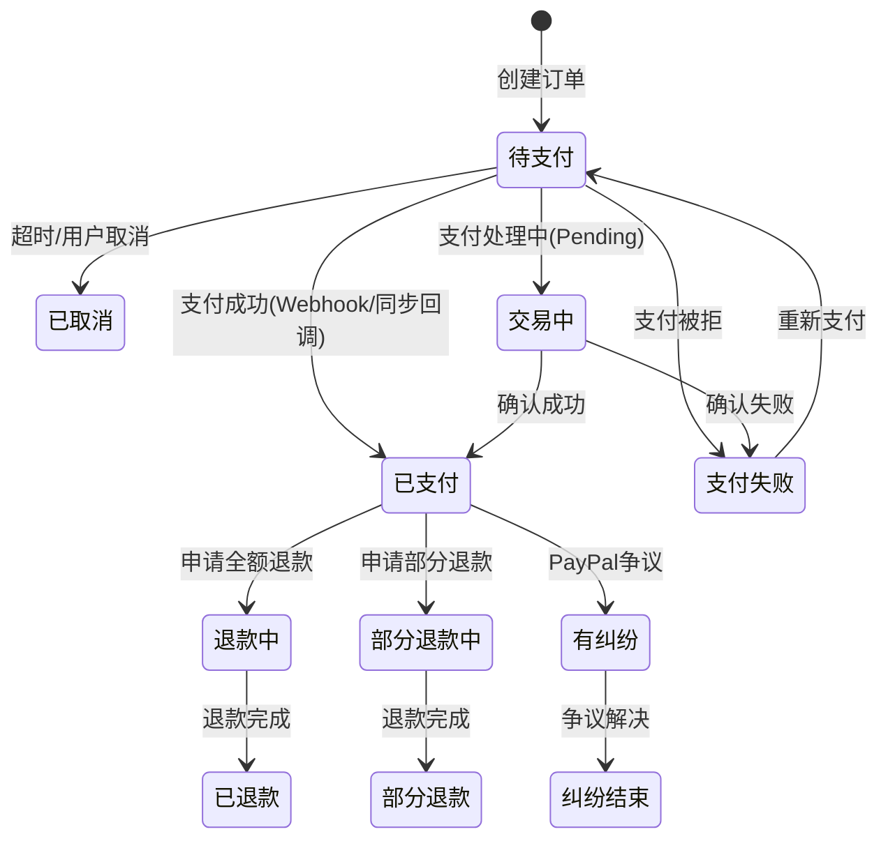
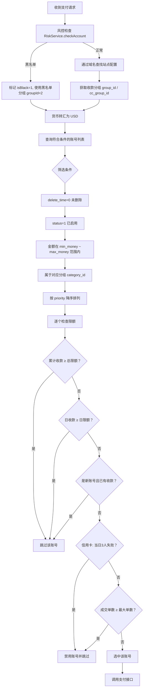

# JerseyHolic 业务规则手册

> 版本：v2.0 | 更新日期：2026-04-16
> 本文档定义跨模块通用的核心业务规则，各模块 PRD 应引用此处规则 ID。
> 规则系列：BR-MAP、BR-ORD、BR-PAY、BR-SHIP、BR-RISK、BR-I18N、BR-CLK、BR-CURR、BR-MCH、BR-SEC、BR-PAY-POOL、BR-PAY-SETTLE、BR-PAY-RISK、BR-PROD、BR-MIX、BR-MULTI-STORE

---

## BR-MAP: 商品映射规则（最高优先级安全规则）

### BR-MAP-001: SKU 前缀分类

商品通过 SKU 前 3 位字符自动分类：

| SKU 前缀 | 分类 | 含义 | 映射行为 |
|---------|------|------|---------|
| `hic` | 仿牌商品 | 仿制品牌球衣等 | **必须映射**为安全普货名称 |
| `WPZ` | 外贸正品 | 正品商品 | 使用原商品名称（不映射） |
| `DIY` | 来图定制 | 客户自定义印刷 | 映射为通用名 "Custom Print Shirt" |
| `NBL` | 其他类型 | 其他杂货商品 | 按配置决定是否映射 |

**判定逻辑**（来源：Order.php checkZwSku/checkWpzSku/checkDiySku/checkNblSku）：
```
如果 SKU 长度 ≤ 3，则不归类
否则取前 3 位字符判定分类
```

### BR-MAP-002: 映射优先级

当需要获取安全商品名称时，按以下优先级查找：

1. **精确映射**：查询 `jh_product_safe_mapping` 表是否有该商品的专门映射记录
2. **SKU 前缀通用名**：
   - `hic` → "Sports Jersey"
   - `WPZ` → 返回原商品名称
   - `DIY` → "Custom Print Shirt"
   - `NBL` → 根据配置决定
3. **兜底默认名**：以上均无匹配时，返回 "Sports Training Jersey"

### BR-MAP-003: 场景使用规则

| 使用场景 | 使用映射？ | 商品名称 | 价格 |
|---------|-----------|---------|------|
| PayPal 创建订单 | ✅ 是 | 安全普货名称 | **真实价格（不变）** |
| Stripe 创建支付 | ✅ 是 | 安全普货名称 | **真实价格（不变）** |
| 其他支付渠道创建 | ✅ 是 | 安全普货名称 | **真实价格（不变）** |
| 物流面单生成 | ✅ 是 | 安全普货名称 | 真实价格 |
| PayPal 卖家保护上传 | ✅ 是 | 安全普货名称 | — |
| 买家前台商品展示（真实买家） | ❌ 否 | 真实商品名称（含特货品牌名） | 真实价格 |
| 前台商品展示（斗篷安全模式/检查人员） | ✅ 是 | 安全普货名称 + 通用图片 | 真实价格 |
| Facebook Pixel 追踪 | ❌ 否 | 真实商品名称 | 真实价格 |
| 后台管理界面 | 🔄 两者 | 真实名称 + 安全名称 | 真实价格 |

**⚠️ 关键安全约束**：
- 价格字段在任何场景下都**永远不被映射替换**
- **真实买家**看到真实品牌商品（特货展示真实名称/图片），仅斗篷检测到检查人员时才展示安全内容
- Pixel 追踪始终使用真实商品信息（不受斗篷影响）
- 支付和物流接口**始终**使用安全名称（与斗篷无关，所有订单均如此）

### BR-MAP-004: 当前系统实现现状

旧 ThinkPHP 系统中 PaypalService.php 对商品名称处理方式：
- PayPal 创建订单时未传递商品明细（items 数组被注释掉），仅传递总金额
- 被注释的代码中使用硬编码 "Custom Jersey" 作为商品名
- **新系统需要完善**：实现 ProductMappingService，在所有支付/物流接口中自动替换商品名称

---

## BR-ORD: 订单状态规则

### BR-ORD-001: 支付状态枚举

来源：Order.php PAY_STATUS_*

| 状态值 | 名称 | 说明 |
|--------|------|------|
| 1 | 待支付 | 订单已创建，等待支付 |
| 2 | 支付失败 | 支付尝试失败 |
| 3 | 已支付 | 支付成功确认 |
| 4 | 已取消 | 订单已取消（超时/用户取消/支付渠道取消） |
| 5 | 部分退款 | 已完成部分退款 |
| 6 | 已退款 | 已完成全额退款 |
| 7 | 交易中 | 支付处理中（Pending） |
| 8 | 部分退款中 | 部分退款进行中 |
| 9 | 退款中 | 全额退款进行中 |

### BR-ORD-002: 发货状态枚举

来源：Order.php shipmentStatusMap

| 状态值 | 名称 | 说明 |
|--------|------|------|
| 0 | 未处理 | 初始状态 |
| 1 | 待配货 | 等待仓库配货 |
| 3 | 配货中 | 仓库正在配货 |
| 8 | 配货完成 | 配货完成（含面单） |
| 9 | 物流已揽收 | 快递已取件 |

### BR-ORD-003: 退款状态枚举

| 状态值 | 名称 | 说明 |
|--------|------|------|
| 1 | 未退款 | 正常状态 |
| 5 | 部分退款 | 部分金额已退回 |
| 6 | 已退款 | 全额已退回 |
| 8 | 部分退款中 | 部分退款处理中 |
| 9 | 退款中 | 全额退款处理中 |

### BR-ORD-004: 纠纷状态枚举

| 状态值 | 名称 | 说明 |
|--------|------|------|
| 1 | 无纠纷 | 正常 |
| 2 | 有纠纷 | 存在 PayPal 争议 |
| 3 | 纠纷结束 | 争议已解决 |

### BR-ORD-005: 订单状态流转状态机



### BR-ORD-006: 支付类型枚举

来源：Order.php payTypeMap

| 值 | 支付类型 |
|----|---------|
| 0 | Other |
| 1 | PayPal |
| 2 | SkrPay |
| 3 | PayPal Invoice |
| 4 | Credit Card |
| 5 | PayPal JHPay |
| 6 | Stripe |
| 7 | Antom Card |
| 8 | Airwallex |
| 9 | Antom iDEAL |
| 10 | Antom Bancomat |
| 11 | Antom Blik |
| 12 | Antom Bancontact |
| 13 | Antom Kakao |
| 14 | Payssion |
| 15 | Antom |
| 16 | Starlink |

### BR-ORD-007: 订单号生成规则

- 系统内部订单号 `order_no`：由 OrderService.orderDispose() 生成
- A站订单号 `a_order_no`：来自前台独立站的订单 ID
- PayPal 订单号 `paypal_order_id`：PayPal 返回的订单标识
- 交易号 `paypal_transaction_no`：支付成功后的交易流水号

### BR-ORD-008: 重复回调防重

- 使用 Redis 缓存 `callback_{transactionId}`，有效期 3600 秒
- 收到 Webhook 时先检查 Redis，已存在则直接返回成功
- 防止 PayPal/Stripe 等重复推送导致重复处理

---

## BR-PAY: 支付账号池规则

### BR-PAY-001: 账号选择流程

ElectionService + PayAccountService 的账号选择逻辑（8层筛选）：



### BR-PAY-002: 账号异常自动禁用

来源：Pay.php getPayUrl() 中的异常处理逻辑

**触发条件**：
1. 前台传来 `payEmail`（异常账号邮箱）+ `errorMsg`（错误信息）
2. 如果有 errorMsg：**立即禁用**（status=0, permission=3）
3. 如果没有 errorMsg 但有异常：
   - 首次异常：记录 error_time
   - 后续异常：检查 `当前时间 - error_time > 180秒（3分钟）`
   - 超过 3 分钟仍在异常：**自动禁用**

**禁用后动作**：
- 将账号 status 设为 0，permission 设为 3
- 在同一分组（category_id）中找到一个 status=0 且 permission=1（可收款）的账号，自动启用
- 推送钉钉告警消息

### BR-PAY-003: 账号耗尽处理

当某域名找不到可用收款账号时：
1. 尝试在当前分组找禁用但可收款（permission=1）的账号自动启用
2. 推送钉钉告警 "{域名} 收款账号为空"
3. 如果非黑名单用户：调用前台 API 关闭支付插件（uPayment 方法）
4. 返回错误 "No PayPal account available"

### BR-PAY-004: 货币转汇

- 所有非 USD 货币在账号选择前转换为 USD 金额
- 转换公式：`USD 金额 = 原始金额 / 汇率`
- 汇率来源：Currency 表的 exchange_rate 字段
- 未匹配到汇率时默认当作 USD 处理（exchange_rate=1）

### BR-PAY-005: 支付方式路由

ElectionService.electionPayments() 根据 pay_method 分发：

| pay_method 值 | 支付服务 | 说明 |
|---------------|---------|------|
| PAY_METHOD_SKRPAY | SkrPayService | SkrPay 分账支付 |
| PAY_METHOD_PAYPAL | PaypalService.pay() | PayPal 标准授权支付 |
| PAY_METHOD_CARD | PaypalService.payCard() | PayPal 信用卡直付 |
| PAY_METHOD_IDEAL | PaypalService.payIdeal() | PayPal iDEAL 支付 |
| PAY_METHOD_EC | PaypalService.tgPay() | PayPal EC 快捷支付 |

### BR-PAY-006: Webhook 事件处理

PayPal Webhook 事件分发（notify 方法）：

| 事件类型 | 处理逻辑 |
|---------|---------|
| CHECKOUT.ORDER.COMPLETED | 解析支付数据、更新订单状态为已支付、通知A站 |
| CHECKOUT.ORDER.APPROVED | 检查是否 PayPal 官方渠道、更新订单状态 |
| CUSTOMER.DISPUTE.CREATED | DisputesService 解析争议、创建争议记录 |
| CUSTOMER.DISPUTE.RESOLVED | DisputesService 更新争议状态 |
| CUSTOMER.DISPUTE.UPDATED | DisputesService 更新争议信息 |
| PAYMENT.CAPTURE.REVERSED | RefundService 处理拒付/撤销 |
| PAYMENT.CAPTURE.COMPLETED | 确认支付完成（PayPal官方渠道） |

### BR-PAY-007: Webhook 验签

PayPal Webhook 使用 OpenSSL RSA-SHA256 验签：
```
签名字符串 = transmissionId + "|" + transmissionTime + "|" + webhookListenerId + "|" + crc32(payload)
验证方式 = openssl_verify(签名字符串, base64_decode(传输签名), PayPal公钥, "sha256WithRSAEncryption")
```

Stripe Webhook 使用 MD5 签名验签：
```
签名 = md5(strtoupper(md5(json(orderData)) + "_" + token))
```

Antom Webhook 验签：通过 paymentRequestId 反查订单，核对金额一致性。

---

## BR-SHIP: 运费与物流规则

### BR-SHIP-001: 运费计算方式

| 计算方式 | 公式 | 适用场景 |
|---------|------|---------|
| 固定运费 | 运费 = 固定金额 | 标准配送 |
| 按重量 | 运费 = 总重量 × 费率 + 基础费用 | 大件/重件 |
| 按件数 | 运费 = 商品数量 × 件数费率 | 标准化商品 |
| 免运费 | 运费 = 0（满足条件时） | 订单满额免运费 |
| 地区不可达 | 不可配送 | 地址不在服务范围 |

### BR-SHIP-002: 物流公司映射

内部物流渠道名 → 国际标准物流公司名（PayPal/AfterShip 识别）：

| 内部渠道 | 映射目标 | 条件 |
|---------|---------|------|
| 全球专线小包-T(服装快线) | DHL / Royal Mail / 等 | 按目的国映射 |
| USPS标准服装专线 | USPS | 固定映射 |
| 澳洲服装-ZH | Australia Post | 固定映射 |
| 德国专线小包-T(服装快线) | DHL | 固定映射 |
| 欧洲专线小包-TZ球衣 | 按国家映射 | 按目的国映射 |
| 火蚁渠道 | DHL | 固定映射 |

### BR-SHIP-003: 面单商品名称规则

物流面单中的商品名称**必须使用安全映射名称**（参见 BR-MAP-003），不得展示真实品牌商品名。

---

## BR-RISK: 风控规则

### BR-RISK-001: 风险等级

| 等级 | 值 | 含义 |
|------|-----|------|
| 低风险 | 1 | 正常处理 |
| 中风险 | 2 | 增加监控 |
| 高风险 | 3 | 限制操作 |

### BR-RISK-002: 黑名单处理

- 黑名单用户（RiskService.checkAccount 返回 false）路由到 groupId=2 黑名单专用分组
- 黑名单分组使用特殊支付账号（低额度/可牺牲账号）
- 黑名单订单标记 is_blacklist=1

---

## BR-I18N: 多语言规则

### BR-I18N-001: 语言选择优先级

```
1. URL 路径前缀（如 /de/product/...）
2. 用户 Cookie 中保存的语言偏好
3. 浏览器 Accept-Language 头
4. 系统默认语言（可配置）
5. 英语（en）兜底
```

### BR-I18N-002: 16 种语言及优先级

| 语言 | Locale | 方向 | 优先级 |
|------|--------|------|--------|
| English | en | LTR | P0 |
| German | de | LTR | P0 |
| French | fr | LTR | P0 |
| Spanish | es | LTR | P0 |
| Italian | it | LTR | P1 |
| Japanese | ja | LTR | P1 |
| Korean | ko | LTR | P1 |
| Portuguese (BR) | pt-BR | LTR | P1 |
| Portuguese (PT) | pt-PT | LTR | P1 |
| Dutch | nl | LTR | P1 |
| Arabic | ar | **RTL** | P1 |
| Polish | pl | LTR | P2 |
| Swedish | sv | LTR | P2 |
| Danish | da | LTR | P2 |
| Turkish | tr | LTR | P2 |
| Greek | el | LTR | P2 |

### BR-I18N-003: 多语言数据存储

- 商品名称/描述：每种语言一条记录
- 分类名称/描述：每种语言一条记录
- 缺失翻译时：优先回退到英语，再回退到默认语言

---

## BR-CLK: 斗篷（MagicChecker）规则

### BR-CLK-001: 流量分离逻辑

**在 Nginx 层实现，新系统应用层不处理**：

```
请求到达 Nginx
  → 检查 switchdb 配置（强制 A/B 库）
  → 检查 IP 白名单（命中→A库）
  → 调用 MagicChecker API 判定
    → isBlocked=0 → A库（真实商品）
    → isBlocked=1 → B库（合规内容）
    → API 超时 → 默认B库（安全优先）
```

**⚠️ 核心业务逻辑 — 谁看到什么**：

| 访问者类型 | 流量判定 | 看到的内容 | 说明 |
|------------|----------|----------|------|
| **真实买家** | isBlocked=0 → **A库** | **真实品牌商品**（真实名称、真实图片、真实描述） | 买家要能看到真实商品才会购买 |
| **检查人员**（品牌方/PayPal/Facebook） | isBlocked=1 → **B库** | **安全普货内容**（安全映射名称、通用化图片、合规描述） | 检查人员看到的全是合规正常商品 |
| **开发/运营**（IP白名单） | 强制 **A库** | 真实品牌商品 | 便于内部测试和管理 |

**❗ 常见误解纠正**：
- ❌ 错误：“特货在前台展示安全名称” — 这是不对的
- ✅ 正确：**特货对真实买家展示真实品牌信息**，仅当斗篷检测到检查人员时才展示安全名称
- 支付描述和物流申报始终使用安全映射名称（与斗篷无关，见 BR-MAP-003）

### BR-CLK-002: nocloak 调试

URL 参数 `?nocloak=test123` 设置 Cookie（24小时），后续访问强制走 A 库。

---

## BR-CURR: 货币规则

### BR-CURR-001: 汇率管理

- 汇率由 InitCurrency 异步任务自动同步更新
- 订单创建时锁定当前汇率
- 退款使用订单创建时的汇率计算

## BR-CURR-002: 价格显示

- 前台按用户选择的货币显示价格
- 后台订单管理同时显示原始货币金额和 USD 金额
- 支付金额以买家选择的货币提交

---

## BR-MCH: 商户管理规则

### BR-MCH-001: 商户唯一性

- **触发条件**：商户注册或信息编辑时
- **规则内容**：商户邮箱（`contact_email`）全局唯一，不可重复注册。商户 `slug` 从名称自动生成（Str::slug），用于数据库命名等标识用途。
- **安全等级**：中
- **示例**：商户 A 使用 `shop@example.com` 注册后，商户 B 不可使用相同邮箱注册。slug 为 `my-jersey-shop` 用于命名 `jerseyholic_merchant_my_jersey_shop`。

### BR-MCH-002: 商户-站点 1:N 关系

- **触发条件**：站点创建、商户管理时
- **规则内容**：一个商户可以拥有多个站点。每个站点拥有独立域名和独立数据库（`jerseyholic_store_{id}`），实现完全数据隔离。站点数量受商户等级限制。
- **安全等级**：高
- **示例**：商户 A（standard 等级）最多拥有 5 个站点，每个站点数据库完全隔离。

### BR-MCH-003: 商户库初始化

- **触发条件**：商户审核通过时
- **规则内容**：审核通过后，系统自动创建商户库 `jerseyholic_merchant_{id}`，包含 `master_products`、`master_product_translations`、`sync_rules` 等表。
- **安全等级**：高
- **示例**：商户 ID=5 审核通过 → 自动创建 `jerseyholic_merchant_5` 数据库并运行迁移。

### BR-MCH-004: 商户状态级联

- **触发条件**：商户状态变更时
- **规则内容**：商户状态变更自动级联影响名下站点：
  - 商户 `suspended` → 所有站点切换为 `maintenance`
  - 商户 `banned` → 所有站点切换为 `inactive`
  - 商户恢复 `active` → 站点不自动恢复，需逐个手动激活
- **安全等级**：高
- **示例**：商户被暂停 → 其 3 个站点全部变为维护模式，前台显示维护页面。

### BR-MCH-005: 商户等级与佣金

- **触发条件**：商户入驻、等级评估时
- **规则内容**：

| 等级 | 基础佣金 | 月均成交额门槛 | 最大站点数 |
|------|---------|-------------|----------|
| starter | 20%-25% | — | 2 |
| standard | 15%-20% | ≥$3,000 | 5 |
| advanced | 10%-15% | ≥$15,000 | 10 |
| vip | 8%-12% | ≥$50,000 | 不限 |

佣金最终值 = 基础佣金 - 成交量奖励(0~5%) - 忠诚度奖励(0~3%)，范围 [8%, 35%]。
- **安全等级**：中
- **示例**：VIP 商户基础佣金 10%，月成交 $80,000 获得 3% 成交量奖励 + 1% 忠诚度奖励 = 最终 6%… 但不可低于 8%，所以实际 8%。

### BR-MCH-006: 站点创建限制

- **触发条件**：创建新站点时
- **规则内容**：创建站点前校验：
  1. 商户状态必须为 `active`
  2. 当前站点数量未达到等级上限
  3. 域名全局唯一（查询 `jh_stores.domain`）
- **安全等级**：中
- **示例**：starter 等级商户已有 2 个站点 → 创建第 3 个站点时返回"站点数量已达上限"。

### BR-MCH-007: 认证体系隔离

- **触发条件**：任何用户登录时
- **规则内容**：系统三套独立认证（使用不同 Sanctum guard）：
  - `admin` — 平台管理员（`jh_admins` 表）
  - `merchant` — 商户用户（`jh_merchant_users` 表）
  - `customer` — 买家（各 Store DB 的 `customers` 表）
- **安全等级**：最高
- **示例**：商户用户 Token 无法访问 Admin API 路由。

### BR-MCH-008: 商品同步机制

- **触发条件**：商品创建/编辑/手动触发同步时
- **规则内容**：
  - 异步队列执行，队列名 `product-sync`
  - 使用 `sync_source_id` 字段关联主库和站点商品，`updateOrInsert` 保证幂等
  - 失败自动重试 3 次，间隔 60 秒
  - 每次同步记录日志（`jh_product_sync_logs`）
- **安全等级**：中
- **示例**：商户编辑商品 → dispatch SyncProductJob → 异步写入目标站点 DB。

### BR-MCH-009: 佣金实时计算

- **触发条件**：订单支付成功时
- **规则内容**：订单支付成功后，系统根据当时的佣金比例实时计算该订单的佣金，记录在订单扩展数据中。退款时同步扣回佣金。争议期间的订单暂不计入结算。
- **安全等级**：高
- **示例**：订单 $100，佣金率 15% → 佣金 $15，退款 $50 → 退回佣金 $7.5。

### BR-MCH-010: 结算按商户聚合

- **触发条件**：结算周期到期时
- **规则内容**：结算以商户为单位（非站点）。一个结算周期内，聚合商户名下所有站点的已完成订单，统一生成一笔结算单。`details` JSON 字段包含各站点的收入明细。
- **安全等级**：高
- **示例**：商户 A 有 3 个站点，月末聚合 150 笔交易生成 1 张结算单。

### BR-MCH-011: 等级自动调整

- **触发条件**：每月 1 日系统自动评估
- **规则内容**：
  - 近 3 个月平均成交额达到上一等级门槛 → 自动升级
  - 连续 2 个月低于当前等级门槛 → 降级
  - 等级变更通知商户（邮件+站内消息）
  - 平台管理员可手动覆盖
- **安全等级**：低
- **示例**：standard 商户近 3 月平均 $18,000 → 升级为 advanced。

### BR-MCH-012: 封禁资金处理

- **触发条件**：商户被封禁时
- **规则内容**：
  - 未结算金额冻结 180 天（与 PayPal 冻结周期对齐）
  - 已付款未完成的订单继续履约（不中断已付款订单的发货和物流）
  - 180 天后如无争议，冻结金额可释放
- **安全等级**：最高
- **示例**：商户封禁时有 $5,000 未结算 → 冻结 180 天，期间有争议 → 延长冻结至争议解决。

---

## BR-SEC: 安全通信规则

### BR-SEC-001: 独立站-管理后台通信签名

- **触发条件**：独立站向管理后台发起任何 API 请求
- **规则内容**：所有请求必须携带 RSA-SHA256 数字签名，使用商户专属密钥对
  - 独立站（请求方）持有私钥 — 用于对请求签名
  - 管理后台（验证方）持有公钥 — 用于验证签名的有效性
  - 签名算法：RSA-SHA256，密钥长度 ≥ 2048 位（推荐 4096）
  - 待签名字符串 = HTTP Method + "\n" + Request Path + "\n" + Timestamp + "\n" + Request Body
  - Timestamp 有效窗口：±5 分钟（防重放攻击）
  - Nonce 去重检查：Redis 缓存，TTL=10 分钟
- **安全等级**：最高
- **示例**：支付创建请求必须包含 X-Merchant-Key-Id、X-Signature、X-Timestamp、X-Nonce 请求头。管理后台使用 key_id 查找对应公钥验签，通过后才处理业务逻辑。

### BR-SEC-002: 密钥生命周期管理

- **触发条件**：商户创建、密钥到期、安全事件
- **规则内容**：
  1. 商户首个站点创建时自动生成 RSA-4096 密钥对
  2. 私钥一次性安全下载（加密链接，24 小时有效，下载 1 次后失效），系统不保留私钥明文
  3. 密钥有效期 365 天，到期前 30 天自动提醒商户
  4. 轮换过渡期 24 小时（新旧密钥同时有效）
  5. 安全事件可触发紧急吊销（立即生效，无过渡期）
- **安全等级**：最高
- **示例**：商户 A 的密钥还有 25 天过期 → 系统发送邮件+站内消息提醒 → 商户发起轮换 → 新密钥 active，旧密钥 rotating → 24 小时后旧密钥 expired。

---

## BR-PAY-POOL: 资金池管理规则

### BR-PAY-POOL-001: 账号分组类型

- **触发条件**：支付账号创建/分组配置时
- **规则内容**：

| 分组类型 | 编码 | 说明 |
|---------|------|------|
| VIP 独占 | VIP_EXCLUSIVE | 绑定单一商户，不与其他商户共享账号 |
| 标准共享 | STANDARD_SHARED | 多个标准商户共用同一批账号 |
| 轻量共享 | LITE_SHARED | 多个小商户共用，账号额度较低 |
| 黑名单隔离 | BLACKLIST_ISOLATED | 专用于黑名单用户，低额度可牺牲账号 |

  - 每个分组可包含多个支付账号，同一账号不可同时属于多个分组
  - VIP 分组与商户 1:1 绑定；Shared 分组可 1:N 关联多个商户
  - 分组可配置最大日收款额、最大月收款额、单笔限额范围
- **安全等级**：最高
- **示例**：VIP 商户 A 独占 GROUP_VIP_A（含 3 个 PayPal 账号），其他商户无法使用。

### BR-PAY-POOL-002: 账号生命周期阶段

- **触发条件**：账号创建、系统定时评估时
- **规则内容**：

```
new(新建) → growing(成长) → mature(成熟) → aging(老化)
                                              → suspended(暂停) → growing/aging
```

| 阶段 | 触发条件 | 限额策略 |
|------|----------|----------|
| 新建 | 刚创建的账号 | 日限 $500，月限 $3000 |
| 成长 | 累计收款 > $3000 且无异常 | 日限 $2000，月限 $15000 |
| 成熟 | 连续 30 天无异常且收款 > $15000 | 日限 $5000，月限 $50000 |
| 老化 | 健康度 < 30 分或被冻结 | 自动禁用，不再分配新订单 |

- **安全等级**：高
- **示例**：新账号 PayPal_X 累计收到 $3,500 且无异常 → 自动升级为"成长"阶段，日限从 $500 提升到 $2,000。

### BR-PAY-POOL-003: 三层映射关系

- **触发条件**：支付选号引擎执行时
- **规则内容**：

```
Domain(站点域名)
  └→ merchant_id(商户)
       └→ group_id(支付分组)
            └→ [PayPal Account A, Stripe Account B, ...]
```

  - 一个域名必须且只能属于一个商户
  - 一个商户可管理多个域名（多站点矩阵）
  - 一个商户可关联一个或多个支付分组（PayPal 分组 + 信用卡分组可不同）
  - VIP 分组不可跨商户共享；Shared 分组可跨商户共享
- **安全等级**：最高
- **示例**：域名 `jerseyholic-a.com` → 商户 M001 → 分组 VIP_GROUP_1 → [PayPal A, PayPal B]。

---

## BR-PAY-SETTLE: 结算规则

### BR-PAY-SETTLE-001: 结算周期规则

- **触发条件**：结算周期到期自动触发
- **规则内容**：

| 商户等级 | 结算周期 | 说明 |
|---------|---------|------|
| 入门级 | 月结（T+30） | 新商户默认 |
| 中级 | 双周结（T+14） | 月均成交 $3000-$15000 |
| 高级 | 周结（T+7） | 月均成交 $15000+ |
| VIP | 周结（T+7） | 月均成交 $50000+ |

- **安全等级**：高
- **示例**：标准商户月均 $8,000 → 双周结，每 14 天生成结算单。

### BR-PAY-SETTLE-002: 结算金额计算公式

- **触发条件**：结算单生成时
- **规则内容**：

```
应结金额 = 结算周期内总收款
           - 佣金总额
           - 未结退款金额
           - 争议冻结金额
           - 历史调整单金额（如有）
```

**特殊场景**：
  - 应结金额为负数：结算单状态为"待回收"，在下期结算中扣除
  - 结算单已打款后发生退款：生成调整单，在下期结算中扣除
  - 争议未解决订单：冻结该金额，争议解决后释放或扣除

**支付费用承担**：
  - PayPal 费用（4.4% + $0.30/笔）和 Stripe 费用（2.9% + $0.30/笔）均由**平台承担**
  - 支付费用已包含在佣金中，无需单独扣除
- **安全等级**：最高
- **示例**：总收款 $10,000 - 佣金 $1,500 - 退款 $200 - 争议冻结 $300 = 应结 $8,000。

### BR-PAY-SETTLE-003: 退款/争议对结算的影响

- **触发条件**：退款/争议事件发生时
- **规则内容**：
  - 全额退款：订单金额和佣金均从结算中扣除
  - 部分退款：按退款比例扣减
  - 争议中的订单：金额暂时冻结，不计入当期结算
  - 争议解决后：根据结果（商户胜/买家胜）补入或扣除
  - 结算后退款：生成调整单，下期扣除
- **安全等级**：最高
- **示例**：$100 订单全额退款 → 扣除订单金额 $100 + 退回佣金 $15。结算后退款 → 下期结算单自动扣除。

---

## BR-PAY-RISK: 风控增强规则

### BR-PAY-RISK-001: 商户风险等级

- **触发条件**：系统每小时自动计算
- **规则内容**：

| 风险等级 | 评分范围 | 影响 |
|---------|---------|------|
| 低风险 | 80-100 | 正常运营，可申请提升限额 |
| 中风险 | 50-79 | 增加监控，限额不变 |
| 高风险 | 20-49 | 限额下调 50%，触发钉钉告警 |
| 极高风险 | 0-19 | 暂停新交易，人工审核 |

**风险评分维度**：

| 指标 | 权重 | 高风险阈值 |
|------|------|----------|
| 争议率 | 30% | > 5% |
| 退款率 | 25% | > 10% |
| 拒付金额占比 | 20% | > 3% |
| 账号违规记录 | 15% | 有记录 |
| 商户合作时长 | 10% | < 30 天 |

- **安全等级**：最高
- **示例**：商户 30 天争议率 6%（超阈值）→ 高风险 → 日限额从 $5,000 下调至 $2,500，推送钉钉告警。

### BR-PAY-RISK-002: 黑名单类型与维度

- **触发条件**：买家发起支付时风控检查
- **规则内容**：

| 类型 | 维度 | 说明 |
|------|------|------|
| 平台级黑名单 | IP、邮箱、设备指纹、支付账号 | Admin 管理，全局生效 |
| 商户级黑名单 | IP、邮箱 | 商户自行维护，仅对其站点生效 |

  - **匹配优先级**：平台级黑名单 > 商户级黑名单
  - 命中黑名单后路由到 BLACKLIST_ISOLATED 分组
  - 黑名单支持过期时间设置（NULL 表示永久）
- **安全等级**：最高
- **示例**：买家邮箱命中平台黑名单 → 路由到黑名单隔离分组（低额度可牺牲账号）。

---

## BR-PROD: 商品管理规则

### BR-PROD-001: 特货识别优先级

- **触发条件**：新建商品或编辑 SKU/品类/品牌时
- **规则内容**：特货识别判定优先级从高到低：
  1. **SKU 前缀判定**：`hic` → 特货，`WPZ` → 普货，`DIY` → 根据品牌，其他 → 根据品类
  2. **品牌黑名单判定**：品牌名命中 `jh_sensitive_brands` → 特货
  3. **品类默认判定**：品类 `is_sensitive=true` → 特货
- **安全等级**：最高
- **示例**：SKU `hic-FCB-2026` → 必定特货；SKU `SHO-Nike-01` 品牌 Nike 在黑名单 → 特货。

### BR-PROD-002: SKU 前缀硬性判定

- **触发条件**：特货识别时
- **规则内容**：`hic` 前缀必定为特货，`WPZ` 前缀必定为普货，不可被品牌或品类配置覆盖。
- **安全等级**：最高
- **示例**：即使 WPZ 商品品牌在黑名单中，仍判定为普货。

### BR-PROD-003: 自动特货识别触发

- **触发条件**：新建商品保存时
- **规则内容**：新建商品时自动执行特货识别逻辑，结果写入 `is_sensitive` 字段，同时记录 `sensitive_source`（auto/manual）。
- **安全等级**：高
- **示例**：创建 SKU `hic-RM-2026` 商品 → 自动标记 `is_sensitive=1, sensitive_source=auto`。

### BR-PROD-004: 手动标记优先

- **触发条件**：管理员手动修改特货标记时
- **规则内容**：手动特货标记优先级高于自动识别。手动标记需记录操作人和原因（审计追溯）。
- **安全等级**：高
- **示例**：某商品自动判定为普货 → 管理员手动标记为特货 → `sensitive_source=manual`。

### BR-PROD-005: 品类编码不可变

- **触发条件**：编辑品类时
- **规则内容**：品类编码（`code` 字段）创建后不可修改，作为系统标识和外键引用依据。
- **安全等级**：中
- **示例**：品类编码 `JERSEY` 创建后不可改为 `JRS`。

### BR-PROD-006: 品类删除保护

- **触发条件**：删除品类时
- **规则内容**：删除品类前需检查是否有关联商品，有则禁止删除。
- **安全等级**：中
- **示例**：品类 FOOTWEAR 下有 50 个商品 → 删除时返回"该品类下有关联商品，无法删除"。

### BR-PROD-010: 品类级物流默认值

- **触发条件**：生成物流面单时
- **规则内容**：品类级物流规则（默认重量、HS 编码、推荐渠道、包装要求）为默认值，可在商品级覆盖。
- **安全等级**：低
- **示例**：JERSEY 品类默认重量 300-500g → 某特殊球衣实际 600g → 商品级覆盖为 600g。

### BR-PROD-011: 面单商品名称安全

- **触发条件**：生成物流面单时
- **规则内容**：物流面单商品名称必须使用安全映射名称（参见 BR-MAP-003 / BR-SHIP-003），不得使用真实品牌商品名。
- **安全等级**：最高
- **示例**：真实商品 "FC Barcelona 2026 Home Jersey" → 面单显示 "Athletic Training Jersey"。

---

## BR-MIX: 混合订单规则

### BR-MIX-001: 混合订单全安全映射

- **触发条件**：订单创建支付/物流请求时
- **规则内容**：订单中只要包含一件特货商品，该订单所有商品在支付/物流接口中均使用安全映射名称。
- **安全等级**：最高
- **示例**：订单含 1 件仿牌球衣（特货）+ 1 件正品手机壳（普货）→ 支付接口中两者都使用安全名称。

### BR-MIX-002: 普货使用品类安全名

- **触发条件**：混合订单中处理普货名称时
- **规则内容**：在混合订单中，普货使用其品类对应的安全名称（而非真实名称）。
- **安全等级**：最高
- **示例**：普货手机壳（品类 ELECTRONICS）→ 在混合订单中使用 "Electronic Accessories"。

### BR-MIX-003: 价格永不映射

- **触发条件**：所有安全映射场景
- **规则内容**：价格字段永远不受映射影响，始终使用真实价格。
- **安全等级**：最高
- **示例**：商品 $29.99 映射为安全名 → 价格仍为 $29.99。

### BR-MIX-004: 前台/Pixel 不受影响

- **触发条件**：前台商品展示和 Pixel 事件触发时
- **规则内容**：前台展示和 Facebook Pixel 追踪不受混合订单规则影响，始终使用真实商品信息（名称+价格+ID）。
- **安全等级**：高
- **示例**：Pixel Purchase 事件中始终包含真实商品名 "FC Barcelona 2026 Home Jersey"。

---

## BR-MULTI-STORE: 多站点规则

### BR-MULTI-STORE-001: 商品同步幂等性

- **触发条件**：商品同步执行时
- **规则内容**：商品同步采用异步队列（Laravel Job Queue，队列名 `product-sync`），使用 `sync_source_id` 字段关联主商品和站点商品，`updateOrInsert` 保证幂等性。站点中没有 `sync_source_id` 的商品为站点独有商品，不参与同步。
- **安全等级**：中
- **示例**：主商品 ID=100 同步到站点 → 站点 products 表写入 `sync_source_id=100`。

### BR-MULTI-STORE-002: 展示/安全名称优先级

- **触发条件**：前台展示商品名称或支付/物流获取安全名称时
- **规则内容**：

**前台展示名称优先级（4 级）**：
1. 站点级名称覆盖
2. 主商品翻译（对应语言）
3. 主商品默认名称
4. 英语兜底名称

**安全名称优先级（支付/物流场景，5 级）**：
1. 站点级安全名称覆盖
2. 精确商品映射（jh_product_safe_mapping）
3. SKU 前缀通用名
4. 品类级安全名称（jh_category_safe_names + 对应语言）
5. 兜底默认名

- **安全等级**：最高
- **示例**：欧洲站点为某球衣设置了安全名覆盖 "Sportliches Trainingstrikot" → 支付接口优先使用此名称。

### BR-MULTI-STORE-003: 价格转换策略

- **触发条件**：站点前台展示价格时
- **规则内容**：
  1. 站点级价格覆盖优先（如有 `price_override`，直接使用）
  2. 否则按同步规则的 `price_strategy` 计算：
     - `fixed`：使用基础价格
     - `multiplier`：基础价格 × price_multiplier
     - `market_based`：根据目标市场定价规则计算
  3. 最终以站点主货币（`primary_currency`）展示
- **安全等级**：中
- **示例**：主商品 $29.99，欧洲站 multiplier=1.15 → €34.49。日本站 market_based → ¥4,500。

### BR-MULTI-STORE-004: 同步覆盖策略

- **触发条件**：商品同步覆盖站点数据时
- **规则内容**：默认主库优先：同步时以主商品库数据覆盖站点数据（可在同步规则中配置）。增量同步只更新 `sync_fields` 中指定的字段。
- **安全等级**：中
- **示例**：sync_fields=["name","base_price"] → 同步时只更新名称和价格，图片保持站点本地版本。

### BR-MULTI-STORE-005: 站点独有商品保护

- **触发条件**：执行全量同步时
- **规则内容**：站点独有商品（无 `sync_source_id`）不参与同步，不会被覆盖或删除。
- **安全等级**：中
- **示例**：站点手动创建的限定商品（无 sync_source_id）→ 全量同步时不受影响。
