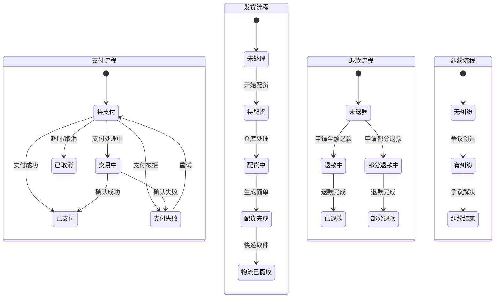

# 订单管理 PRD

> 优先级：**P0** | 版本：v1.0 | 更新日期：2026-04-16
> 关联业务规则：BR-ORD-001 ~ BR-ORD-008

## 1. 概述

### 功能简述
订单管理是 JerseyHolic 的核心业务模块，连接买家下单、支付确认、仓库配货、物流发货的全生命周期。系统需整合 OpenCart 前台下单和 ThinkPHP 后台管理的订单逻辑，支持 9 种支付状态 + 9 种发货状态 + 5 种退款状态 + 3 种纠纷状态的复合状态管理。

### 业务价值
- 统一两个旧系统的订单数据和管理流程
- 实时同步支付状态，确保订单生命周期完整
- 支持退款/争议处理，保护买卖双方利益

## 2. 用户角色

| 角色 | 权限 |
|------|------|
| Admin | 全部订单管理、退款、争议处理、状态修改 |
| Merchant | 查看本站订单、发起发货、基本管理 |
| Buyer | 查看自己的订单、申请退货/退款 |

## 3. 用户故事

#### US-ORD-001: 订单创建

**作为** 买家，
**我希望** 在结账确认后系统自动创建订单，
**以便** 我可以跟踪购买进度。

**验收标准：**
- Given 买家确认结账，When 订单创建，Then 生成唯一系统订单号、记录商品明细/地址/金额
- Given 订单创建，When 包含 hic 前缀 SKU，Then 标记 is_zw=1（仿牌标记）
- Given 订单创建，When 包含 DIY 前缀 SKU，Then 标记 is_diy=1
- Given 订单创建，When 包含 WPZ 前缀 SKU，Then 标记 is_wpz=1
- Given 订单包含多种货币，When 创建订单，Then 锁定当前汇率

**优先级**: P0 | **复杂度**: L

---

#### US-ORD-002: 订单状态流转

**作为** 系统管理员，
**我希望** 订单在支付、发货、退款各环节自动或手动流转状态，
**以便** 准确跟踪每个订单的当前阶段。

**验收标准：**
- Given 订单待支付，When 支付 Webhook 确认成功，Then 支付状态→已支付(3)、退款状态→未退款(1)
- Given 订单待支付超过 24 小时，When 定时任务检查，Then 支付状态→已取消(4)
- Given 订单已支付，When 管理员发起退款，Then 退款状态→退款中(9)
- Given 退款完成，When 支付渠道确认，Then 退款状态→已退款(6)
- Given 订单已支付，When 收到 PayPal 争议通知，Then 纠纷状态→有纠纷(2)
- Given 每次状态变更，When 执行更新，Then 记录操作历史（时间+操作者+备注）

**业务规则：** BR-ORD-001 ~ BR-ORD-005

**优先级**: P0 | **复杂度**: L

---

#### US-ORD-003: 订单列表搜索

**作为** 管理员，
**我希望** 通过多种条件筛选和搜索订单，
**以便** 快速定位特定订单。

**验收标准：**
- Given 管理员进入订单列表，When 按订单号搜索，Then 精确匹配系统订单号或A站订单号
- Given 按支付状态筛选"已支付"，When 查询，Then 仅返回 pay_status=3 的订单
- Given 按日期范围筛选，When 查询，Then 返回创建时间在范围内的订单
- Given 按域名筛选，When 查询，Then 返回指定站点的订单
- Given 按支付类型筛选"PayPal"，When 查询，Then 返回 pay_type=1 的订单
- Given 按 SKU 类型筛选"仿牌"，When 查询，Then 返回 is_zw=1 的订单

**优先级**: P0 | **复杂度**: M

---

#### US-ORD-004: 退货退款处理

**作为** 管理员，
**我希望** 处理买家的退货和退款请求，
**以便** 及时解决售后问题。

**验收标准：**
- Given 买家申请退货，When 管理员审核通过，Then 创建退货记录、设置退货状态
- Given 退货审核通过，When 发起退款，Then 调用支付渠道退款 API
- Given 退款金额 < 订单金额，When 退款成功，Then 标记为"部分退款"
- Given 退款金额 = 订单金额，When 退款成功，Then 标记为"已退款"

**优先级**: P0 | **复杂度**: L

---

#### US-ORD-005: PayPal 争议处理

**作为** 管理员，
**我希望** 自动接收和处理 PayPal 争议通知，
**以便** 及时响应并降低拒付损失。

**验收标准：**
- Given 收到 CUSTOMER.DISPUTE.CREATED Webhook，When 解析争议信息，Then 创建争议记录、关联订单、标记纠纷状态=有纠纷
- Given 收到 CUSTOMER.DISPUTE.RESOLVED，When 更新，Then 纠纷状态→纠纷结束
- Given 收到 PAYMENT.CAPTURE.REVERSED（拒付），When 处理，Then 自动标记退款状态

**优先级**: P1 | **复杂度**: L

## 4. 订单状态机

## 5. 数据需求

### 核心数据表

**jh_orders** — 订单主表
- id, order_no(系统单号), a_order_no(A站单号), yy_order_id(YY平台单号)
- merchant_id, a_website(来源域名), domain
- a_price(订单金额), currency(货币), price(USD金额)
- pay_status(支付状态1-9), shipment_status(发货状态0-9)
- refund_status(退款状态1/5/6/8/9), dispute_status(纠纷状态1-3)
- pay_type(支付类型0-16), pay_time
- paypal_account, paypal_email, paypal_order_id, paypal_transaction_no
- stripe_client, customer_email, customer_name
- is_blacklist(黑名单), is_zw(仿牌), is_diy(定制), is_wpz(正品)
- risk_type(风险等级), deduction_status(扣款), settlement_status(结算)
- order_time, create_time, update_time

**jh_order_addresses** — 订单地址
- order_id, customer_name, customer_email, phone
- country, country_name, state, state_name, city, zip
- address1, address2

**jh_order_products** — 订单商品行
- order_id, product_id, sku, name, quantity, price, options(JSON)

**jh_order_totals** — 订单费用明细
- order_id, code(sub_total/tax/shipping/coupon/total), title, value, sort_order

**jh_order_histories** — 订单状态历史
- order_id, status_type, old_status, new_status, comment, operator, created_at

**jh_order_ext** — 订单扩展信息
- order_id, success_url, cancel_url, notify_url

**jh_disputes** — 争议记录
- order_id, dispute_id(PayPal), reason, status, amount, created_at, resolved_at

## 6. API 需求

### 买家端
| 接口 | 方法 | 说明 |
|------|------|------|
| POST /api/orders | POST | 创建订单 |
| GET /api/orders | GET | 买家订单列表 |
| GET /api/orders/{id} | GET | 订单详情 |
| POST /api/orders/{id}/return | POST | 申请退货 |

### 管理端
| 接口 | 方法 | 说明 |
|------|------|------|
| GET /api/admin/orders | GET | 订单列表（多条件搜索） |
| GET /api/admin/orders/{id} | GET | 订单详情 |
| PUT /api/admin/orders/{id}/status | PUT | 更新订单状态 |
| POST /api/admin/orders/{id}/refund | POST | 发起退款 |
| GET /api/admin/orders/export | GET | 订单导出 |
| GET /api/admin/disputes | GET | 争议列表 |

## 7. 验收标准

### 功能验收
- [ ] 订单创建正确记录所有字段（商品/地址/金额/SKU分类标记）
- [ ] 支付状态 9 种枚举流转正确
- [ ] 发货状态枚举流转正确
- [ ] 退款全额/部分流程完整
- [ ] PayPal 争议自动接收和记录
- [ ] 订单超时自动取消
- [ ] 每次状态变更记录历史

### 安全验收
- [ ] 买家只能查看自己的订单
- [ ] 订单商品在后台同时显示真实名和安全映射名

### 边界场景
- [ ] 同步回调和异步回调同时到达时，不重复处理
- [ ] 退款金额不超过订单金额
- [ ] 已退款订单不可再次退款

## 8. 非功能需求

- **性能**：订单列表查询 < 500ms（含分页）
- **数据一致性**：支付状态更新使用事务
- **审计**：所有状态变更可追溯

## 9. 依赖

| 模块 | 依赖内容 |
|------|---------|
| 支付系统 | 支付成功/失败→订单状态更新 |
| 物流管理 | 发货→更新发货状态 |
| 商品映射 | 后台显示映射名称 |
| 用户系统 | 买家信息关联 |
