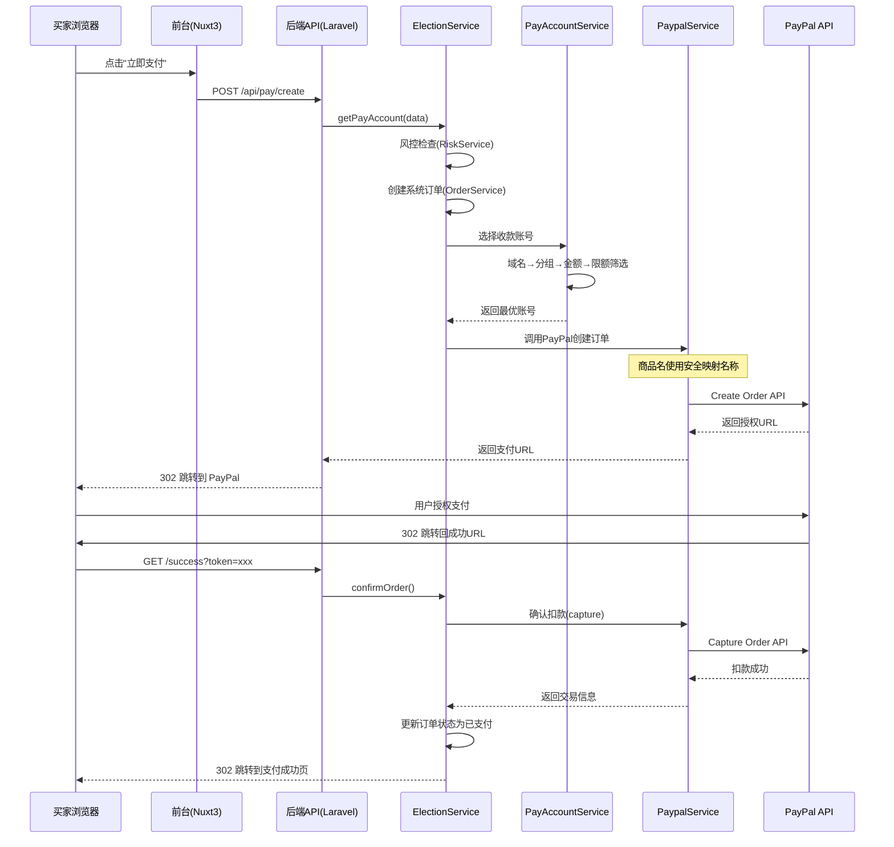
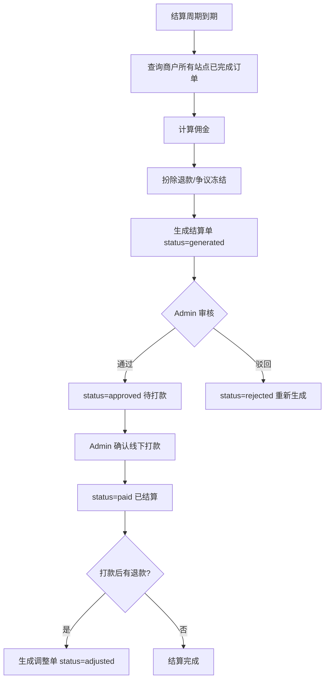

# 支付系统 PRD — Phase M3 支付与结算增强

> 优先级：**P0** | 版本：v3.0 (Phase M3) | 更新日期：2026-04-17
> 关联业务规则：BR-PAY-001 ~ BR-PAY-007, BR-PAY-POOL-*, BR-PAY-SETTLE-*, BR-PAY-RISK-*, BR-PAY-SEC-*, BR-SEC-*, BR-MAP-003, BR-PAY-DESC-*, BR-PAY-NURTURE-*, BR-PAY-COMM-*, BR-PAY-NOTIFY-*
>
> **Phase M3 范围调整说明**：经需求沟通后，Phase M3 聚焦于 **PayPal + Stripe** 两个支付网关，Antom/Payssion 推迟至后续 Phase。新增商品描述脱敏三层防护、账号温养策略、佣金规则引擎、消息推送模块、黑名单自动触发等核心能力。

## 1. 概述

### 功能简述
统一支付系统是 JerseyHolic 的核心交易模块。Phase M3 实现 **PayPal + Stripe** 两个网关集成，通过支付账号池和智能选号引擎（ElectionService，8层筛选+三层映射）实现多账号轮询、自动路由、异常熔断。同时引入商品描述脱敏三层防护体系、账号温养4阶段生命周期、佣金规则引擎（等级-成交量-忠诚度三维计算）、月结结算体系、RSA 签名验证（仅资金操作接口）、黑名单自动触发机制以及站内+钉钉双通道消息推送。

### 业务价值
- **PayPal + Stripe 双网关**：覆盖全球主流支付方式，M3 阶段聚焦核心网关
- **商品描述脱敏三层防护**：全局品类映射 → 站点级模板 → 动态轮换，杜绝模式识别风险
- **8层选号+三层映射**：Domain→Merchant→PaymentAccountGroup 精确路由，最大化收款成功率
- **账号温养4阶段**：new→growing→mature→aging 精细化限额管理，模拟正常交易行为
- **佣金规则引擎**：基础佣金(等级) - 成交量奖励 - 忠诚度奖励，激励商户成长
- **月结结算体系**：跨 Tenant DB 聚合，结算金额 = 收入 - 退款 - 争议冻结 - 佣金
- **RSA 签名验证**：仅资金操作接口强制验签，防篡改+防重放
- **黑名单自动触发**：风险评分达到阈值自动加入，管理员可手动干预
- **消息推送双通道**：站内通知 + 钉钉 Webhook，覆盖风险告警/结算提醒/账号异常

### 影响范围
- 买家前台结账流程
- 后台支付账号管理
- 订单状态更新
- 物流模块（PayPal 卖家保护 + Tracking API）
- 商户管理模块（结算、佣金、风险评分）
- 财务对账与报表
- 消息推送系统（站内+钉钉）
- **⚠️ 安全约束**：支付接口中的商品名称必须经过三层脱敏体系处理
- **⚠️ 每笔支付记录必须携带独立站域名信息（store_domain）**

## 2. 用户角色

| 角色 | 权限 |
|------|------|
| Admin | 管理支付账号、配置分组、查看收款报表、手动启用/禁用账号、管理结算规则、审核结算单 |
| Merchant | **(v2.0)** 查看自己的结算单与佣金明细、查看站点支付成功率（不可直接管理支付账号） |
| Buyer | 选择支付方式、完成支付、查看支付结果 |
| 系统 | 自动选号、Webhook 处理、异常熔断、退款处理、结算单自动生成、风险评分计算 |

## 3. 功能清单

### 3.1 支付网关集成（Phase M3 范围：PayPal + Stripe）

| 功能ID | 功能名称 | 优先级 | 复杂度 | 描述 |
|--------|---------|--------|--------|------|
| F-PAY-001 | PayPal 标准支付 | P0 | XL | Create Order → Approve → Capture 完整流程 |
| F-PAY-002 | PayPal 信用卡直付 | P0 | XL | Advanced Credit/Debit Card Payments，Hosted Fields，含 3DS |
| F-PAY-003 | Stripe 支付 | P0 | L | Checkout Session 模式 |
| F-PAY-004 | Antom 支付 | **延后** | L | 推迟至后续 Phase |
| F-PAY-005 | Payssion 本地支付 | **延后** | M | 推迟至后续 Phase |
| F-PAY-017 | PayPal Tracking API | P0 | M | 发货后上传 tracking number，卖家保护合规 |
| F-PAY-018 | PayPal 卖家保护合规 | P0 | M | 确保符合 PayPal Seller Protection 全部要求 |

**PayPal Webhook 事件处理**：
| 事件类型 | 处理逻辑 |
|---------|----------|
| CHECKOUT.ORDER.COMPLETED | 解析支付数据、更新订单状态为已支付、通知A站 |
| PAYMENT.CAPTURE.COMPLETED | 确认支付完成（PayPal官方渠道） |
| CUSTOMER.DISPUTE.CREATED | DisputesService 解析争议、创建争议记录 |
| CUSTOMER.DISPUTE.RESOLVED | DisputesService 更新争议状态 |

**Stripe Webhook 事件处理**：
| 事件类型 | 处理逻辑 |
|---------|----------|
| checkout.session.completed | 更新订单为已支付 |
| payment_intent.succeeded | 确认支付意图成功 |
| charge.refunded | 处理退款回调 |

### 3.2 商品描述脱敏体系（核心安全需求）

| 功能ID | 功能名称 | 优先级 | 复杂度 | 描述 |
|--------|---------|--------|--------|------|
| F-PAY-070 | Layer 1 全局品类映射 | P0 | L | 每个商品分类对应一组安全描述，如 basketball_jersey → "Men's Sports Performance Shirt" |
| F-PAY-071 | Layer 2 站点级模板 | P0 | M | 每个独立站可自定义安全描述风格 |
| F-PAY-072 | Layer 3 动态轮换 | P0 | M | 同一品类随机从多个安全描述中按权重选取，避免模式识别 |
| F-PAY-073 | 安全描述管理后台 | P0 | M | 管理 jh_paypal_safe_descriptions 表，CRUD + 权重配置 |

### 3.3 选号算法（8层筛选 + 三层映射）

| 功能ID | 功能名称 | 优先级 | 复杂度 | 描述 |
|--------|---------|--------|--------|------|
| F-PAY-006 | 支付账号池管理 | P0 | XL | 多账号 CRUD、分组、限额、优先级 |
| F-PAY-007 | 智能选号引擎 | P0 | XL | 8层筛选 + 三层映射自动选号 |
| F-PAY-008 | 异常自动禁用 | P0 | L | 3 分钟异常→自动禁用+启用备用 |
| F-PAY-009 | Webhook 统一处理 | P0 | L | PayPal/Stripe 异步回调验签+订单更新 |
| F-PAY-010 | 退款 API | P0 | M | 全额/部分退款 |
| F-PAY-011 | 风控检查 | P0 | M | 黑名单路由（自动触发+手动干预） |
| F-PAY-012 | 货币转汇 | P0 | M | 非 USD 自动转汇 |
| F-PAY-014 | 支付通道自动开关 | P1 | M | 账号耗尽自动下架前台支付 |
| F-PAY-015 | 3D Secure 验证 | P1 | M | PayPal 3DS 回跳处理 |
| F-PAY-016 | 支付配置查询 | P0 | S | 前台获取支付配置 |
| F-PAY-019 | 支付记录域名来源 | P0 | S | 每笔支付记录携带 store_domain，追溯订单来源 |

### 3.4 资金池管理与账号温养

| 功能ID | 功能名称 | 优先级 | 复杂度 | 描述 |
|--------|---------|--------|--------|------|
| F-PAY-030 | 支付账号分组管理 | P0 | L | VIP独占/Standard共享/Lite共享/黑名单隔离四类分组 |
| F-PAY-031 | 账号温养生命周期 | P0 | L | new(0-30天)→growing(30-90天)→mature(90-180天)→aging(180天+) 4阶段 |
| F-PAY-032 | 账号健康度评分 | P0 | L | 综合错误率/冻结信号/限制信号的实时评分 |
| F-PAY-033 | 三层映射引擎 | P0 | L | Domain→Merchant→PaymentAccountGroup，缓存 Redis TTL 5min |
| F-PAY-034 | 交易行为模拟 | P0 | M | 金额波动、时间分布约束、退款率控制 |
| F-PAY-035 | 支付成功率监控仪表盘 | P2 | M | 按账号/分组/商户/通道多维度实时监控 |

### 3.5 佣金规则引擎

| 功能ID | 功能名称 | 优先级 | 复杂度 | 描述 |
|--------|---------|--------|--------|------|
| F-PAY-040 | 佣金规则引擎 | P0 | L | 最终佣金 = 基础佣金(等级) - 成交量奖励 - 忠诚度奖励 |
| F-PAY-041 | 结算单自动生成 | P0 | XL | 按商户维度聚合所有站点交易，跨 Tenant DB |
| F-PAY-042 | 结算周期管理 | P0 | M | 初期仅月结，结算周期作为配置项预留扩展 |
| F-PAY-043 | 退款/争议结算影响 | P0 | L | 全额/部分退款扣减 + 争议冻结 |
| F-PAY-044 | 结算对账 | P1 | L | 系统流水 vs 支付网关对账 |
| F-PAY-045 | 结算报表 | P2 | M | 按商户/站点/品类/时间维度的结算汇总 |

### 3.6 风控与黑名单

| 功能ID | 功能名称 | 优先级 | 复杂度 | 描述 |
|--------|---------|--------|--------|------|
| F-PAY-050 | 商户风险评分 | P0 | L | 聚合所有站点的争议率/退款率/拒付金额 |
| F-PAY-051 | 动态限额调整 | P0 | M | 基于风险评分自动调整日/月限额 |
| F-PAY-052 | 买家行为风控 | P2 | L | 重复下单检测、大额预警、设备指纹 |
| F-PAY-053 | 平台级黑名单管理 | P0 | M | 风险评分自动触发 + 管理员手动干预，维度：ip/email/device/payment_account |
| F-PAY-054 | 商户级黑名单管理 | P1 | S | 商户自行维护站点范围黑名单 |
| F-PAY-055 | 黑名单双级范围 | P0 | M | platform(全局) + merchant(商户级) 两级范围 |

### 3.7 RSA 签名验证（仅资金操作接口）

| 功能ID | 功能名称 | 优先级 | 复杂度 | 描述 |
|--------|---------|--------|--------|------|
| F-PAY-060 | VerifyMerchantSignature 中间件 | P0 | L | 验证资金操作接口的 RSA-SHA256 数字签名 |
| F-PAY-061 | MerchantSignatureClient SDK | P0 | M | PHP 签名 SDK + Guzzle 中间件自动签名 |

### 3.8 消息推送模块

| 功能ID | 功能名称 | 优先级 | 复杂度 | 描述 |
|--------|---------|--------|--------|------|
| F-PAY-080 | 站内通知系统 | P0 | M | 数据库记录 + 管理后台轮询/WebSocket |
| F-PAY-081 | 钉钉 Webhook 推送 | P0 | M | 钉钉机器人，覆盖风险告警、结算提醒、账号异常 |
| F-PAY-082 | NotificationService 统一服务 | P0 | M | 统一消息发送入口，支持多通道分发 |

## 4. 用户故事

#### US-PAY-001: 买家 PayPal 支付

**作为** 买家，
**我希望** 在结账时选择 PayPal 支付并完成付款，
**以便** 使用我熟悉的支付方式购买商品。

**验收标准：**
- Given 买家选择 PayPal 支付并点击付款，When 系统处理请求，Then 系统自动选择可用 PayPal 账号、创建订单、返回 PayPal 授权 URL
- Given PayPal 授权成功后用户返回，When 系统确认订单，Then 执行扣款并更新订单状态为已支付
- Given 用户在 PayPal 页面取消，When 返回商城，Then 订单状态更新为已取消
- Given 支付创建过程中，When 传递商品信息到 PayPal，Then 商品名称使用安全映射名称（**非真实品牌名**）

**优先级**: P0 | **复杂度**: XL

---

#### US-PAY-002: 支付账号智能选择

**作为** 系统，
**我希望** 每次支付请求时，自动根据域名、金额、账号健康度选择最优收款账号，
**以便** 分散收款风险并最大化成功率。

**验收标准：**
- Given 域名 A 配置了分组 G1，When 支付请求来自域名 A，Then 从分组 G1 中选择账号
- Given 分组 G1 中有 3 个账号，When 一个累计收款达到限额，Then 自动跳过选择下一个
- Given 账号日收款达到日限额，When 新支付请求，Then 跳过该账号
- Given 黑名单用户请求支付，When 选择账号，Then 路由到黑名单专用分组（groupId=2）
- Given 订单金额为 EUR 50，When 选择账号，Then 先转汇为 USD 再匹配金额范围
- Given 所有账号均不可用，When 选择账号，Then 推送钉钉告警 + 下架前台支付 + 返回错误

**业务规则：** BR-PAY-001, BR-PAY-003, BR-PAY-004

**优先级**: P0 | **复杂度**: XL

---

#### US-PAY-003: 异常账号自动熔断

**作为** 系统管理员，
**我希望** 异常支付账号能在 3 分钟内自动禁用，并启用备用账号，
**以便** 减少支付失败对收入的影响。

**验收标准：**
- Given 账号首次报错（无 errorMsg），When 记录异常时间，Then 仅记录 error_time，不禁用
- Given 账号持续报错超过 180 秒，When 新请求携带异常信息，Then 自动禁用（status=0, permission=3）
- Given 账号报错且携带明确 errorMsg，When 处理异常，Then 立即禁用
- Given 账号被禁用，When 同分组存在可收款备用账号（status=0, permission=1），Then 自动启用备用账号
- Given 任何账号禁用事件，When 触发，Then 推送钉钉告警

**业务规则：** BR-PAY-002

**优先级**: P0 | **复杂度**: L

---

#### US-PAY-004: Webhook 异步回调处理

**作为** 系统，
**我希望** 正确处理各支付渠道的异步回调通知，
**以便** 及时更新订单支付状态。

**验收标准：**
- Given 收到 PayPal CHECKOUT.ORDER.COMPLETED 事件，When 验签通过，Then 更新订单为已支付
- Given 收到 PayPal CUSTOMER.DISPUTE.CREATED 事件，When 验签通过，Then 创建争议记录、更新纠纷状态
- Given 收到 Stripe checkout.session.completed 事件，When 验签通过且 livemode=true，Then 更新订单为已支付
- Given 重复收到同一 transactionId 的回调，When 检查 Redis 缓存，Then 直接返回成功（防重）
- Given 验签失败，When 处理回调，Then 返回错误，不更新订单

**业务规则：** BR-PAY-006, BR-PAY-007, BR-ORD-008

**优先级**: P0 | **复杂度**: L

---

#### US-PAY-005: 退款处理

**作为** 管理员，
**我希望** 对已支付订单发起全额或部分退款，
**以便** 处理客户退货或争议。

**验收标准：**
- Given 订单已支付且有交易号，When 发起全额退款，Then 调用 PayPal 退款 API 并更新退款状态为"退款中"
- Given 退款 API 返回成功，When 更新状态，Then 订单退款状态变为"已退款"
- Given 发起部分退款 $20（订单 $50），When 退款成功，Then 退款状态为"部分退款"
- Given 订单无交易号，When 尝试退款，Then 返回错误"查无此订单"

**优先级**: P0 | **复杂度**: M

---

### Phase M3 新增用户故事

#### US-PAY-006: 商品描述脱敏三层防护

**作为** 系统，
**我希望** 支付接口中的商品描述经过三层防护处理（全局品类映射 → 站点级模板 → 动态轮换），
**以便** 最大程度降低支付平台模式识别和商品审查风险。

**验收标准：**
- Given 商品品类为 basketball_jersey，When 创建 PayPal 订单，Then 商品名称显示为 "Men's Sports Performance Shirt" 等安全描述
- Given 站点 A 配置了自定义安全描述风格，When 创建支付，Then 优先使用站点级模板而非全局映射
- Given 同一品类有 3 条安全描述（权重 50/30/20），When 多次创建支付，Then 随机按权重选取不同描述，不出现固定模式
- Given 品类未配置安全描述，When 创建支付，Then 回退到全局兆底默认名 "Sports Training Jersey"
- Given 任何场景，When 安全映射处理，Then **价格字段永远不被映射替换**

**三层防护架构：**
```
Layer 1: 全局品类映射 (store_id=NULL)
  └→ basketball_jersey → ["Men's Sports Performance Shirt", "Athletic Training Top", ...]
Layer 2: 站点级模板 (store_id=具体站点)
  └→ 站点 A 自定义风格，覆盖 Layer 1
Layer 3: 动态轮换
  └→ 按权重随机选取，同一品类每次可能返回不同描述
```

**业务规则：** BR-PAY-DESC-001, BR-PAY-DESC-002, BR-PAY-DESC-003

**优先级**: P0 | **复杂度**: L

---

#### US-PAY-007: 账号温养与流量分配

**作为** 系统，
**我希望** 根据账号生命周期阶段精细化管理限额并模拟正常交易行为，
**以便** 最大化账号生存率，避免触发风控冻结。

**验收标准：**
- Given 新账号（0-30天），When 分配订单，Then 日限额$200，月限额$2000，每天最多3-5单，单笔≤$50
- Given 成长期账号（30-90天），When 分配订单，Then 日限额$500，月限额$8000，每天最10-20单
- Given 成熟期账号（90-180天），When 分配订单，Then 日限额$2000，月限额$30000
- Given 老化期账号（180天+），When 分配订单，Then 日限额$5000，月限额$50000
- Given 支付金额处理，When 生成实际扣款金额，Then 浮动±$0.01-$0.99 随机金额
- Given 同一账号，When 连续交易，Then 60秒内最多1笔，5分钟内最多3笔
- Given 账号退款率>1%，When 系统监控，Then 发出预警；退款率>1.5% → 账号降级

**账号生命周期 4 阶段明细：**
| 阶段 | 时间范围 | 日限额 | 月限额 | 单量约束 |
|------|----------|--------|--------|----------|
| new | 0-30天 | $200 | $2,000 | 每天最多3-5单，单笔≤$50 |
| growing | 30-90天 | $500 | $8,000 | 每天10-20单 |
| mature | 90-180天 | $2,000 | $30,000 | 正常分配 |
| aging | 180天+ | $5,000 | $50,000 | 正常分配 |

**交易行为模拟约束：**
| 约束项 | 规则 |
|---------|------|
| 金额波动 | ±$0.01-$0.99 随机浮动，避免整数金额 |
| 时间分布 | 同账号60秒内最多1笔，5分钟内最多3笔 |
| 退款控制 | 退款率>1% 预警，>1.5% 账号降级 |

**业务规则：** BR-PAY-NURTURE-001, BR-PAY-NURTURE-002

**优先级**: P0 | **复杂度**: L

---

#### US-PAY-008: 选号算法（8层筛选 + 三层映射）

**作为** 系统，
**我希望** 每次支付请求通过 8 层筛选和三层映射自动选择最优收款账号，
**以便** 精确路由并最大化收款成功率。

**8层筛选流程：**
```
① 风控前置检查(黑名单路由) 
→ ② 三层映射获取分组 (Domain → Merchant → PaymentAccountGroup)
→ ③ 筛选可用账号 (status=1 + permission 正常)
→ ④ 优先级排序 (priority DESC)
→ ⑤ 限额检查 (日限额/月限额)
→ ⑥ 健康度检查 (score≥30)
→ ⑦ 交易行为约束检查 (时间间隔/单量/退款率)
→ ⑧ 返回账号/容灾
```

**三层映射：**
```
Domain(jerseyholic-a.com)
  └→ Merchant(merchant_001)
       └→ PaymentAccountGroup(VIP_GROUP_1)
            └→ [PayPal Account A, PayPal Account B, Stripe Account C]
```
- 通过 `jh_merchant_payment_group_mappings` 表关联
- 缓存映射结果（Redis TTL 5min）

**验收标准：**
- Given 域名 A 的商户配置了分组 G1，When 支付请求来自域名 A，Then 从分组 G1 中选择账号
- Given 账号健康度评分 < 30，When 选号，Then 跳过该账号
- Given 同一账号 60 秒内已有 1 笔交易，When 新支付请求，Then 跳过该账号
- Given 所有账号均不可用，When 选号，Then 推送钉钉告警 + 下架前台支付 + 返回错误

**业务规则：** BR-PAY-001, BR-PAY-003, BR-PAY-POOL-003

**优先级**: P0 | **复杂度**: XL

---

#### US-PAY-009: 佣金规则引擎

**作为** 系统，
**我希望** 根据商户等级、成交量和忠诚度三个维度自动计算佣金，
**以便** 激励商户成长并确保平台收益。

**佣金计算公式：**
```
最终佣金 = 基础佣金(等级) - 成交量奖励 - 忠诚度奖励
```

**基础佣金（按商户等级）：**
| 商户等级 | 基础佣金范围 |
|----------|------------|
| Starter | 20%-25% |
| Standard | 15%-20% |
| Advanced | 10%-15% |
| VIP | 8%-12% |

**成交量奖励：**
| 累计月成交额 | 奖励减免 |
|--------------|----------|
| ≥$50,000 | 5% |
| $30,000-$50,000 | 3% |
| $10,000-$30,000 | 1% |
| <$10,000 | 0% |

**忠诚度奖励：**
| 合作时长 | 奖励减免 |
|----------|----------|
| ≥12个月 | 3% |
| 6-12个月 | 2% |
| 3-6个月 | 1% |
| <3个月 | 0% |

**范围约束：** min 8%, max 35%

**验收标准：**
- Given VIP商户基础佣金10%，月成交$80,000(奖励5%)，合作18个月(奖励3%)，When 计算佣金，Then 10%-5%-3%=2% → 但不可低于8% → 实际**8%**
- Given Starter商户基础佣金20%，月成交$5,000，合作2个月，When 计算佣金，Then 20%-0%-0%=**20%**

**业务规则：** BR-PAY-COMM-001, BR-PAY-COMM-002

**优先级**: P0 | **复杂度**: L

---

#### US-PAY-010: 月结结算体系

**作为** 系统，
**我希望** 每月自动聚合商户名下所有站点的交易数据，生成结算单并经过审核后打款，
**以便** 平台与商户进行透明、准确的资金结算。

**结算流程：**
```
定时生成 draft → 管理员审核 → approved → 打款 → paid
```

**结算金额计算：**
```
结算金额 = 收入 - 退款 - 争议冻结 - 佣金
```

**退款/争议影响：**
| 场景 | 处理规则 |
|------|----------|
| 全额退款 | 扣除订单金额 + 佣金 |
| 部分退款 | 按比例扣减 |
| 争议中 | 冻结该金额，不计入当期结算 |
| 结算后退款 | 生成调整单，下期扣除 |

**验收标准：**
- Given 商户 A 有 3 个站点，When 月末触发结算，Then 遍历商户名下所有站点数据库，聚合生成 1 张结算单
- Given 结算单生成，When 计算金额，Then 结算金额 = 收入 - 退款 - 争议冻结 - 佣金
- Given 初期版本，When 配置结算周期，Then 仅支持月结，结算周期作为配置项预留扩展
- Given 结算单状态为 draft，When 管理员审核通过，Then 状态 → approved
- Given 结算单状态为 approved，When 管理员确认打款，Then 状态 → paid

**业务规则：** BR-PAY-SETTLE-001, BR-PAY-SETTLE-002, BR-PAY-SETTLE-003

**优先级**: P0 | **复杂度**: XL

---

#### US-PAY-011: 黑名单自动触发机制

**作为** 系统，
**我希望** 当买家风险评分达到阈值时自动加入黑名单，同时管理员可手动干预，
**以便** 高效防范欺诈交易同时保留人工纠错能力。

**验收标准：**
- Given 买家风险评分 ≥ 阈值，When 系统评估，Then 自动加入黑名单
- Given 管理员认为误判，When 手动移除黑名单，Then 立即生效并记录操作日志
- Given 黑名单维度为 ip/email/device/payment_account，When 任一维度命中，Then 路由到黑名单隔离分组
- Given 平台级黑名单和商户级黑名单同时存在，When 匹配，Then 平台级优先级更高

**业务规则：** BR-PAY-RISK-002

**优先级**: P0 | **复杂度**: M

---

#### US-PAY-012: 消息推送双通道

**作为** 系统管理员，
**我希望** 收到站内通知和钉钉推送的重要事件告警，
**以便** 及时响应风险事件和业务异常。

**覆盖场景：**
| 事件类型 | 站内通知 | 钉钉推送 | 说明 |
|----------|----------|----------|------|
| 风险告警 | ✅ | ✅ | 黑名单触发、高风险商户、账号异常 |
| 结算提醒 | ✅ | ✅ | 结算单生成、审核待办、打款确认 |
| 账号异常 | ✅ | ✅ | 账号禁用、健康度低于阈值、耗尽告警 |
| 结算状态变更 | ✅ | ❌ | 商户可在后台查看 |

**验收标准：**
- Given 账号被自动禁用，When 触发通知，Then 同时发送站内通知 + 钉钉 Webhook
- Given 结算单生成，When 触发通知，Then 站内通知 + 钉钉推送审核提醒
- Given 钉钉 Webhook 发送失败，When 重试，Then 最多重试 3 次，间隔 30秒

**业务规则：** BR-PAY-NOTIFY-001

**优先级**: P0 | **复杂度**: M

---

#### US-PAY-013: 支付请求签名验证（仅资金操作接口）

**作为** 系统，
**我希望** 验证独立站发来的支付请求的数字签名，
**以便** 确保请求来自合法的独立站且未被篡改。

**验收标准：**
- Given 独立站发起支付请求，When 请求携带有效的 X-Merchant-Key-Id 和 X-Signature 头，Then 管理后台使用对应公钥验证签名，通过后继续处理
- Given 请求缺少签名头，When 中间件检查，Then 返回 401001 错误码
- Given 签名验证失败，When 公钥验签不通过，Then 返回 401003 错误码，记录安全日志
- Given 请求时间戳偏差超过 ±5 分钟，When 验证时间窗口，Then 返回 401004 错误码（防重放攻击）
- Given 同一 Nonce 重复使用，When Redis 检测到重复，Then 返回 401005 错误码
- Given 密钥已吊销或过期，When 查询密钥状态，Then 返回 401002 错误码
- Given 连续签名失败超过阈值，When 触发安全告警，Then 推送钉钉告警 + 记录安全事件

**签名数据构造**：
```
待签名字符串 = HTTP Method + "\n" + Request Path + "\n" + Timestamp + "\n" + Request Body (JSON)
签名 = Base64(RSA-SHA256(private_key, signing_string))
```

**示例请求头**：
```
X-Merchant-Key-Id: mk_abc123def456
X-Signature: Base64(RSA-SHA256(signing_string))
X-Timestamp: 1713283200
X-Nonce: uuid-v4
```

**错误码定义**：
| 错误码 | 说明 |
|--------|------|
| 401001 | 缺少签名头（X-Merchant-Key-Id / X-Signature / X-Timestamp / X-Nonce） |
| 401002 | 密钥不存在或已吊销/过期 |
| 401003 | 签名验证失败 |
| 401004 | 请求已过期（时间窗口外） |
| 401005 | 重复请求（Nonce 重复） |

**业务规则：** BR-SEC-001, BR-SEC-002

**优先级**: P0 | **复杂度**: L

## 5. 业务规则

详见 `business-rules.md` BR-PAY-001 ~ BR-PAY-007、BR-SEC-001 ~ BR-SEC-002。

**⚠️ 安全提醒**：所有支付渠道创建订单时，必须通过三层脱敏体系获取安全商品名称。参见 BR-MAP-003、BR-PAY-DESC-001~003。

### Phase M3 新增业务规则

以下规则已同步更新到 `business-rules.md`。

#### BR-PAY-DESC-001: 商品描述脱敏三层防护

- **触发条件**：支付接口创建订单时获取商品描述
- **规则内容**：
  1. **Layer 1 全局品类映射**：每个商品分类对应一组安全描述（store_id=NULL）
  2. **Layer 2 站点级模板**：每个独立站可自定义安全描述风格（store_id=具体站点）
  3. **Layer 3 动态轮换**：同一品类随机从多个安全描述中按权重选取
- **查询优先级**：站点级(store_id) > 全局(store_id=NULL) > 兆底默认名
- **安全等级**：最高

#### BR-PAY-DESC-002: 安全描述权重轮换

- **触发条件**：同一品类有多条安全描述时
- **规则内容**：按 weight 字段权重随机选取，避免模式识别。weight=0 的记录不参与轮换。
- **安全等级**：高

#### BR-PAY-DESC-003: 价格永不映射

- **触发条件**：所有安全映射场景
- **规则内容**：价格字段在任何场景下都永远不被映射替换，始终使用真实价格。
- **安全等级**：最高

#### BR-PAY-NURTURE-001: 账号温养 4 阶段生命周期

- **触发条件**：账号创建、系统定时评估时
- **规则内容**：

| 阶段 | 时间范围 | 日限额 | 月限额 | 单量约束 |
|------|----------|--------|--------|----------|
| new | 0-30天 | $200 | $2,000 | 每天最多3-5单，单笔≤$50 |
| growing | 30-90天 | $500 | $8,000 | 每天10-20单 |
| mature | 90-180天 | $2,000 | $30,000 | 正常分配 |
| aging | 180天+ | $5,000 | $50,000 | 正常分配 |

- **安全等级**：高

#### BR-PAY-NURTURE-002: 交易行为模拟约束

- **触发条件**：选号引擎分配账号时
- **规则内容**：
  - 金额波动：±$0.01-$0.99 随机浮动，避免整数金额
  - 时间分布：同账号 60 秒内最多 1 笔，5 分钟内最多 3 笔
  - 退款控制：退款率 > 1% 预警，> 1.5% 账号降级
- **安全等级**：高

#### BR-PAY-COMM-001: 佣金计算公式

- **触发条件**：订单支付成功时计算佣金
- **规则内容**：
  - 公式：最终佣金 = 基础佣金(等级) - 成交量奖励 - 忠诚度奖励
  - 基础佣金：Starter 20-25%, Standard 15-20%, Advanced 10-15%, VIP 8-12%
  - 成交量奖励：≥$50k→5%, $30-50k→3%, $10-30k→1%
  - 忠诚度奖励：≥12月→3%, 6-12月→2%, 3-6月→1%
  - 范围约束：min 8%, max 35%
- **安全等级**：高

#### BR-PAY-COMM-002: 佣金实时计算与退回

- **触发条件**：订单支付成功或退款时
- **规则内容**：支付成功后实时计算佣金，退款时按比例退回佣金。争议期间订单暂不计入结算。
- **安全等级**：高

#### BR-PAY-SETTLE-M3-001: 初期仅月结

- **触发条件**：结算周期配置时
- **规则内容**：Phase M3 初期仅支持月结，结算周期作为配置项预留扩展。
- **结算金额公式**：结算金额 = 收入 - 退款 - 争议冻结 - 佣金
- **跨 Tenant DB 聚合**：遍历商户名下所有站点数据库，聚合订单数据
- **流程**：定时生成 draft → 管理员审核 → approved → 打款 → paid
- **安全等级**：最高

#### BR-PAY-SETTLE-M3-002: 退款/争议影响规则

- **触发条件**：退款/争议事件发生时
- **规则内容**：
  - 全额退款：扣除订单金额 + 佣金
  - 部分退款：按比例扣减
  - 争议中：冻结该金额，不计入当期结算
  - 结算后退款：生成调整单，下期扣除
- **安全等级**：最高

#### BR-PAY-NOTIFY-001: 消息推送规则

- **触发条件**：风险告警、结算事件、账号异常时
- **规则内容**：
  - 站内通知：所有事件均记录到 jh_notifications 表
  - 钉钉推送：风险告警、结算提醒、账号异常三类事件通过 Webhook 机器人推送
  - 钉钉失败重试：最多 3 次，间隔 30 秒
- **安全等级**：中

#### BR-PAY-SEC-001: 支付请求必须签名（仅资金操作接口）

- **触发条件**：独立站向管理后台发起支付相关请求
- **规则内容**：
  1. 所有支付相关 API 请求必须携带有效的数字签名
  2. 签名使用 RSA-SHA256 算法
  3. 时间戳偏差不超过 ±5 分钟
  4. 每个 Nonce 只能使用一次（Redis 缓存，TTL=10 分钟）
- **安全等级**：最高
- **违规处理**：拒绝请求，记录安全日志，连续失败超过阈值触发钉钉告警

#### BR-PAY-SEC-002: 密钥轮换规则

- **触发条件**：密钥接近过期或手动触发轮换
- **规则内容**：
  1. 密钥默认有效期 365 天
  2. 到期前 30 天系统自动提醒商户
  3. 轮换时新旧密钥并存 24 小时过渡期
  4. 过渡期结束后旧密钥自动失效
  5. 紧急吊销立即生效，无过渡期
- **安全等级**：高

#### BR-PAY-POOL-001: 账号分组类型

| 分组类型 | 编码 | 说明 |
|---------|------|------|
| VIP 独占 | VIP_EXCLUSIVE | 绑定单一商户，不与其他商户共享账号 |
| 标准共享 | STANDARD_SHARED | 多个标准商户共用同一批账号 |
| 轻量共享 | LITE_SHARED | 多个小商户共用，账号额度较低 |
| 黑名单隔离 | BLACKLIST_ISOLATED | 专用于黑名单用户，低额度可牺牲账号 |

#### BR-PAY-POOL-002: 账号生命周期阶段

```
new(新建) → growing(成长) → mature(成熟) → aging(老化)
                                              → suspended(暂停) → growing/aging
```

| 阶段 | 触发条件 | 限额策略 |
|------|----------|----------|
| 新建 | 刚创建的账号 | 日限 $500，月限 $3000 |
| 成长 | 累计收款 > $3000 且无异常 | 日限 $2000，月限 $15000 |
| 成熟 | 连续 30 天无异常且收款 > $15000 | 日限 $5000，月限 $50000 |
| 老化 | 健康度 < 30 分或被冻结 | 自动禁用，不再分配新订单 |

#### BR-PAY-POOL-003: 三层映射关系

```
Domain(jerseyholic-a.com)
  └→ merchant_id(merchant_001)
       └→ group_id(VIP_GROUP_1)
            └→ [PayPal Account A, PayPal Account B, Stripe Account C]

Domain(jerseyholic-b.com)
  └→ merchant_id(merchant_001)  // 同一商户可拥有多个域名
       └→ group_id(VIP_GROUP_1)  // 共用同一分组
```

**规则：**
- 一个域名必须且只能属于一个商户
- 一个商户可管理多个域名（多站点矩阵）
- 一个商户可关联一个或多个支付分组（PayPal 分组 + 信用卡分组可不同）
- 分组不可跨商户共享（VIP类型）或可跨商户共享（Shared类型）

#### BR-PAY-SETTLE-001: 结算周期规则

| 商户等级 | 结算周期 | 说明 |
|---------|---------|------|
| 入门级 | 月结（T+30） | 新商户默认 |
| 中级 | 双周结（T+14） | 月均成交 $3000-$15000 |
| 高级 | 周结（T+7） | 月均成交 $15000+ |
| VIP | 周结（T+7） | 月均成交 $50000+ |

#### BR-PAY-SETTLE-002: 结算金额计算公式

```
应结金额 = 结算周期内总收款
           - 佣金总额
           - 未结退款金额
           - 争议冻结金额
           - 历史调整单金额（如有）
```

**特殊场景：**
- 应结金额为负数：结算单状态为“待回收”，在下期结算中扣除
- 结算单已打款后发生退款：生成调整单，在下期结算中扮除
- 争议未解决订单：冻结该金额，争议解决后释放或扮除

#### BR-PAY-SETTLE-003: 支付费用承担

- PayPal 费用（4.4% + $0.30/笔）：**平台承担**，不从商户结算中扮除
- Stripe 费用（2.9% + $0.30/笔）：**平台承担**
- 支付费用已包含在佣金中，无需单独扮除

#### BR-PAY-RISK-001: 商户风险等级

| 风险等级 | 评分范围 | 影响 |
|---------|---------|------|
| 低风险 | 80-100 | 正常运营，可申请提升限额 |
| 中风险 | 50-79 | 增加监控，限额不变 |
| 高风险 | 20-49 | 限额下调 50%，触发告警 |
| 极高风险 | 0-19 | 暂停新交易，人工审核 |

#### BR-PAY-RISK-002: 黑名单类型与维度

| 类型 | 维度 | 说明 |
|------|------|------|
| 平台级黑名单 | IP、邮箱、设备指纹、支付账号 | Admin 管理，全局生效 |
| 商户级黑名单 | IP、邮箱 | 商户自行维护，仅对其站点生效 |

**匹配优先级：** 平台级黑名单 > 商户级黑名单

## 6. 数据需求

### 核心数据表（传递给 @architect）

**jh_payment_accounts** — 支付账号表
- id, account(标识), email, client(client_id), secret(secret_key)
- merchant_id(PayPal商户ID), domain(关联域名)
- pay_method(支付方式), category_id(PayPal分组), cc_category_id(信用卡分组)
- status(启用/禁用), permission(1可收款/3已封禁)
- min_money, max_money(金额范围)
- limit_money(总限额), daily_limit_money(日限额)
- money_total(累计收款), daily_money_total(日累计)
- priority(优先级), max_num(最大成交单数)
- is_new(新账号标记), is_force(强制启用)
- error_time(首次异常时间), error_msg(异常信息)
- webhook_id, access_token, access_token_expires_in
- success_url, cancel_url, pay_url, skrpay_url/key/secret
- **(v2.0 新增)** lifecycle_stage ENUM('new','growing','mature','aging') DEFAULT 'new' — 生命周期阶段
- **(v2.0 新增)** lifecycle_days INT DEFAULT 0 — 账号已使用天数（用于温养阶段判定）
- **(v2.0 新增)** health_score TINYINT DEFAULT 100 — 健康度评分(0-100)
- **(v2.0 新增)** health_updated_at DATETIME — 健康度最后计算时间
- **(v2.0 新增)** monthly_limit_money DECIMAL — 月限额
- **(v2.0 新增)** monthly_money_total DECIMAL — 月累计收款
- **(v2.0 新增)** daily_order_count INT DEFAULT 0 — 日累计单数（温养单量约束）
- **(v2.0 新增)** last_transaction_at DATETIME NULL — 最后交易时间（时间分布约束）
- **(v2.0 新增)** refund_rate DECIMAL(5,4) DEFAULT 0 — 退款率（温养退款控制）
- **(v2.0 新增)** group_type ENUM — 分组类型冗余
- **(v2.0 新增)** frozen_signal_count INT DEFAULT 0 — 冻结/限制信号累计
- delete_time, create_time, update_time

**jh_payment_account_logs** — 账号收款日志
- id, account_id, order_id, amount, currency, created_at

**jh_payment_cards** — 信用卡信息（临时存储）
- id, order_id, name, number(加密), expiry, security_code(加密)

**jh_websites** — 站点配置
- id, website(域名), group_id(PayPal分组), cc_group_id(信用卡分组)
- user_id(商户ID), token(API token)
- **(v2.0 新增)** merchant_id — 关联商户表 ID（明确三层映射）

### Phase M3 新增数据表

**jh_paypal_safe_descriptions** — 商品安全描述表（三层脱敏核心表）
- id
- store_id BIGINT NULL — NULL=全局(Layer 1)，具体值=站点级(Layer 2)
- product_category VARCHAR(100) — 商品品类编码（如 basketball_jersey）
- safe_name VARCHAR(255) — 安全商品名称（如 "Men's Sports Performance Shirt"）
- safe_description TEXT — 安全商品描述
- safe_category_code VARCHAR(50) — 安全品类编码
- weight INT DEFAULT 1 — 权重（用于动态轮换，0=不参与）
- status TINYINT DEFAULT 1 — 状态（1=启用, 0=禁用）
- created_at, updated_at

**jh_merchant_payment_group_mappings** — 商户支付分组映射表（三层映射核心表）
- id
- merchant_id BIGINT — 商户 ID
- store_id BIGINT — 站点 ID
- domain VARCHAR(255) — 站点域名
- paypal_group_id BIGINT — PayPal 支付分组 ID
- stripe_group_id BIGINT NULL — Stripe 支付分组 ID
- cc_group_id BIGINT NULL — 信用卡分组 ID
- created_at, updated_at

**jh_notifications** — 站内通知表
- id
- type VARCHAR(50) — 通知类型（risk_alert, settlement_reminder, account_abnormal, etc.）
- title VARCHAR(255) — 通知标题
- content TEXT — 通知内容
- level ENUM('info','warning','critical') — 紧急级别
- target_type ENUM('admin','merchant') — 目标角色
- target_id BIGINT NULL — 目标用户 ID（NULL=全部）
- read_at DATETIME NULL — 已读时间（NULL=未读）
- metadata JSON NULL — 附加数据
- created_at, updated_at

**jh_settlements** — 结算单表
- id
- settlement_no VARCHAR(32) UNIQUE — 结算单号
- merchant_id BIGINT — 商户 ID
- period_start DATE — 结算周期开始
- period_end DATE — 结算周期结束
- total_amount DECIMAL(12,2) — 总收款金额 (USD)
- commission_amount DECIMAL(12,2) — 佣金总额
- refund_amount DECIMAL(12,2) — 退款扮除
- dispute_frozen_amount DECIMAL(12,2) — 争议冻结金额
- adjustment_amount DECIMAL(12,2) DEFAULT 0 — 调整金额
- net_amount DECIMAL(12,2) — 实际应结金额
- status ENUM('pending','generated','approved','rejected','paid','adjusted') — 状态
- approved_by BIGINT NULL — 审核人
- approved_at DATETIME NULL — 审核时间
- paid_at DATETIME NULL — 打款时间
- paid_remark TEXT NULL — 打款备注（线下打款参考）
- created_at, updated_at

**jh_settlement_details** — 结算明细表
- id
- settlement_id BIGINT — 关联结算单
- order_id BIGINT — 订单 ID
- website_id BIGINT — 站点 ID
- store_domain VARCHAR(255) — 独立站域名（分站点对账）
- order_amount DECIMAL(10,2) — 订单金额 (USD)
- commission_rate DECIMAL(5,4) — 佣金率
- commission_amount DECIMAL(10,2) — 佣金金额
- refund_amount DECIMAL(10,2) DEFAULT 0 — 退款金额
- net_amount DECIMAL(10,2) — 应结金额
- type ENUM('normal','refund','dispute','adjustment') — 明细类型
- created_at

**jh_merchant_risk_scores** — 商户风险评分表
- id
- merchant_id BIGINT — 商户 ID
- risk_score INT — 风险评分 (0-100)
- risk_level ENUM('low','medium','high','critical') — 风险等级
- dispute_rate DECIMAL(5,4) — 争议率
- refund_rate DECIMAL(5,4) — 退款率
- chargeback_amount DECIMAL(12,2) — 拒付金额
- calculated_at DATETIME — 计算时间
- created_at, updated_at

**jh_merchant_transaction_limits** — 商户交易限额表
- id
- merchant_id BIGINT — 商户 ID
- daily_limit DECIMAL(12,2) — 日限额
- monthly_limit DECIMAL(12,2) — 月限额
- daily_used DECIMAL(12,2) DEFAULT 0 — 日已用
- monthly_used DECIMAL(12,2) DEFAULT 0 — 月已用
- auto_adjusted TINYINT DEFAULT 0 — 是否自动调整
- last_adjusted_at DATETIME NULL — 最后调整时间
- created_at, updated_at

**jh_fund_flow_logs** — 资金流水日志表
- id
- merchant_id BIGINT — 商户 ID
- order_id BIGINT NULL — 关联订单
- settlement_id BIGINT NULL — 关联结算单
- type ENUM('income','commission','refund','dispute','settlement','adjustment') — 流水类型
- amount DECIMAL(12,2) — 金额
- balance_after DECIMAL(12,2) — 操作后余额
- description VARCHAR(255) — 描述
- created_at

**jh_blacklist** — 平台级黑名单表
- id
- type ENUM('ip','email','device','payment_account') — 黑名单维度
- value VARCHAR(255) — 黑名单值
- reason VARCHAR(500) — 加入原因
- expires_at DATETIME NULL — 过期时间（NULL 表示永久）
- created_by BIGINT — 创建人
- created_at, updated_at

**jh_merchant_blacklist** — 商户级黑名单表
- id
- merchant_id BIGINT — 商户 ID
- type ENUM('ip','email') — 黑名单维度
- value VARCHAR(255) — 黑名单值
- reason VARCHAR(500) — 加入原因
- created_at, updated_at

## 7. 页面/交互说明

### 买家前台
1. **支付方式选择** — 展示可用支付方式（PayPal/信用卡/本地支付）
2. **支付处理中** — 跳转到支付网关/等待页面
3. **支付成功页** — 显示订单确认信息
4. **支付失败页** — 显示错误并提供重试选项

### 管理后台
1. **账号列表页** — 查看所有支付账号、状态、收款额、限额使用率
2. **账号编辑页** — 配置账号信息、限额、分组、优先级
3. **站点支付配置** — 域名→收款分组映射
4. **支付报表** — 各账号收款统计、健康度图表
5. **账号分组管理** — 分组 CRUD、类型配置、商户关联
6. **账号温养仪表盘** — 健康度评分、生命周期阶段、交易行为统计、异常趋势图
7. **结算单列表页** — 查看所有商户结算单、状态筛选、审核操作
8. **结算单详情页** — 商户交易汇总、佣金明细、退款扣除、审核/确认打款
9. **佣金规则配置** — 按商户/品类配置佣金模型和率
10. **商户风险监控** — 风险评分、限额状态、争议/退款率趋势
11. **黑名单管理** — 平台级黑名单 CRUD，支持自动触发查看
12. **安全描述管理** — jh_paypal_safe_descriptions 的 CRUD、权重配置、预览
13. **消息中心** — 站内通知列表、未读标记、筛选

### 商户后台（v2.0 新增）
1. **我的结算** — 结算单列表、结算详情、佣金明细
2. **支付概览** — 各站点支付成功率、收款趋势（不展示支付账号）
3. **我的黑名单** — 商户级黑名单 CRUD

### 支付流程图



### 结算流程图（v2.0 新增）



## 8. API 需求

### 买家端 API
| 接口 | 方法 | 说明 |
|------|------|------|
| POST /api/pay/create | POST | 创建支付（PayPal/信用卡/Stripe等） |
| GET /api/pay/config/{order_no} | GET | 获取订单支付配置 |
| POST /api/pay/stripe/create | POST | 创建 Stripe 支付 |
| POST /api/pay/antom/create | POST | 创建 Antom 支付 |
| POST /api/pay/payssion/create | POST | 创建 Payssion 支付 |

### Webhook 回调
| 接口 | 方法 | 说明 |
|------|------|------|
| POST /api/webhook/paypal | POST | PayPal 异步通知 |
| POST /api/webhook/stripe | POST | Stripe 异步通知 |
| POST /api/webhook/antom | POST | Antom 异步通知 |
| POST /api/webhook/payssion | POST | Payssion 异步通知 |

### 管理端 API
| 接口 | 方法 | 说明 |
|------|------|------|
| GET /api/admin/payment-accounts | GET | 账号列表 |
| POST /api/admin/payment-accounts | POST | 创建账号 |
| PUT /api/admin/payment-accounts/{id} | PUT | 更新账号 |
| POST /api/admin/payment-accounts/{id}/toggle | POST | 启用/禁用 |
| POST /api/admin/refund | POST | 发起退款 |

### v2.0 新增管理端 API
| 接口 | 方法 | 说明 |
|------|------|------|
| GET /api/admin/payment-groups | GET | 支付分组列表 |
| POST /api/admin/payment-groups | POST | 创建分组 |
| PUT /api/admin/payment-groups/{id} | PUT | 更新分组 |
| DELETE /api/admin/payment-groups/{id} | DELETE | 删除分组 |
| GET /api/admin/payment-accounts/{id}/health | GET | 账号健康度详情 |
| POST /api/admin/payment-accounts/{id}/lifecycle | POST | 手动调整生命周期阶段 |
| GET /api/admin/safe-descriptions | GET | 安全描述列表 |
| POST /api/admin/safe-descriptions | POST | 创建安全描述 |
| PUT /api/admin/safe-descriptions/{id} | PUT | 更新安全描述 |
| DELETE /api/admin/safe-descriptions/{id} | DELETE | 删除安全描述 |
| GET /api/admin/settlements | GET | 结算单列表（筛选商户/状态/时间） |
| GET /api/admin/settlements/{id} | GET | 结算单详情（含明细） |
| POST /api/admin/settlements/{id}/approve | POST | 审核通过结算单 |
| POST /api/admin/settlements/{id}/reject | POST | 驳回结算单 |
| POST /api/admin/settlements/{id}/confirm-paid | POST | 确认已打款 |
| GET /api/admin/commission-rules | GET | 佣金规则列表 |
| POST /api/admin/commission-rules | POST | 创建佣金规则 |
| PUT /api/admin/commission-rules/{id} | PUT | 更新佣金规则 |
| GET /api/admin/merchant-risk/{merchant_id} | GET | 商户风险评分详情 |
| GET /api/admin/merchant-limits/{merchant_id} | GET | 商户限额详情 |
| PUT /api/admin/merchant-limits/{merchant_id} | PUT | 手动调整商户限额 |
| GET /api/admin/blacklist | GET | 平台黑名单列表 |
| POST /api/admin/blacklist | POST | 添加黑名单（手动） |
| DELETE /api/admin/blacklist/{id} | DELETE | 移除黑名单 |
| GET /api/admin/payment-dashboard | GET | 支付成功率监控仪表盘数据 |
| GET /api/admin/fund-flow-logs | GET | 资金流水日志 |
| GET /api/admin/notifications | GET | 站内通知列表 |
| PUT /api/admin/notifications/{id}/read | PUT | 标记通知已读 |
| GET /api/admin/notifications/unread-count | GET | 未读通知数量 |

### v2.0 新增商户端 API
| 接口 | 方法 | 说明 |
|------|------|------|
| GET /api/merchant/settlements | GET | 我的结算单列表 |
| GET /api/merchant/settlements/{id} | GET | 结算单详情 |
| GET /api/merchant/payment-overview | GET | 支付概览（成功率/趋势） |
| GET /api/merchant/blacklist | GET | 我的黑名单 |
| POST /api/merchant/blacklist | POST | 添加商户级黑名单 |
| DELETE /api/merchant/blacklist/{id} | DELETE | 移除商户级黑名单 |
| GET /api/merchant/notifications | GET | 商户站内通知列表 |
| PUT /api/merchant/notifications/{id}/read | PUT | 标记通知已读 |

## 9. 验收标准

### 功能验收
- [ ] PayPal 标准支付流程完整（创建→授权→确认→成功）
- [ ] PayPal 信用卡直付流程完整（含 3DS 验证）
- [ ] Stripe Checkout 支付流程完整
- [ ] 支付账号按 8 层筛选逻辑正确选择
- [ ] 异常账号 3 分钟内自动禁用
- [ ] 禁用后同分组备用账号自动启用
- [ ] Webhook 验签正确（PayPal RSA-SHA256 / Stripe MD5 / Antom 金额校验）
- [ ] 重复回调防重机制有效
- [ ] 退款全额/部分均正常

### 安全验收
- [ ] **支付接口中商品名称为安全映射名称**
- [ ] **价格字段未被映射修改**
- [ ] PayPal Webhook 使用 openssl_verify 验签
- [ ] 信用卡信息加密存储
- [ ] API 认证（HMAC-SHA256 或 Sanctum Token）
- [ ] 独立站支付请求签名验证中间件正确拒绝无签名/无效签名请求
- [ ] 时间戳防重放机制有效（±5 分钟窗口）
- [ ] Nonce 去重检查有效（Redis TTL=10 分钟）

### 边界场景
- [ ] 所有账号均不可用时，正确告警并关闭前台支付
- [ ] 货币转汇找不到汇率时，默认按 USD 处理
- [ ] PayPal 返回 PENDING 状态时，订单标记为“交易中”
- [ ] 同步回调和异步回调竞争时，只处理一次

### v2.0 新增验收标准

#### 商品描述脱敏验收（Phase M3 核心）
- [ ] Layer 1 全局品类映射正确，支付接口中商品名称为安全描述
- [ ] Layer 2 站点级模板优先于全局映射
- [ ] Layer 3 动态轮换按权重随机选取，同一品类不出现固定模式
- [ ] jh_paypal_safe_descriptions 表 CRUD 功能完整
- [ ] 价格字段永远不被映射修改

#### 账号温养验收（Phase M3 核心）
- [ ] 4 阶段生命周期正确流转（new→growing→mature→aging，按天数）
- [ ] new 阶段：日限额$200，月限额$2000，每天最多3-5单，单笔≤$50
- [ ] growing 阶段：日限额$500，月限额$8000，每天10-20单
- [ ] mature 阶段：日限额$2000，月限额$30000
- [ ] aging 阶段：日限额$5000，月限额$50000
- [ ] 金额波动：±$0.01-$0.99 随机浮动生效
- [ ] 时间分布：同账号60秒内最多1笔，5分钟内最多3笔
- [ ] 退款率>1%触发预警，>1.5%触发账号降级

#### 佣金规则引擎验收（Phase M3 核心）
- [ ] 佣金公式正确：基础佣金 - 成交量奖励 - 忠诺度奖励
- [ ] 基础佣金按商户等级正确查表
- [ ] 成交量奖励按累计月成交额正确计算
- [ ] 忠诚度奖励按合作时长正确计算
- [ ] 最终佣金率不可低于 8% 或超过 35%

#### 结算体系验收（Phase M3 核心）
- [ ] 初期仅支持月结，结算周期为配置项
- [ ] 结算金额 = 收入 - 退款 - 争议冻结 - 佣金 计算正确
- [ ] 跨 Tenant DB 聚合：正确遍历商户名下所有站点数据库
- [ ] 全额退款扣除订单金额 + 佣金
- [ ] 部分退款按比例扣减
- [ ] 争议中订单金额冻结，不计入当期结算
- [ ] 结算后退款正确生成调整单
- [ ] 结算单状态流转正确（draft→approved→paid）

#### 黑名单机制验收（Phase M3 核心）
- [ ] 风险评分达到阈值自动加入黑名单
- [ ] 管理员可手动覆盖/移除黑名单
- [ ] 支持 ip/email/device/payment_account 四个维度
- [ ] 平台级和商户级两级范围正确

#### 消息推送验收（Phase M3 核心）
- [ ] 站内通知正确记录到 jh_notifications 表
- [ ] 钉钉 Webhook 推送正确触发（风险告警/结算提醒/账号异常）
- [ ] 钉钉失败重试 3 次机制有效
- [ ] NotificationService 统一入口正确分发

#### 支付记录域名来源验收
- [ ] 每笔支付记录包含 store_domain 字段
- [ ] 结算明细包含 store_domain 字段，支持分站点对账

#### 资金池管理验收
- [ ] 支付账号分组 CRUD 功能完整，四种分组类型均可配置
- [ ] VIP 分组与商户 1:1 绑定，不可被其他商户使用
- [ ] 账号生命周期自动流转（new→growing→mature→aging）
- [ ] 健康度评分实时更新，低于 60 分自动降优先级，低于 30 分自动禁用
- [ ] Domain→merchant_id→group_id 三层映射正确解析
- [ ] 多通道降级逻辑正确（PayPal→Stripe→Antom）
- [ ] 主通道恢复后自动回切

#### 结算系统验收（原 v2.0 规则保留）
- [ ] 结算单按商户维度聚合（非站点维度）
- [ ] 佣金计算正确（比例/固定/阶梯三种模型 + M3 三维公式）
- [ ] 佣金率不可低于 8% 或超过 35%
- [ ] 退款金额在结算单中正确扣除
- [ ] 争议未解决订单金额被冻结不参与结算
- [ ] 结算单状态流转正确（pending→generated→approved→paid，M3: draft→approved→paid）
- [ ] 结算后发生退款时正确生成调整单
- [ ] 应结金额为负时结算单状态为“待回收”
- [ ] 商户只能查看自己的结算单，不可看到其他商户
- [ ] 商户结算视图中不展示具体支付账号信息

#### 风控增强验收
- [ ] 商户风险评分自动计算，聚合所有站点数据
- [ ] 高风险商户限额自动下调 50%
- [ ] 限额调整触发钉钉告警
- [ ] 平台级黑名单全局生效
- [ ] 商户级黑名单仅对其站点生效
- [ ] 黑名单匹配优先级正确（平台级 > 商户级）

## 10. 非功能需求

- **性能**：支付创建响应 < 3s（含账号选择 + 三层脱敏）
- **可靠性**：Webhook 处理幂等，支持至少 1 次重试
- **安全**：PCI DSS 合规要求（信用卡信息不落地/加密存储）
- **监控**：账号异常/耗尽实时告警（站内+钉钉双通道）
- **健康度计算**：账号健康度评分每 10 分钟更新一次，不影响支付主流程
- **风险评分**：商户风险评分每小时计算一次，异步执行
- **结算**：结算单生成支持大批量订单聚合，单次生成耗时 < 30s；跨 Tenant DB 查询使用连接池
- **审计**：所有资金相关操作必须记录到 jh_fund_flow_logs，不可删除
- **缓存**：三层映射结果 Redis TTL 5min；安全描述缓存 TTL 10min
- **消息推送**：钉钉 Webhook 失败重试 3 次，间隔 30 秒；站内通知不可丢失

## 11. 依赖与风险

| 依赖模块 | 依赖内容 |
|---------|----------|
| 商品映射模块 | 三层脱敏体系获取安全商品名称（jh_paypal_safe_descriptions） |
| 订单管理模块 | 订单创建和状态更新 |
| 商户管理模块 | 域名→分组映射配置、商户等级、商户基础信息 |
| 多语言模块 | 支付页面多语言 |
| 商品分类模块 | 品类信息用于佣金规则差异化和安全描述映射 |
| 异步任务中心 | 结算单定时生成、健康度/风险评分定时计算 |
| 消息推送模块 | NotificationService — 站内通知 + 钉钉 Webhook |

| 风险 | 缓解措施 |
|------|---------|
| PayPal 账号被批量冻结 | 多分组隔离 + 自动切换备用账号 + 多通道降级 |
| Webhook 延迟导致订单状态不一致 | 同步回调+异步回调双保险，Redis 防重 |
| 3DS 验证流失率高 | 提供非 3DS 信用卡支付通道作为后备 |
| **（v2.0）结算金额计算错误** | 引入对账机制（F-PAY-044），系统流水 vs 支付网关对账 |
| **（v2.0）商户风险评分误判** | 评分只影响限额，不自动封停商户，极端情况人工介入 |
| **（v2.0）线下打款未实际到账** | 结算单状态区分“待打款”和“已结算”，必须 Admin 手动确认 |
