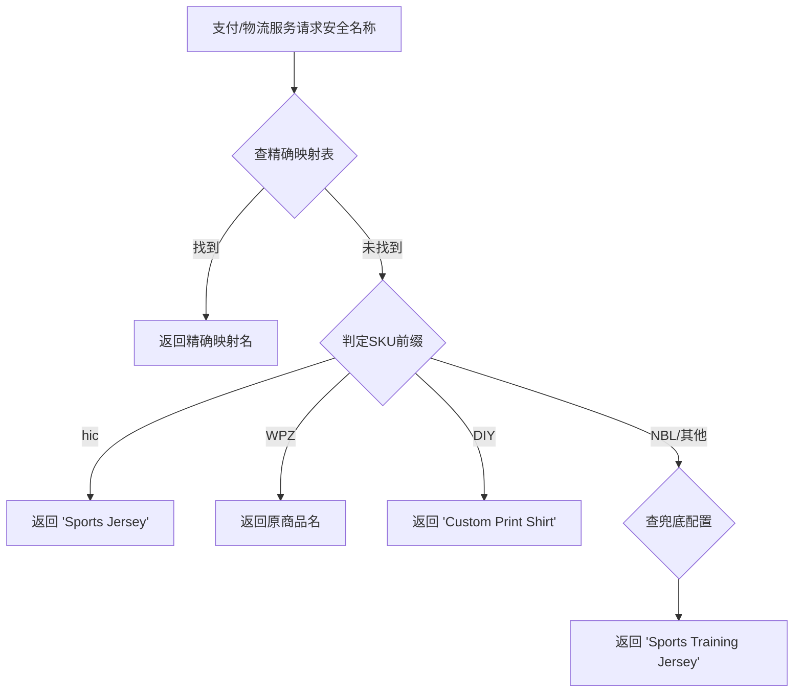

# 商品映射系统 PRD

> 优先级：**P0（安全级）** | 版本：v1.1 | 更新日期：2026-04-17
> 关联业务规则：BR-MAP-001 ~ BR-MAP-004
> **实现状态：✅ 已实现（Phase M4 — 品类级映射升级为 5 级优先级）**

## 1. 概述

### 功能简述
商品映射系统是 JerseyHolic 跨境电商的核心安全模块，负责将真实商品名称（含品牌仿制品信息）映射为安全的普货名称，用于支付接口和物流面单，防止支付渠道（PayPal/Stripe）和物流环节因品牌侵权问题导致账号冻结或订单拦截。

### 业务价值
- 保护支付账号安全，避免因商品名称包含品牌关键词被冻结
- 确保物流面单合规，降低海关查验风险
- 同时保持前台买家体验不受影响（看到真实商品信息）
- 保持 Facebook Pixel 追踪数据准确性（使用真实商品信息）

### 影响范围
- 支付模块（所有支付渠道的订单创建）
- 物流模块（面单生成、PayPal 卖家保护上传）
- 后台管理（商品映射配置管理）
- **不影响**：买家前台展示、Facebook Pixel 追踪

## 2. 用户角色

| 角色 | 权限 |
|------|------|
| Admin（超级管理员） | 管理映射规则、配置兜底名称、查看映射命中统计 |
| Merchant（商户运营） | 查看本商户商品映射状态 |
| Buyer（买家） | 无感知（前台看到真实名称） |
| 系统服务 | 自动调用映射引擎获取安全名称 |

## 3. 功能清单

| 功能ID | 功能名称 | 优先级 | 复杂度 | 描述 |
|--------|---------|--------|--------|------|
| F-MAP-001 | SKU 前缀自动识别 | P0 | M | 根据 SKU 前 3 位自动判定商品分类 | ✅ 已实现（M4） |
| F-MAP-002 | 精确映射管理 | P0 | M | 为单个商品配置专属安全名称 | ✅ 已实现（M4） |
| F-MAP-003 | SKU 前缀通用名 | P0 | S | 按前缀分类返回通用安全名称 | ✅ 已实现（M4） |
| F-MAP-004 | 兖底默认名配置 | P0 | S | 无匹配时的默认安全名称 | ✅ 已实现（M4） |
| F-MAP-005 | 五级优先级引擎 | P0 | M | 精确→前缀→L2品类→L1品类→兖底 的查询链 | ✅ 已实现（M4） |
| F-MAP-006 | 安全名称库管理 | P1 | S | 管理可用的安全商品名称池 | ✅ 已实现（M4） |
| F-MAP-007 | 场景使用控制 | P0 | M | 不同场景调用时返回正确名称 | ✅ 已实现（M4） |

## 4. 用户故事

#### US-MAP-001: SKU 自动分类

**作为** 系统管理员，
**我希望** 系统能根据 SKU 前缀自动识别商品分类（仿牌/正品/定制/其他），
**以便** 自动决定该商品是否需要名称映射。

**验收标准：**
- Given SKU 为 "hic-JUVE-2026-H"，When 调用分类识别，Then 返回分类="仿牌"，需映射=是
- Given SKU 为 "WPZ-NK-SOCK-001"，When 调用分类识别，Then 返回分类="外贸正品"，需映射=否
- Given SKU 为 "DIY-CUST-2026"，When 调用分类识别，Then 返回分类="来图定制"，需映射=是
- Given SKU 为 "NBL-ACC-001"，When 调用分类识别，Then 返回分类="其他"
- Given SKU 为 "AB"（长度≤3），When 调用分类识别，Then 返回分类="未知"
- Given SKU 为空字符串，When 调用分类识别，Then 返回分类="未知"

**业务规则：** BR-MAP-001

**优先级**: P0 | **复杂度**: M

---

#### US-MAP-002: 精确映射配置

**作为** 管理员，
**我希望** 能为特定商品配置专属的安全名称映射，
**以便** 高风险/高关注商品使用更精准的安全名称。

**验收标准：**
- Given 商品 ID=123，When 创建精确映射 "Sports Team Training Kit"，Then 该商品支付时使用此名称
- Given 已有映射记录，When 修改映射名称，Then 后续支付使用新名称
- Given 已有映射记录，When 删除映射，Then 回退到 SKU 前缀通用名规则

**优先级**: P0 | **复杂度**: M

---

#### US-MAP-003: 三级优先级查询

**作为** 支付/物流系统，
**我希望** 获取商品安全名称时，按三级优先级自动查找最合适的名称，
**以便** 确保任何商品都能获得有效的安全名称。

**验收标准：**
- Given 商品有精确映射记录，When 查询安全名称，Then 返回精确映射名
- Given 商品无精确映射但 SKU 前缀为 hic，When 查询安全名称，Then 返回 "Sports Jersey"
- Given 商品无精确映射且 SKU 前缀为 WPZ，When 查询安全名称，Then 返回原商品名
- Given 商品无精确映射且 SKU 前缀为 DIY，When 查询安全名称，Then 返回 "Custom Print Shirt"
- Given 商品无任何匹配规则，When 查询安全名称，Then 返回兜底默认 "Sports Training Jersey"
- Given 任何查询场景，When 获取安全名称，Then 价格字段永远不被修改

**业务规则：** BR-MAP-002, BR-MAP-003

**优先级**: P0 | **复杂度**: M

---

#### US-MAP-004: 支付接口使用安全名称

**作为** 支付系统，
**我希望** 创建 PayPal/Stripe/Antom 支付订单时，商品名称自动替换为安全名称，
**以便** 支付渠道不会因品牌侵权关键词冻结账号。

**验收标准：**
- Given 调用 PayPal 创建订单 API，When 传递商品信息，Then items 中的 name 为安全映射名称
- Given 调用 Stripe Checkout Session，When 创建 line_items，Then description 为安全映射名称
- Given 任何支付渠道，When 传递金额，Then 价格为真实金额，不做修改
- Given 前台展示支付确认页，When 显示商品名称，Then 使用真实商品名称（买家看到的是真实名）

**优先级**: P0 | **复杂度**: M

---

#### US-MAP-005: 后台同时展示两个名称

**作为** 管理员，
**我希望** 在后台商品列表和订单详情中，同时看到真实商品名和安全映射名，
**以便** 了解映射效果并及时调整。

**验收标准：**
- Given 查看商品列表，When 商品有映射，Then 显示"真实名称 → 安全名称"
- Given 查看订单详情，When 订单商品有映射，Then 标注使用的安全名称
- Given 管理映射列表，When 筛选未映射的仿牌商品（hic），Then 高亮提醒需要配置映射

**优先级**: P1 | **复杂度**: S

## 5. 业务规则

详见 `business-rules.md` 中的 BR-MAP-001 至 BR-MAP-004。

**核心规则摘要**：
1. SKU 前缀 `hic` 商品**必须**映射
2. 映射优先级：精确 → 前缀通用 → 兜底默认
3. 支付/物流用安全名，前台/Pixel 用真实名
4. **价格永远不替换**

## 6. 数据需求

### 需要的数据表（传递给 @architect）

**jh_product_safe_mapping** — 精确映射表
- product_id: 商品ID（外键）
- safe_name: 安全映射名称
- is_active: 是否启用
- created_at, updated_at

**jh_safe_name_pool** — 安全名称库
- id: 主键
- name: 安全名称（如 "Sports Jersey"）
- category: 适用分类（hic/DIY/通用）
- is_active: 是否可用

**jh_sku_prefix_config** — SKU 前缀配置
- prefix: SKU 前缀（hic/WPZ/DIY/NBL）
- classification: 分类名
- default_safe_name: 默认安全名称
- needs_mapping: 是否需要映射（boolean）

## 7. 页面/交互说明

### 后台页面

1. **映射管理列表页** — 查看/搜索/筛选所有商品映射
2. **映射编辑页** — 为商品配置精确映射名称
3. **安全名称库页** — 管理安全名称池
4. **SKU 前缀配置页** — 配置前缀通用名和兜底名

### 交互流程

## 8. API 需求

| 接口 | 方法 | 说明 | 调用方 |
|------|------|------|--------|
| GET /api/admin/product-mappings | GET | 映射列表（分页/搜索） | 管理后台 |
| POST /api/admin/product-mappings | POST | 创建精确映射 | 管理后台 |
| PUT /api/admin/product-mappings/{id} | PUT | 更新映射 | 管理后台 |
| DELETE /api/admin/product-mappings/{id} | DELETE | 删除映射 | 管理后台 |
| GET /api/internal/safe-name/{product_id} | GET | 查询安全名称（内部服务调用） | 支付/物流服务 |
| GET /api/admin/safe-name-pool | GET | 安全名称库列表 | 管理后台 |
| POST /api/admin/safe-name-pool | POST | 添加安全名称 | 管理后台 |

## 9. 验收标准

### 功能验收 ✅ 已验收（M4）
- [x] SKU 前缀识别覆盖 hic/WPZ/DIY/NBL 四种分类
- [x] 空 SKU 或长度≤3 的 SKU 返回“未知”分类
- [x] 精确映射 CRUD 操作正常
- [x] 五级优先级查询链路正确：精确→前缀→L2品类→L1品类→兖底
- [x] 安全名称库管理功能正常

### 安全验收（**最关键**） ✅ 已验收（M4）
- [x] PayPal 创建订单 API 中商品名称为映射后的安全名称
- [x] Stripe 创建支付中商品描述为映射后的安全名称
- [x] 所有支付渠道（Antom/Payssion 等）均使用安全名称
- [x] 物流面单中的商品名称为映射后的安全名称
- [x] PayPal 卖家保护上传使用安全名称
- [x] **价格字段在所有场景中未被修改**
- [x] 买家前台展示使用真实商品名称
- [x] Facebook Pixel 事件使用真实商品名称和 ID

### 边界场景 ✅ 已验收（M4）
- [x] 当精确映射被删除时，自动回退到 SKU 前缀规则
- [x] 当安全名称库为空时，兖底名称仍可用
- [x] 当 SKU 前缀不匹配任何已知分类时，使用兖底默认名
- [x] 批量商品同时请求安全名称时，性能不退化

## 10. 非功能需求

- **性能**：安全名称查询响应时间 < 50ms（建议缓存）
- **安全**：映射管理仅 Admin 角色可操作
- **审计**：映射变更记录操作日志
- **缓存**：映射结果建议 Redis 缓存，精确映射变更时刷新缓存

## 11. 依赖与风险

### 依赖
- 商品管理模块（product_id 外键）
- 支付系统模块（调用方）
- 物流管理模块（调用方）

### 风险
| 风险 | 影响 | 缓解措施 |
|------|------|---------|
| 映射遗漏（hic 商品未映射） | 支付账号被冻结 | 兜底默认名机制 + 未映射仿牌商品告警 |
| 映射缓存过期未刷新 | 短暂使用旧名称 | 缓存 TTL 设为 5 分钟 + 变更时主动刷新 |
| 安全名称本身被标记 | 安全名称也可能被风控 | 定期更新安全名称库 |
